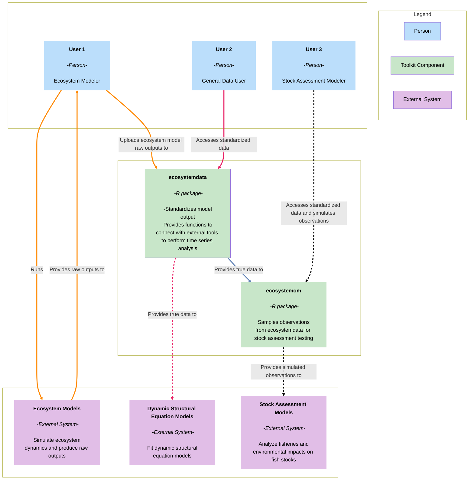

# System context diagram

This diagram presents the ecosystem simulation toolkit at the center, surrounded by its users and the external systems 
it interacts with. The emphasis is on the people and the toolkit itself, rather than on technologies or low-level 
implementation details.

