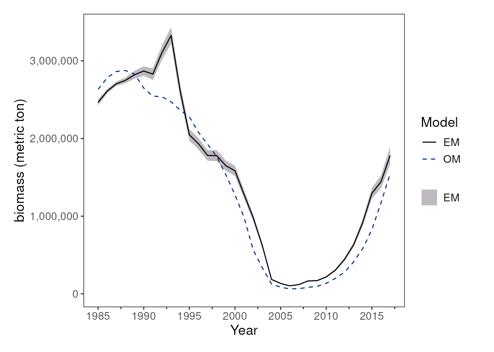
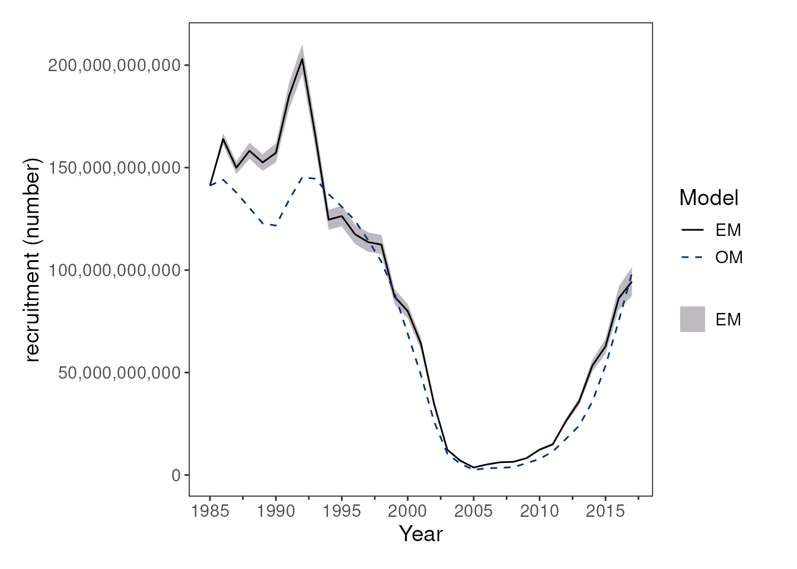
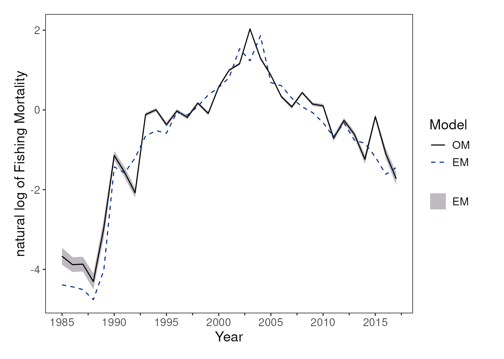
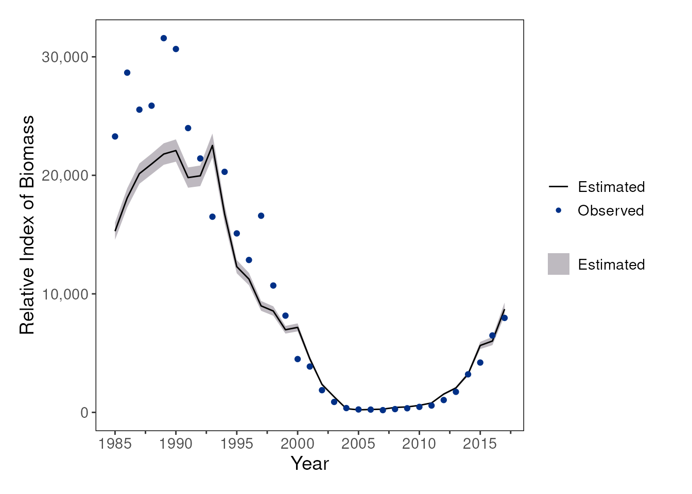
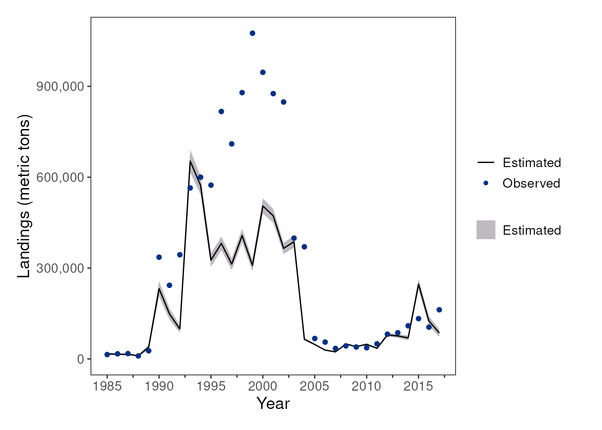
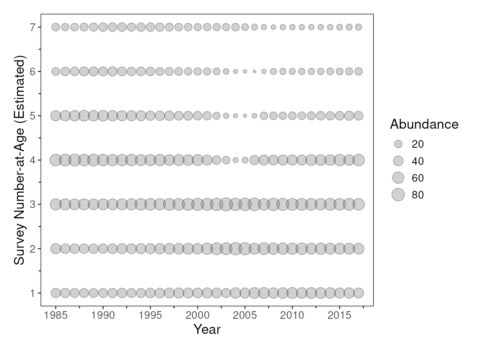
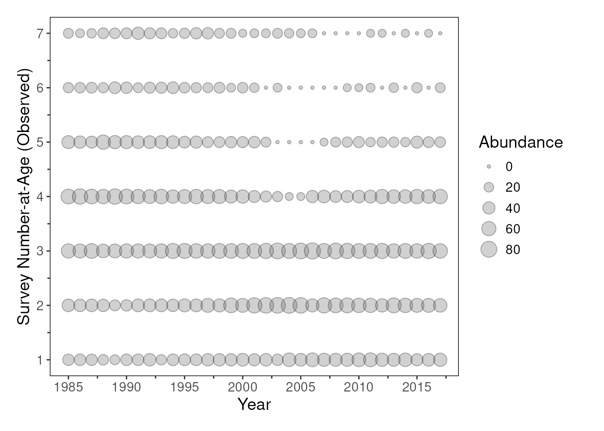
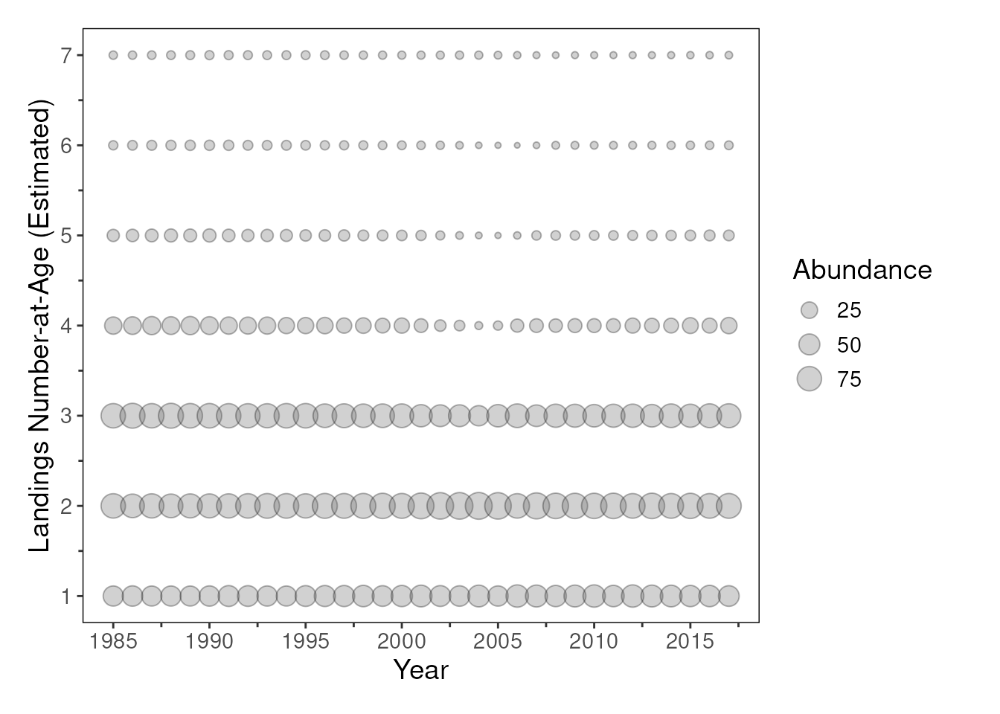
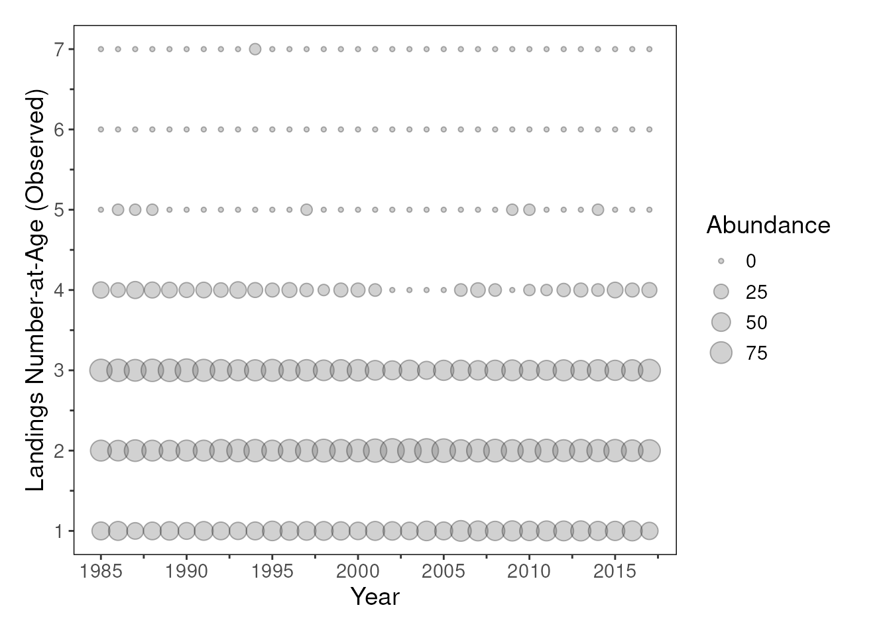

# From Ecopath with Ecosim to Fisheries Integrated Modeling System (with YOY survey)

## Introduction

Ecosystem-based fishery management (EBFM) is crucial for addressing the
complex, dynamic challenges posed by non-stationary climate, ecological,
and economic conditions. However, translating outputs from ecosystem
models into products suitable for fishery stock assessment models
remains a key challenge.

This vignette demonstrates an end-to-end simulation workflow implemented
in the {ecosystemom} package for linking ecosystem model outputs with
fisheries estimation models. The workflow includes functions to:

- [`load_model()`](https://noaa-fims.github.io/ecosystemom/reference/load_model.md)
  — import and standardize output from ecosystem operating models (OM).
  For example, this function can be used to read and standardize Ecopath
  with Ecosim (EwE) Ecosim outputs for downstream analyses within
  {ecosystemom}.
- [`get_truth()`](https://noaa-fims.github.io/ecosystemom/reference/get_truth.md)
  — extract “true” population quantities from the OM, including annual
  or monthly biomass trajectories and biomass-at-age.
- `sample_*()` — generate sampled observations from OM outputs for use
  in estimation models such as the Fisheries Integrated Modeling System
  (FIMS).
- [`create_dsem_inputs()`](https://noaa-fims.github.io/ecosystemom/reference/create_dsem_inputs.md)
  — prepare environmental covariates or diet composition data from the
  OM to support candidate model specifications for dynamic structural
  equation models (DSEMs) and related ecosystem-informed analyses.

## Load EwE Model Outputs

We begin by identifying and parsing raw comma-separated output matrices
exported from a baseline EwE model run of the Northwest Atlantic. The
critical target files extracted by {ecosystemom} include:

- basic_estimates.csv
- biomass_monthly.csv
- catch_monthly.csv
- diet_composition.csv
- mortality_monthly.csv
- weight_monthly.csv

## Get functional groups from the EwE model

``` r

# Locate package internal files
ewe_nwatlantic_path <- system.file(
  "extdata", "ewe_ecosim_base_nwatlantic",
  package = "ecosystemom"
)

model_years <- 1985:2017

# Load functional groups
functional_groups <- get_functional_groups(
  file_path = fs::path(ewe_nwatlantic_path, "basic_estimates.csv")
)

functional_groups |>
  scroll_table()
```

| functional_group     | species          | group | functional_group_snake_case |
|:---------------------|:-----------------|:------|:----------------------------|
| striped bass 0       | striped bass     | 0     | striped_bass_0              |
| striped bass 2-5     | striped bass     | 2-5   | striped_bass_2_5            |
| striped bass 6+      | striped bass     | 6+    | striped_bass_6_plus         |
| menhaden 0           | menhaden         | 0     | menhaden_0                  |
| menhaden 1           | menhaden         | 1     | menhaden_1                  |
| menhaden 2           | menhaden         | 2     | menhaden_2                  |
| menhaden 3           | menhaden         | 3     | menhaden_3                  |
| menhaden 4           | menhaden         | 4     | menhaden_4                  |
| menhaden 5           | menhaden         | 5     | menhaden_5                  |
| menhaden 6+          | menhaden         | 6+    | menhaden_6_plus             |
| spiny dogfish        | spiny dogfish    | NA    | spiny_dogfish               |
| bluefish juv         | bluefish         | juv   | bluefish_juv                |
| bluefish adult       | bluefish         | adult | bluefish_adult              |
| weakfish juv         | weakfish         | juv   | weakfish_juv                |
| weakfish adult       | weakfish         | adult | weakfish_adult              |
| Atlantic herring 0-1 | Atlantic herring | 0-1   | atlantic_herring_0_1        |
| Atlantic herring 2+  | Atlantic herring | 2+    | atlantic_herring_2_plus     |
| anchovies            | anchovies        | NA    | anchovies                   |
| benthos              | benthos          | NA    | benthos                     |
| zooplankton          | zooplankton      | NA    | zooplankton                 |
| phytoplankton        | phytoplankton    | NA    | phytoplankton               |
| Detritus             | Detritus         | NA    | detritus                    |

### Load EwE Ecosim model

``` r

# Load and standardize EwE outputs
data_om <- load_model(
  directory = ewe_nwatlantic_path,
  functional_groups = functional_groups,
  type = "ewe_ecosim",
  unit = c(
    "biomass" = "1e^6 mt",
    "catch" = "1e^6 mt",
    "landings" = "1e^6 mt",
    "total_mortality" = "year^-1",
    "weight" = "NA"
  )
)

data_om |>
  head(n = 10) |>
  dplyr::mutate(file_name = "./biomass_monthly.csv") |>
  scroll_table()
```

| file_name | type | year | month | functional_group | value | species | group | functional_group_snake_case | unit |
|:---|:---|---:|---:|:---|---:|:---|:---|:---|:---|
| ./biomass_monthly.csv | biomass | 1985 | 1 | striped bass 0 | 0.0084961 | striped bass | 0 | striped_bass_0 | 1e^6 mt |
| ./biomass_monthly.csv | biomass | 1985 | 1 | striped bass 2-5 | 0.0362939 | striped bass | 2-5 | striped_bass_2_5 | 1e^6 mt |
| ./biomass_monthly.csv | biomass | 1985 | 1 | striped bass 6+ | 0.0186583 | striped bass | 6+ | striped_bass_6_plus | 1e^6 mt |
| ./biomass_monthly.csv | biomass | 1985 | 1 | menhaden 0 | 0.2910449 | menhaden | 0 | menhaden_0 | 1e^6 mt |
| ./biomass_monthly.csv | biomass | 1985 | 1 | menhaden 1 | 0.9729747 | menhaden | 1 | menhaden_1 | 1e^6 mt |
| ./biomass_monthly.csv | biomass | 1985 | 1 | menhaden 2 | 0.7663768 | menhaden | 2 | menhaden_2 | 1e^6 mt |
| ./biomass_monthly.csv | biomass | 1985 | 1 | menhaden 3 | 0.3195014 | menhaden | 3 | menhaden_3 | 1e^6 mt |
| ./biomass_monthly.csv | biomass | 1985 | 1 | menhaden 4 | 0.1119810 | menhaden | 4 | menhaden_4 | 1e^6 mt |
| ./biomass_monthly.csv | biomass | 1985 | 1 | menhaden 5 | 0.0409002 | menhaden | 5 | menhaden_5 | 1e^6 mt |
| ./biomass_monthly.csv | biomass | 1985 | 1 | menhaden 6+ | 0.0314173 | menhaden | 6+ | menhaden_6_plus | 1e^6 mt |

``` r


data_om |> 
  dplyr::distinct(type, species) |>
  scroll_table()
```

| type              | species          |
|:------------------|:-----------------|
| biomass           | striped bass     |
| biomass           | menhaden         |
| biomass           | spiny dogfish    |
| biomass           | bluefish         |
| biomass           | weakfish         |
| biomass           | Atlantic herring |
| biomass           | anchovies        |
| biomass           | benthos          |
| biomass           | zooplankton      |
| biomass           | phytoplankton    |
| biomass           | Detritus         |
| catch             | striped bass     |
| catch             | menhaden         |
| catch             | spiny dogfish    |
| catch             | bluefish         |
| catch             | weakfish         |
| catch             | Atlantic herring |
| catch             | anchovies        |
| catch             | benthos          |
| catch             | zooplankton      |
| catch             | phytoplankton    |
| catch             | Detritus         |
| total_mortality   | striped bass     |
| total_mortality   | menhaden         |
| total_mortality   | spiny dogfish    |
| total_mortality   | bluefish         |
| total_mortality   | weakfish         |
| total_mortality   | Atlantic herring |
| total_mortality   | anchovies        |
| total_mortality   | benthos          |
| total_mortality   | zooplankton      |
| total_mortality   | phytoplankton    |
| total_mortality   | Detritus         |
| weight            | striped bass     |
| weight            | menhaden         |
| weight            | spiny dogfish    |
| weight            | bluefish         |
| weight            | weakfish         |
| weight            | Atlantic herring |
| weight            | anchovies        |
| weight            | benthos          |
| weight            | zooplankton      |
| weight            | phytoplankton    |
| weight            | Detritus         |
| fishing_mortality | striped bass     |
| fishing_mortality | menhaden         |
| fishing_mortality | spiny dogfish    |
| fishing_mortality | bluefish         |
| fishing_mortality | weakfish         |
| fishing_mortality | Atlantic herring |
| fishing_mortality | anchovies        |
| fishing_mortality | benthos          |
| fishing_mortality | zooplankton      |
| fishing_mortality | phytoplankton    |
| fishing_mortality | Detritus         |
| natural_mortality | striped bass     |
| natural_mortality | menhaden         |
| natural_mortality | spiny dogfish    |
| natural_mortality | bluefish         |
| natural_mortality | weakfish         |
| natural_mortality | Atlantic herring |
| natural_mortality | anchovies        |
| natural_mortality | benthos          |
| natural_mortality | zooplankton      |
| natural_mortality | phytoplankton    |
| natural_mortality | Detritus         |

## Extract “Truth” from the OM

Using
[`get_truth()`](https://noaa-fims.github.io/ecosystemom/reference/get_truth.md),
we synthesize raw EwE time series into a structured tibble. This “truth”
represents the true state of the ecosystem against which our estimation
model will be tested. For this demonstration, our focal species is
“menhaden”. To isolate a target stock assessment from the broader
ecosystem web, we subset a single focal species from the OM. In this
vignette, we track Atlantic Menhaden (Brevoortia tyrannus), a key forage
fish species. We extract “true” indices and age compositions using
[`get_truth()`](https://noaa-fims.github.io/ecosystemom/reference/get_truth.md).

``` r

# Extract "true" values for menhaden
truth_om <- get_truth(
  data = data_om,
  species_name = "menhaden"
)

truth_om |>
  dplyr::select(-truth_om) |>
  scroll_table()
```

| species_name | truth_label       | truth_type | truth_time_step |
|:-------------|:------------------|:-----------|:----------------|
| menhaden     | biomass           | index      | monthly         |
| menhaden     | biomass           | index      | yearly          |
| menhaden     | biomass           | agecomp    | monthly         |
| menhaden     | biomass           | agecomp    | yearly          |
| menhaden     | catch             | index      | monthly         |
| menhaden     | catch             | index      | yearly          |
| menhaden     | catch             | agecomp    | monthly         |
| menhaden     | catch             | agecomp    | yearly          |
| menhaden     | fishing_mortality | index      | monthly         |
| menhaden     | fishing_mortality | index      | yearly          |
| menhaden     | fishing_mortality | agecomp    | monthly         |
| menhaden     | fishing_mortality | agecomp    | yearly          |
| menhaden     | natural_mortality | agecomp    | monthly         |
| menhaden     | natural_mortality | agecomp    | yearly          |
| menhaden     | numbers           | index      | monthly         |
| menhaden     | numbers           | index      | yearly          |
| menhaden     | numbers           | agecomp    | monthly         |
| menhaden     | numbers           | agecomp    | yearly          |
| menhaden     | total_mortality   | agecomp    | monthly         |
| menhaden     | total_mortality   | agecomp    | yearly          |
| menhaden     | weight            | agecomp    | monthly         |
| menhaden     | weight            | agecomp    | yearly          |

``` r


# Extract and unnest annual catch
biomass_scalar <- 1000000
catch_index_om <- truth_om |> 
  dplyr::filter(
    truth_label == "catch",
    truth_type == "index",
    truth_time_step == "yearly"
  ) |> 
  tidyr::unnest(cols = c(truth_om)) |>
  dplyr::mutate(
    truth_value = truth_value * biomass_scalar, 
    truth_unit = "mt"
  ) 
  
catch_index_om |>
  scroll_table()
```

| species_name | truth_label | truth_type | truth_time_step | truth_year | truth_unit | truth_value |
|:---|:---|:---|:---|---:|:---|---:|
| menhaden | catch | index | yearly | 1985 | mt | 16436.46 |
| menhaden | catch | index | yearly | 1986 | mt | 16565.34 |
| menhaden | catch | index | yearly | 1987 | mt | 15939.05 |
| menhaden | catch | index | yearly | 1988 | mt | 12596.12 |
| menhaden | catch | index | yearly | 1989 | mt | 25993.96 |
| menhaden | catch | index | yearly | 1990 | mt | 321014.86 |
| menhaden | catch | index | yearly | 1991 | mt | 258893.40 |
| menhaden | catch | index | yearly | 1992 | mt | 365211.37 |
| menhaden | catch | index | yearly | 1993 | mt | 600358.51 |
| menhaden | catch | index | yearly | 1994 | mt | 659307.57 |
| menhaden | catch | index | yearly | 1995 | mt | 604887.34 |
| menhaden | catch | index | yearly | 1996 | mt | 907276.10 |
| menhaden | catch | index | yearly | 1997 | mt | 771183.60 |
| menhaden | catch | index | yearly | 1998 | mt | 878034.15 |
| menhaden | catch | index | yearly | 1999 | mt | 981962.22 |
| menhaden | catch | index | yearly | 2000 | mt | 961678.94 |
| menhaden | catch | index | yearly | 2001 | mt | 926563.53 |
| menhaden | catch | index | yearly | 2002 | mt | 933937.94 |
| menhaden | catch | index | yearly | 2003 | mt | 435965.57 |
| menhaden | catch | index | yearly | 2004 | mt | 292324.12 |
| menhaden | catch | index | yearly | 2005 | mt | 66979.80 |
| menhaden | catch | index | yearly | 2006 | mt | 58767.23 |
| menhaden | catch | index | yearly | 2007 | mt | 36368.17 |
| menhaden | catch | index | yearly | 2008 | mt | 41439.10 |
| menhaden | catch | index | yearly | 2009 | mt | 42480.31 |
| menhaden | catch | index | yearly | 2010 | mt | 42963.63 |
| menhaden | catch | index | yearly | 2011 | mt | 47277.22 |
| menhaden | catch | index | yearly | 2012 | mt | 91043.37 |
| menhaden | catch | index | yearly | 2013 | mt | 87008.47 |
| menhaden | catch | index | yearly | 2014 | mt | 120764.99 |
| menhaden | catch | index | yearly | 2015 | mt | 119770.21 |
| menhaden | catch | index | yearly | 2016 | mt | 110616.90 |
| menhaden | catch | index | yearly | 2017 | mt | 175165.13 |

``` r


# Extract and unnest annual weight-at-age
weight_scalar <- 738 / 1000000
weight_agecomp_om <- truth_om |>
  dplyr::filter(
    truth_label == "weight",
    truth_type == "agecomp",
    truth_time_step == "yearly"
  ) |> 
  tidyr::unnest(cols = c(truth_om)) |>
  dplyr::mutate(
    truth_value = truth_value * weight_scalar,
    truth_unit = "mt"
  )

# Extract and unnest annual catch-at-age in numbers
catch_agecomp_om <- truth_om |> 
  dplyr::filter(
    truth_label == "catch",
    truth_type == "agecomp",
    truth_time_step == "yearly"
  ) |>
  tidyr::unnest(cols = c(truth_om)) |>
  dplyr::mutate(
    truth_value = truth_value * biomass_scalar,
    truth_unit = "mt"
  ) |>
  dplyr::left_join(
    weight_agecomp_om |>
      dplyr::select(-species_name, -truth_label, -truth_type, -truth_time_step, -truth_unit), 
    by = c("truth_year", "truth_group"),
    suffix = c("_catch", "_weight")
  ) |>
  dplyr::mutate(
    truth_value = ceiling(truth_value_catch / truth_value_weight), 
    truth_unit = "numbers"
  ) |>
  dplyr::select(-truth_value_catch, -truth_value_weight)

# Extract and unnest annual biomass
biomass_index_om <- truth_om |>
  dplyr::filter(
    truth_label == "biomass",
    truth_type == "index",
    truth_time_step == "yearly"
  ) |> 
  tidyr::unnest(cols = c(truth_om)) |>
  dplyr::mutate(
    truth_value = truth_value * biomass_scalar, 
    truth_unit = "mt"
  )

# Extract and unnest annual number-at-age
number_agecomp_om <- truth_om |>
  dplyr::filter(
    truth_label == "numbers",
    truth_type == "agecomp",
    truth_time_step == "yearly"
  ) |> 
  tidyr::unnest(cols = c(truth_om)) |>
  dplyr::mutate(
    truth_value = ceiling(truth_value * biomass_scalar / weight_scalar),
    truth_unit = "numbers"
  )

# Extract and unnest annual natural mortality by age
natural_mortality_agecomp_om <- truth_om |>
  dplyr::filter(
    truth_label == "natural_mortality",
    truth_type == "agecomp",
    truth_time_step == "yearly"
  ) |> 
  tidyr::unnest(cols = c(truth_om))

# Extract and unnest annual fishing mortality by age
fishing_mortality_agecomp_om <- truth_om |>
  dplyr::filter(
    truth_label == "fishing_mortality",
    truth_type == "agecomp",
    truth_time_step == "yearly"
  ) |> 
  tidyr::unnest(cols = c(truth_om))

# Extract and unnest annual fishing mortality: apical F
fishing_mortality_index_om <- truth_om |>
  dplyr::filter(
    truth_label == "fishing_mortality",
    truth_type == "index",
    truth_time_step == "yearly"
  ) |>
  tidyr::unnest(cols = c(truth_om))
```

## Generate Sampled Data

To mimic observed fisheries data, sampled observations are generated
from the OM “truth” while incorporating observation error.

#### Fishery-Dependent Data

Observed catch data are simulated by applying lognormal observation
error to the “true” catch values with a standard deviation of 0.1. Age
composition data are generated using a multinomial sampling distribution
with an effective sample size of N=120.

``` r

catch_index_sd <- 0.1
catch_index_sampled <- catch_index_om |> 
  dplyr::mutate(
    sampled_value = sample_lognormal(
      x = truth_value, 
      sd = catch_index_sd
    )
  )

catch_index_sampled |>
  scroll_table()
```

| species_name | truth_label | truth_type | truth_time_step | truth_year | truth_unit | truth_value | sampled_value |
|:---|:---|:---|:---|---:|:---|---:|---:|
| menhaden | catch | index | yearly | 1985 | mt | 16436.46 | 14494.881 |
| menhaden | catch | index | yearly | 1986 | mt | 16565.34 | 16946.404 |
| menhaden | catch | index | yearly | 1987 | mt | 15939.05 | 17676.144 |
| menhaden | catch | index | yearly | 1988 | mt | 12596.12 | 9912.724 |
| menhaden | catch | index | yearly | 1989 | mt | 25993.96 | 26998.372 |
| menhaden | catch | index | yearly | 1990 | mt | 321014.86 | 335993.901 |
| menhaden | catch | index | yearly | 1991 | mt | 258893.40 | 243214.162 |
| menhaden | catch | index | yearly | 1992 | mt | 365211.37 | 344058.983 |
| menhaden | catch | index | yearly | 1993 | mt | 600358.51 | 564579.828 |
| menhaden | catch | index | yearly | 1994 | mt | 659307.57 | 600154.042 |
| menhaden | catch | index | yearly | 1995 | mt | 604887.34 | 573824.133 |
| menhaden | catch | index | yearly | 1996 | mt | 907276.10 | 816974.732 |
| menhaden | catch | index | yearly | 1997 | mt | 771183.60 | 710025.642 |
| menhaden | catch | index | yearly | 1998 | mt | 878034.15 | 879304.601 |
| menhaden | catch | index | yearly | 1999 | mt | 981962.22 | 1075458.369 |
| menhaden | catch | index | yearly | 2000 | mt | 961678.94 | 946387.501 |
| menhaden | catch | index | yearly | 2001 | mt | 926563.53 | 876013.639 |
| menhaden | catch | index | yearly | 2002 | mt | 933937.94 | 848347.591 |
| menhaden | catch | index | yearly | 2003 | mt | 435965.57 | 398953.997 |
| menhaden | catch | index | yearly | 2004 | mt | 292324.12 | 370349.337 |
| menhaden | catch | index | yearly | 2005 | mt | 66979.80 | 67545.392 |
| menhaden | catch | index | yearly | 2006 | mt | 58767.23 | 55674.141 |
| menhaden | catch | index | yearly | 2007 | mt | 36368.17 | 34627.193 |
| menhaden | catch | index | yearly | 2008 | mt | 41439.10 | 43171.637 |
| menhaden | catch | index | yearly | 2009 | mt | 42480.31 | 39435.590 |
| menhaden | catch | index | yearly | 2010 | mt | 42963.63 | 36985.779 |
| menhaden | catch | index | yearly | 2011 | mt | 47277.22 | 49824.363 |
| menhaden | catch | index | yearly | 2012 | mt | 91043.37 | 81774.903 |
| menhaden | catch | index | yearly | 2013 | mt | 87008.47 | 86443.553 |
| menhaden | catch | index | yearly | 2014 | mt | 120764.99 | 109426.336 |
| menhaden | catch | index | yearly | 2015 | mt | 119770.21 | 133060.612 |
| menhaden | catch | index | yearly | 2016 | mt | 110616.90 | 104953.101 |
| menhaden | catch | index | yearly | 2017 | mt | 175165.13 | 162354.971 |

``` r


catch_agecomp_sample_size <- 120
catch_agecomp_sampled <- catch_agecomp_om |> 
  dplyr::group_by(truth_year) |> 
  dplyr::mutate(
    sampled_value = sample_multinomial(
      x = truth_value,
      sample_size = catch_agecomp_sample_size
    )
  ) |> 
  dplyr::ungroup()
```

#### Fishery-Independent Survey Data

Fishery-independent survey observations are simulated by applying a
double-logistic selectivity and catchability coefficient (q) to the
“true” number-at-age matrix from the OM. Observed survey index is
simulated by applying lognormal observation error to the “true” values
with a standard deviation of 0.1. Age composition data are generated
using a multinomial sampling distribution with an effective sample size
of N=120.

``` r

ages <- 0:6
names(ages) <- functional_groups |>
  dplyr::filter(species == "menhaden") |>
  dplyr::pull(group)

# YOY survey for age-0
yoy_q <- 0.05
yoy_index_sd <- 0.1
yoy_selectivity <- c(1, 0, 0, 0, 0, 0, 0)
names(yoy_selectivity) <- functional_groups |>
  dplyr::filter(species == "menhaden") |>
  dplyr::pull(group)
yoy_index_sampled <- number_agecomp_om |>
  dplyr::left_join(
    weight_agecomp_om |>
      dplyr::select(-species_name, -truth_label, -truth_type, -truth_time_step, -truth_unit), 
    by = c("truth_year", "truth_group"),
    suffix = c("_number", "_weight")
  ) |>
  dplyr::filter(truth_group == "0") |>
  dplyr::mutate(
    truth_value_selected_number = ceiling(truth_value_number * yoy_q),
    truth_value_selected_biomass = truth_value_selected_number * truth_value_weight,
    sampled_value = sample_lognormal(
      x = truth_value_selected_biomass, 
      sd = yoy_index_sd
    )
  ) |>
  dplyr::select(
    -truth_value_number, -truth_value_weight, 
    -truth_value_selected_number, -truth_value_selected_biomass
  ) |>
  dplyr::mutate(
    species_name = "menhaden",
    truth_label = "biomass",
    truth_type = "index",
    truth_time_step = "yearly",
    truth_unit = "mt"
  )
yoy_inflection_point_asc <- -1.0
yoy_slope_asc <- 10
yoy_inflection_point_desc <- 0.5
yoy_slope_desc <- 10
yoy_selectivity_ascending  <- 1 / (1 + exp(-yoy_slope_asc * (ages - yoy_inflection_point_asc)))
yoy_selectivity_descending <- 1 / (1 + exp(-yoy_slope_desc * (ages - yoy_inflection_point_desc)))
yoy_selectivity <- yoy_selectivity_ascending * (1 - yoy_selectivity_descending)

# Survey for ages 1-6+
# Define explicit survey catchability
catchability_survey <- 0.05
# Define logistic selectivity parameters using values from BAM NAD survey
selectivity_inflection_point <- 3.03
selectivity_slope <- 2.2
selectivity_survey <- 1 / (1 + exp(-selectivity_slope * (ages - selectivity_inflection_point)))

# selectivity_inflection_point_asc <- -5
# selectivity_slope_asc <- 5
# selectivity_inflection_point_desc <- 0.55
# selectivity_slope_desc <- 3.30
# selectivity_ascending  <- 1 / (1 + exp(-selectivity_slope_asc * (ages - selectivity_inflection_point_asc)))
# selectivity_descending <- 1 / (1 + exp(-selectivity_slope_desc * (ages - selectivity_inflection_point_desc)))
# selectivity_survey <- selectivity_ascending * (1 - selectivity_descending)

names(selectivity_survey) <- functional_groups |>
  dplyr::filter(species == "menhaden") |>
  dplyr::pull(group)

# Survey index
survey_data <- number_agecomp_om |>
  dplyr::left_join(
    weight_agecomp_om |>
      dplyr::select(-species_name, -truth_label, -truth_type, -truth_time_step, -truth_unit), 
    by = c("truth_year", "truth_group"),
    suffix = c("_number", "_weight")
  ) |>
  dplyr::mutate(
    selectivity = selectivity_survey[truth_group],
    truth_value_selected_number = ceiling(truth_value_number * selectivity * catchability_survey),
    truth_value_selected_biomass = truth_value_selected_number * truth_value_weight
  )

# Generate observed survey biomass indices with lognormal error (SD = 0.1)
survey_index_sd <- 0.1
survey_index_sampled <- survey_data |> 
  dplyr::select(
    -truth_value_number, -truth_value_weight, -selectivity, -truth_value_selected_number
  ) |>
  dplyr::mutate(
    truth_label = "biomass",
    truth_unit = "mt"
  ) |>
  # Aggregate all ages/groups into one annual value
  dplyr::group_by(truth_year) |>
  dplyr::summarise(
    truth_value = sum(truth_value_selected_biomass),
    .groups = "drop"
  ) |>
  dplyr::mutate(
    species_name = "menhaden",
    truth_label = "biomass",
    truth_type = "index",
    truth_time_step = "yearly",
    truth_unit = "mt"
  ) |>
  dplyr::mutate(
    sampled_value = sample_lognormal(
      x = truth_value, 
      sd = survey_index_sd
    )
  )

# Survey agecomp
survey_agecomp_sample_size <- 120
survey_agecomp_sampled <- survey_data |> 
  dplyr::group_by(truth_year) |> 
  dplyr::mutate(
    sampled_value = sample_multinomial(
      x = truth_value_selected_number,
      sample_size = survey_agecomp_sample_size
    )
  ) |> 
  dplyr::ungroup() |>
  dplyr::select(
    -truth_value_number, -truth_value_weight, -selectivity,
    -truth_value_selected_biomass
  ) |>
  dplyr::rename(truth_value = truth_value_selected_number)
```

## Prepare FIMS-compatible data

The sampled fishery-dependent and fishery-independent observations are
next reformatted into a `FIMSFrame` object for use with the FIMS. This
includes annual landings, survey biomass indices, age composition
observations, and weight-at-age information.

The resulting `FIMSFrame object` provides the standardized data
structure required for model configuration and estimation in FIMS.

Click to expand/collapse code

``` r

fishing_fleet_name <- "fishing_fleet"
survey_fleet_name <- "survey_fleet"
yoy_fleet_name <- "yoy_fleet"

landings_data <- data.frame(
  type = "landings",
  fleet = fishing_fleet_name,
  age = NA, 
  timing = model_years,
  value = catch_index_sampled[["sampled_value"]],
  unit = "mt",
  uncertainty = catch_index_sd
)

index_data <- rbind(
  data.frame(
    type = "index",
    fleet = yoy_fleet_name,
    age = NA,
    timing = model_years,
    value = yoy_index_sampled[["sampled_value"]],
    unit = "mt",
    uncertainty = yoy_index_sd
  ),
  data.frame(
    type = "index",
    fleet = survey_fleet_name,
    age = NA,
    timing = model_years,
    value = survey_index_sampled[["sampled_value"]],
    unit = "mt",
    uncertainty = survey_index_sd
  )
)

age_data <- rbind(
  data.frame(
    type = "age_comp",
    fleet = fishing_fleet_name,
    age = unname(ages[catch_agecomp_sampled[["truth_group"]]]),
    timing = catch_agecomp_sampled[["truth_year"]],
    value = catch_agecomp_sampled[["sampled_value"]],
    unit = "number",
    uncertainty = catch_agecomp_sample_size
  ),
  data.frame(
    type = "age_comp",
    fleet = survey_fleet_name,
    age = unname(ages[survey_agecomp_sampled[["truth_group"]]]),
    timing = survey_agecomp_sampled[["truth_year"]],
    value = survey_agecomp_sampled[["sampled_value"]],
    unit = "number",
    uncertainty = survey_agecomp_sample_size
  )
)

weight_at_age <- data.frame(
  type = "weight_at_age",
  fleet = fishing_fleet_name,
  age = unname(ages[weight_agecomp_om[["truth_group"]]]),
  timing = weight_agecomp_om[["truth_year"]],
  value = weight_agecomp_om[["truth_value"]],
  unit = "mt",
  uncertainty = NA
)

weight_year_plus <- weight_at_age |>
  dplyr::filter(timing == max(model_years)) |>
  dplyr::mutate(timing = timing + 1)

weight_at_age_data <- dplyr::bind_rows(
  weight_at_age, 
  weight_year_plus
)

data_fims <- rbind(landings_data, index_data, age_data, weight_at_age_data) |>
  dplyr::mutate(
    length = NA, 
    .after = "age"
  ) |>
  FIMS::FIMSFrame()

methods::show(data_fims)
#> # A tibble: 6 × 8
#>   type     fleet           age length timing value unit   uncertainty
#>   <chr>    <chr>         <int>  <dbl>  <dbl> <dbl> <chr>        <dbl>
#> 1 age_comp fishing_fleet     0     NA   1985    17 number         120
#> 2 age_comp fishing_fleet     1     NA   1985    39 number         120
#> 3 age_comp fishing_fleet     2     NA   1985    54 number         120
#> 4 age_comp fishing_fleet     3     NA   1985    10 number         120
#> 5 age_comp fishing_fleet     4     NA   1985     0 number         120
#> 6 age_comp fishing_fleet     5     NA   1985     0 number         120
#> additional slots include the following:fleets:
#> [1] "fishing_fleet" "yoy_fleet"     "survey_fleet" 
#> n_years:
#> [1] 33
#> ages:
#> [1] 0 1 2 3 4 5 6
#> n_ages:
#> [1] 7
#> lengths:
#> numeric(0)
#> n_lengths:
#> [1] 0
#> start_year:
#> [1] 1985
#> end_year:
#> [1] 2017
```

## Configure the FIMS estimation model

FIMS models are initialized using a set of default configurations and
parameter values derived from the input data. In this section, we
customize those defaults to better align the FIMS estimation model with
the underlying ecosystem OM.

Key modifications include:

- Replacing the default selectivity formulation with a double-logistic
  selectivity function for both the fishing fleet and survey fleet.
- Initializing fishing mortality, survey catchability, recruitment, and
  natural mortality parameters using values derived from the OM “truth”.
- Specifying maturity-at-age using a logistic maturity curve.
- Initializing numbers-at-age in the first model year directly from the
  OM population state.

These steps provide informed starting values that improve consistency
between the OM and the estimation model.

Click to expand/collapse code

``` r

# Generate default FIMS model configurations
default_configurations <- FIMS::create_default_configurations(
  data = data_fims
)

default_configurations |>
  tidyr::unnest(cols = data) |>
  scroll_table()
```

| model_family | module_name | fleet | module_type | distribution_type | distribution |
|:---|:---|:---|:---|:---|:---|
| catch_at_age | Data | fishing_fleet | AgeComp | Data | Dmultinom |
| catch_at_age | Data | fishing_fleet | Landings | Data | Dlnorm |
| catch_at_age | Selectivity | fishing_fleet | Logistic | NA | NA |
| catch_at_age | Data | survey_fleet | AgeComp | Data | Dmultinom |
| catch_at_age | Data | survey_fleet | Index | Data | Dlnorm |
| catch_at_age | Selectivity | survey_fleet | Logistic | NA | NA |
| catch_at_age | Data | yoy_fleet | Index | Data | Dlnorm |
| catch_at_age | Selectivity | yoy_fleet | Logistic | NA | NA |
| catch_at_age | Growth | NA | EWAA | NA | NA |
| catch_at_age | Maturity | NA | Logistic | NA | NA |
| catch_at_age | Recruitment | NA | BevertonHolt | process | Dnorm |

``` r


# Replace the default selectivity model with a double-logistic function
updated_configurations <- default_configurations |>
  tidyr::unnest(cols = data) |>
  dplyr::rows_update(
    y = tibble::tibble(
      fleet = fishing_fleet_name,
      module_name = "Selectivity",
      module_type = "DoubleLogistic"
    ),
    by = c("fleet", "module_name")
  ) |>
  dplyr::rows_update(
    y = tibble::tibble(
      fleet = yoy_fleet_name,
      module_name = "Selectivity",
      module_type = "DoubleLogistic"
    ),
    by = c("fleet", "module_name")
  )

updated_configurations |>
  scroll_table()
```

| model_family | module_name | fleet | module_type | distribution_type | distribution |
|:---|:---|:---|:---|:---|:---|
| catch_at_age | Data | fishing_fleet | AgeComp | Data | Dmultinom |
| catch_at_age | Data | fishing_fleet | Landings | Data | Dlnorm |
| catch_at_age | Selectivity | fishing_fleet | DoubleLogistic | NA | NA |
| catch_at_age | Data | survey_fleet | AgeComp | Data | Dmultinom |
| catch_at_age | Data | survey_fleet | Index | Data | Dlnorm |
| catch_at_age | Selectivity | survey_fleet | Logistic | NA | NA |
| catch_at_age | Data | yoy_fleet | Index | Data | Dlnorm |
| catch_at_age | Selectivity | yoy_fleet | DoubleLogistic | NA | NA |
| catch_at_age | Growth | NA | EWAA | NA | NA |
| catch_at_age | Maturity | NA | Logistic | NA | NA |
| catch_at_age | Recruitment | NA | BevertonHolt | process | Dnorm |

``` r


# Create default parameter values from the updated model configuration
default_parameters <- FIMS::create_default_parameters(
  configurations = updated_configurations,
  data = data_fims
) |>
  tidyr::unnest(cols = data)

# Fishing fleet selectivity
# Option 1: Estimate selectivity from OM fishing mortality-at-age
# Mismatch note: the ecosystem model OM scales fishing selectivity (double 
# logistic) to a maximum of 1, where FIMS does not.
catch_selectivity <- estimate_true_selectivity(
  data = fishing_mortality_agecomp_om,
  ages = ages,
  functional_form = "double_logistic"
) |>
  dplyr::mutate(fleet_name = fishing_fleet_name)

# Option 2: Explicit fishing fleet selectivity parameter values
catch_selectivity_inflection_point_asc <- 1.8
catch_selectivity_slope_asc <- 3.1
catch_selectivity_inflection_point_desc <- 0.01
catch_selectivity_slope_desc <- 0.88
selectivity_ascending  <- 1 / (1 + exp(-catch_selectivity_slope_asc * (ages - catch_selectivity_inflection_point_asc)))
selectivity_descending <- 1 / (1 + exp(-catch_selectivity_slope_desc * (ages - catch_selectivity_inflection_point_desc)))
selectivity_catch <- selectivity_ascending * (1 - selectivity_descending)
selectivity_catch_max <- max(selectivity_catch)

# Estimate maturity parameters
maturity_parameters <- estimate_true_maturity(
  ages = ages,
  spawning_proportion = c(0, 0.1, 0.5, 0.9, 1, 1, 1),
  functional_form = "logistic"
)

# Estimate recruitment log_sd
recruitment_ewe <- number_agecomp_om |>
  dplyr::filter(truth_group == "0", truth_year != model_years[1]) |>
  dplyr::pull(truth_value)

# log_sd_proxy <- (sd(log(recruitment_ewe) - mean(log(recruitment_ewe)))) |>
#  log()
# am019.rdat from BAM
log_sd_proxy <- log(4.932904e-01)


# Update parameter values using OM-derived truth information
updated_parameters <- default_parameters |>
  # dplyr::filter(!(module_name == "Selectivity" & fleet_name == fishing_fleet_name)) |>
  # dplyr::bind_rows(catch_selectivity) |>
  dplyr::rows_update(
    y = tibble::tibble(
      fleet = fishing_fleet_name,
      label = c(
        "inflection_point_asc", "slope_asc",
        "inflection_point_desc", "slope_desc"
      ),
      # estimation_type = "constant",
      estimation_type = c(
        "fixed_effects", "fixed_effects", "constant", "constant"
      ),
      value = c(
        catch_selectivity_inflection_point_asc,
        catch_selectivity_slope_asc,
        catch_selectivity_inflection_point_desc,
        catch_selectivity_slope_desc
      )
    ),
    by = c("fleet", "label")
  ) |>
  dplyr::rows_update(
    y = tibble::tibble(
      fleet = fishing_fleet_name,
      label = "log_Fmort",
      time = fishing_mortality_index_om[["truth_year"]],
      value = fishing_mortality_index_om[["truth_value"]] |>
        log()
    ), 
    by = c("fleet", "label", "time")
  ) |> 
  dplyr::rows_update(
    y = tibble::tibble(
      fleet = survey_fleet_name,
      label = c("inflection_point", "slope", "log_q"),
      # estimation_type = "constant",
      value = c(selectivity_inflection_point, selectivity_slope, log(catchability_survey))
    ),
    by = c("fleet", "label")
  ) |>
  # dplyr::rows_update(
  #   y = tibble::tibble(
  #     fleet = survey_fleet_name,
  #     label = c(
  #       "inflection_point_asc", "slope_asc", 
  #       "inflection_point_desc", "slope_desc", 
  #       "log_q"
  #     ),
  #     estimation_type = c(
  #       rep("fixed_effects", 0),
  #       rep("constant", 5)
  #     ),
  #     value = c(
  #       selectivity_inflection_point_asc,
  #       selectivity_slope_asc,
  #       selectivity_inflection_point_desc,
  #       selectivity_slope_desc,
  #       log(catchability_survey)
  #     )
  #   ),
  #   by = c("fleet", "label")
  # ) |>
  dplyr::rows_update(
    y = tibble::tibble(
      fleet = yoy_fleet_name,
      label = c("inflection_point_asc", "slope_asc", 
                "inflection_point_desc", "slope_desc", 
                "log_q"),
      estimation_type = c(
        rep("constant", 4),
        rep("fixed_effects", 1)
      ),
      value = c(
        yoy_inflection_point_asc,
        yoy_slope_asc,
        yoy_inflection_point_desc,
        yoy_slope_desc,
        log(yoy_q)
      )
    ),
    by = c("fleet", "label")
  ) |>
  dplyr::rows_update(
    y = tibble::tibble(
      label = "log_rzero", 
      module_type = "BevertonHolt",
      value = number_agecomp_om |>
        dplyr::filter(truth_group == "0") |>
        dplyr::pull(truth_value) |>
        mean() |>
        log()
    ),
    by = c("label", "module_type")
  ) |>
  dplyr::rows_update(
    y = tibble::tibble(
      label = "logit_steep", 
      module_type = "BevertonHolt",
      # calculate from vulnerability matrix: v / (v + 1)
      # v = 411.23 + 1.02 + 191.58 + 2 + 1016.36 + 12.18 + 2 + 403.26 = 2039.63
      # h = v / (v + 1) = 0.99
      value = -log(1.0 - 0.99) + log(0.99 - 0.2)
    ),
    by = c("label", "module_type")
  ) |>
  dplyr::rows_update(
    y = tibble::tibble(
      label = "log_sd",
      module_type = "BevertonHolt",
      # estimation_type = "constant",
      value = log_sd_proxy
    ),
    by = c("label", "module_type")
  ) |>
  # dplyr::rows_update(
  #   y = tibble::tibble(
  #      label = "log_devs",
  #      estimation_type = "fixed_effects",
  #      module_type = "BevertonHolt"
  #   ),
  #   by = c("label", "module_type")
  # ) |>
  dplyr::filter(!(module_name == "Maturity")) |>
  dplyr::bind_rows(maturity_parameters) |>
  dplyr::rows_update(
    y = tibble::tibble(
      label = "log_M", 
      age = unname(ages[natural_mortality_agecomp_om[["truth_group"]]]),
      time = natural_mortality_agecomp_om[["truth_year"]],
      value = log(natural_mortality_agecomp_om[["truth_value"]])
    ),
    by = c("label", "age", "time")
  ) |>
  dplyr::rows_update(
    y = tibble::tibble(
      label = "log_init_naa",
      age = number_agecomp_om |>
        dplyr::filter(truth_year == model_years[1]) |>
        dplyr::pull(truth_group) |>
        (\(x) unname(ages[x]))(),
      value = number_agecomp_om |>
        dplyr::filter(truth_year == model_years[1]) |>
        dplyr::pull(truth_value) |>
        log(),
      estimation_type = c(
        rep("constant", 1),
        rep("fixed_effects", 6)
      )
    ),
    by = c("label", "age")
  )

# Display updated parameter table
updated_parameters |>
  scroll_table()
```

| model_family | module_name | fleet | module_type | label | age | length | time | value | estimation_type | distribution_type | distribution | fleet_name |
|:---|:---|:---|:---|:---|---:|---:|---:|---:|:---|:---|:---|:---|
| catch_at_age | Selectivity | fishing_fleet | DoubleLogistic | inflection_point_asc | NA | NA | NA | 1.8000000 | fixed_effects | NA | NA | NA |
| catch_at_age | Selectivity | fishing_fleet | DoubleLogistic | slope_asc | NA | NA | NA | 3.1000000 | fixed_effects | NA | NA | NA |
| catch_at_age | Selectivity | fishing_fleet | DoubleLogistic | inflection_point_desc | NA | NA | NA | 0.0100000 | constant | NA | NA | NA |
| catch_at_age | Selectivity | fishing_fleet | DoubleLogistic | slope_desc | NA | NA | NA | 0.8800000 | constant | NA | NA | NA |
| catch_at_age | Fleet | fishing_fleet | NA | log_q | NA | NA | NA | 0.0000000 | constant | NA | NA | NA |
| catch_at_age | Fleet | fishing_fleet | NA | log_Fmort | NA | NA | 1985 | -4.3883506 | fixed_effects | NA | NA | NA |
| catch_at_age | Fleet | fishing_fleet | NA | log_Fmort | NA | NA | 1986 | -4.4365488 | fixed_effects | NA | NA | NA |
| catch_at_age | Fleet | fishing_fleet | NA | log_Fmort | NA | NA | 1987 | -4.5062927 | fixed_effects | NA | NA | NA |
| catch_at_age | Fleet | fishing_fleet | NA | log_Fmort | NA | NA | 1988 | -4.7597733 | fixed_effects | NA | NA | NA |
| catch_at_age | Fleet | fishing_fleet | NA | log_Fmort | NA | NA | 1989 | -4.0244071 | fixed_effects | NA | NA | NA |
| catch_at_age | Fleet | fishing_fleet | NA | log_Fmort | NA | NA | 1990 | -1.4276610 | fixed_effects | NA | NA | NA |
| catch_at_age | Fleet | fishing_fleet | NA | log_Fmort | NA | NA | 1991 | -1.5789096 | fixed_effects | NA | NA | NA |
| catch_at_age | Fleet | fishing_fleet | NA | log_Fmort | NA | NA | 1992 | -1.2008085 | fixed_effects | NA | NA | NA |
| catch_at_age | Fleet | fishing_fleet | NA | log_Fmort | NA | NA | 1993 | -0.6559324 | fixed_effects | NA | NA | NA |
| catch_at_age | Fleet | fishing_fleet | NA | log_Fmort | NA | NA | 1994 | -0.5195762 | fixed_effects | NA | NA | NA |
| catch_at_age | Fleet | fishing_fleet | NA | log_Fmort | NA | NA | 1995 | -0.5837083 | fixed_effects | NA | NA | NA |
| catch_at_age | Fleet | fishing_fleet | NA | log_Fmort | NA | NA | 1996 | -0.0562434 | fixed_effects | NA | NA | NA |
| catch_at_age | Fleet | fishing_fleet | NA | log_Fmort | NA | NA | 1997 | -0.1307473 | fixed_effects | NA | NA | NA |
| catch_at_age | Fleet | fishing_fleet | NA | log_Fmort | NA | NA | 1998 | 0.0898828 | fixed_effects | NA | NA | NA |
| catch_at_age | Fleet | fishing_fleet | NA | log_Fmort | NA | NA | 1999 | 0.3755226 | fixed_effects | NA | NA | NA |
| catch_at_age | Fleet | fishing_fleet | NA | log_Fmort | NA | NA | 2000 | 0.5622899 | fixed_effects | NA | NA | NA |
| catch_at_age | Fleet | fishing_fleet | NA | log_Fmort | NA | NA | 2001 | 0.8092934 | fixed_effects | NA | NA | NA |
| catch_at_age | Fleet | fishing_fleet | NA | log_Fmort | NA | NA | 2002 | 1.5348651 | fixed_effects | NA | NA | NA |
| catch_at_age | Fleet | fishing_fleet | NA | log_Fmort | NA | NA | 2003 | 1.2316391 | fixed_effects | NA | NA | NA |
| catch_at_age | Fleet | fishing_fleet | NA | log_Fmort | NA | NA | 2004 | 1.8614121 | fixed_effects | NA | NA | NA |
| catch_at_age | Fleet | fishing_fleet | NA | log_Fmort | NA | NA | 2005 | 0.6861542 | fixed_effects | NA | NA | NA |
| catch_at_age | Fleet | fishing_fleet | NA | log_Fmort | NA | NA | 2006 | 0.6069573 | fixed_effects | NA | NA | NA |
| catch_at_age | Fleet | fishing_fleet | NA | log_Fmort | NA | NA | 2007 | 0.2939806 | fixed_effects | NA | NA | NA |
| catch_at_age | Fleet | fishing_fleet | NA | log_Fmort | NA | NA | 2008 | 0.0769286 | fixed_effects | NA | NA | NA |
| catch_at_age | Fleet | fishing_fleet | NA | log_Fmort | NA | NA | 2009 | -0.0688433 | fixed_effects | NA | NA | NA |
| catch_at_age | Fleet | fishing_fleet | NA | log_Fmort | NA | NA | 2010 | -0.3206130 | fixed_effects | NA | NA | NA |
| catch_at_age | Fleet | fishing_fleet | NA | log_Fmort | NA | NA | 2011 | -0.6751821 | fixed_effects | NA | NA | NA |
| catch_at_age | Fleet | fishing_fleet | NA | log_Fmort | NA | NA | 2012 | -0.3278062 | fixed_effects | NA | NA | NA |
| catch_at_age | Fleet | fishing_fleet | NA | log_Fmort | NA | NA | 2013 | -0.7579312 | fixed_effects | NA | NA | NA |
| catch_at_age | Fleet | fishing_fleet | NA | log_Fmort | NA | NA | 2014 | -0.8353783 | fixed_effects | NA | NA | NA |
| catch_at_age | Fleet | fishing_fleet | NA | log_Fmort | NA | NA | 2015 | -1.1794289 | fixed_effects | NA | NA | NA |
| catch_at_age | Fleet | fishing_fleet | NA | log_Fmort | NA | NA | 2016 | -1.6155008 | fixed_effects | NA | NA | NA |
| catch_at_age | Fleet | fishing_fleet | NA | log_Fmort | NA | NA | 2017 | -1.4445852 | fixed_effects | NA | NA | NA |
| catch_at_age | Data | fishing_fleet | Landings | log_sd | NA | NA | 1985 | -2.3025851 | constant | Data | Dlnorm | NA |
| catch_at_age | Data | fishing_fleet | Landings | log_sd | NA | NA | 1986 | -2.3025851 | constant | Data | Dlnorm | NA |
| catch_at_age | Data | fishing_fleet | Landings | log_sd | NA | NA | 1987 | -2.3025851 | constant | Data | Dlnorm | NA |
| catch_at_age | Data | fishing_fleet | Landings | log_sd | NA | NA | 1988 | -2.3025851 | constant | Data | Dlnorm | NA |
| catch_at_age | Data | fishing_fleet | Landings | log_sd | NA | NA | 1989 | -2.3025851 | constant | Data | Dlnorm | NA |
| catch_at_age | Data | fishing_fleet | Landings | log_sd | NA | NA | 1990 | -2.3025851 | constant | Data | Dlnorm | NA |
| catch_at_age | Data | fishing_fleet | Landings | log_sd | NA | NA | 1991 | -2.3025851 | constant | Data | Dlnorm | NA |
| catch_at_age | Data | fishing_fleet | Landings | log_sd | NA | NA | 1992 | -2.3025851 | constant | Data | Dlnorm | NA |
| catch_at_age | Data | fishing_fleet | Landings | log_sd | NA | NA | 1993 | -2.3025851 | constant | Data | Dlnorm | NA |
| catch_at_age | Data | fishing_fleet | Landings | log_sd | NA | NA | 1994 | -2.3025851 | constant | Data | Dlnorm | NA |
| catch_at_age | Data | fishing_fleet | Landings | log_sd | NA | NA | 1995 | -2.3025851 | constant | Data | Dlnorm | NA |
| catch_at_age | Data | fishing_fleet | Landings | log_sd | NA | NA | 1996 | -2.3025851 | constant | Data | Dlnorm | NA |
| catch_at_age | Data | fishing_fleet | Landings | log_sd | NA | NA | 1997 | -2.3025851 | constant | Data | Dlnorm | NA |
| catch_at_age | Data | fishing_fleet | Landings | log_sd | NA | NA | 1998 | -2.3025851 | constant | Data | Dlnorm | NA |
| catch_at_age | Data | fishing_fleet | Landings | log_sd | NA | NA | 1999 | -2.3025851 | constant | Data | Dlnorm | NA |
| catch_at_age | Data | fishing_fleet | Landings | log_sd | NA | NA | 2000 | -2.3025851 | constant | Data | Dlnorm | NA |
| catch_at_age | Data | fishing_fleet | Landings | log_sd | NA | NA | 2001 | -2.3025851 | constant | Data | Dlnorm | NA |
| catch_at_age | Data | fishing_fleet | Landings | log_sd | NA | NA | 2002 | -2.3025851 | constant | Data | Dlnorm | NA |
| catch_at_age | Data | fishing_fleet | Landings | log_sd | NA | NA | 2003 | -2.3025851 | constant | Data | Dlnorm | NA |
| catch_at_age | Data | fishing_fleet | Landings | log_sd | NA | NA | 2004 | -2.3025851 | constant | Data | Dlnorm | NA |
| catch_at_age | Data | fishing_fleet | Landings | log_sd | NA | NA | 2005 | -2.3025851 | constant | Data | Dlnorm | NA |
| catch_at_age | Data | fishing_fleet | Landings | log_sd | NA | NA | 2006 | -2.3025851 | constant | Data | Dlnorm | NA |
| catch_at_age | Data | fishing_fleet | Landings | log_sd | NA | NA | 2007 | -2.3025851 | constant | Data | Dlnorm | NA |
| catch_at_age | Data | fishing_fleet | Landings | log_sd | NA | NA | 2008 | -2.3025851 | constant | Data | Dlnorm | NA |
| catch_at_age | Data | fishing_fleet | Landings | log_sd | NA | NA | 2009 | -2.3025851 | constant | Data | Dlnorm | NA |
| catch_at_age | Data | fishing_fleet | Landings | log_sd | NA | NA | 2010 | -2.3025851 | constant | Data | Dlnorm | NA |
| catch_at_age | Data | fishing_fleet | Landings | log_sd | NA | NA | 2011 | -2.3025851 | constant | Data | Dlnorm | NA |
| catch_at_age | Data | fishing_fleet | Landings | log_sd | NA | NA | 2012 | -2.3025851 | constant | Data | Dlnorm | NA |
| catch_at_age | Data | fishing_fleet | Landings | log_sd | NA | NA | 2013 | -2.3025851 | constant | Data | Dlnorm | NA |
| catch_at_age | Data | fishing_fleet | Landings | log_sd | NA | NA | 2014 | -2.3025851 | constant | Data | Dlnorm | NA |
| catch_at_age | Data | fishing_fleet | Landings | log_sd | NA | NA | 2015 | -2.3025851 | constant | Data | Dlnorm | NA |
| catch_at_age | Data | fishing_fleet | Landings | log_sd | NA | NA | 2016 | -2.3025851 | constant | Data | Dlnorm | NA |
| catch_at_age | Data | fishing_fleet | Landings | log_sd | NA | NA | 2017 | -2.3025851 | constant | Data | Dlnorm | NA |
| catch_at_age | Data | fishing_fleet | AgeComp | NA | NA | NA | NA | NA | NA | Data | Dmultinom | NA |
| catch_at_age | Selectivity | survey_fleet | Logistic | inflection_point | NA | NA | NA | 3.0300000 | fixed_effects | NA | NA | NA |
| catch_at_age | Selectivity | survey_fleet | Logistic | slope | NA | NA | NA | 2.2000000 | fixed_effects | NA | NA | NA |
| catch_at_age | Fleet | survey_fleet | NA | log_q | NA | NA | NA | -2.9957323 | fixed_effects | NA | NA | NA |
| catch_at_age | Fleet | survey_fleet | NA | log_Fmort | NA | NA | 1985 | -200.0000000 | constant | NA | NA | NA |
| catch_at_age | Fleet | survey_fleet | NA | log_Fmort | NA | NA | 1986 | -200.0000000 | constant | NA | NA | NA |
| catch_at_age | Fleet | survey_fleet | NA | log_Fmort | NA | NA | 1987 | -200.0000000 | constant | NA | NA | NA |
| catch_at_age | Fleet | survey_fleet | NA | log_Fmort | NA | NA | 1988 | -200.0000000 | constant | NA | NA | NA |
| catch_at_age | Fleet | survey_fleet | NA | log_Fmort | NA | NA | 1989 | -200.0000000 | constant | NA | NA | NA |
| catch_at_age | Fleet | survey_fleet | NA | log_Fmort | NA | NA | 1990 | -200.0000000 | constant | NA | NA | NA |
| catch_at_age | Fleet | survey_fleet | NA | log_Fmort | NA | NA | 1991 | -200.0000000 | constant | NA | NA | NA |
| catch_at_age | Fleet | survey_fleet | NA | log_Fmort | NA | NA | 1992 | -200.0000000 | constant | NA | NA | NA |
| catch_at_age | Fleet | survey_fleet | NA | log_Fmort | NA | NA | 1993 | -200.0000000 | constant | NA | NA | NA |
| catch_at_age | Fleet | survey_fleet | NA | log_Fmort | NA | NA | 1994 | -200.0000000 | constant | NA | NA | NA |
| catch_at_age | Fleet | survey_fleet | NA | log_Fmort | NA | NA | 1995 | -200.0000000 | constant | NA | NA | NA |
| catch_at_age | Fleet | survey_fleet | NA | log_Fmort | NA | NA | 1996 | -200.0000000 | constant | NA | NA | NA |
| catch_at_age | Fleet | survey_fleet | NA | log_Fmort | NA | NA | 1997 | -200.0000000 | constant | NA | NA | NA |
| catch_at_age | Fleet | survey_fleet | NA | log_Fmort | NA | NA | 1998 | -200.0000000 | constant | NA | NA | NA |
| catch_at_age | Fleet | survey_fleet | NA | log_Fmort | NA | NA | 1999 | -200.0000000 | constant | NA | NA | NA |
| catch_at_age | Fleet | survey_fleet | NA | log_Fmort | NA | NA | 2000 | -200.0000000 | constant | NA | NA | NA |
| catch_at_age | Fleet | survey_fleet | NA | log_Fmort | NA | NA | 2001 | -200.0000000 | constant | NA | NA | NA |
| catch_at_age | Fleet | survey_fleet | NA | log_Fmort | NA | NA | 2002 | -200.0000000 | constant | NA | NA | NA |
| catch_at_age | Fleet | survey_fleet | NA | log_Fmort | NA | NA | 2003 | -200.0000000 | constant | NA | NA | NA |
| catch_at_age | Fleet | survey_fleet | NA | log_Fmort | NA | NA | 2004 | -200.0000000 | constant | NA | NA | NA |
| catch_at_age | Fleet | survey_fleet | NA | log_Fmort | NA | NA | 2005 | -200.0000000 | constant | NA | NA | NA |
| catch_at_age | Fleet | survey_fleet | NA | log_Fmort | NA | NA | 2006 | -200.0000000 | constant | NA | NA | NA |
| catch_at_age | Fleet | survey_fleet | NA | log_Fmort | NA | NA | 2007 | -200.0000000 | constant | NA | NA | NA |
| catch_at_age | Fleet | survey_fleet | NA | log_Fmort | NA | NA | 2008 | -200.0000000 | constant | NA | NA | NA |
| catch_at_age | Fleet | survey_fleet | NA | log_Fmort | NA | NA | 2009 | -200.0000000 | constant | NA | NA | NA |
| catch_at_age | Fleet | survey_fleet | NA | log_Fmort | NA | NA | 2010 | -200.0000000 | constant | NA | NA | NA |
| catch_at_age | Fleet | survey_fleet | NA | log_Fmort | NA | NA | 2011 | -200.0000000 | constant | NA | NA | NA |
| catch_at_age | Fleet | survey_fleet | NA | log_Fmort | NA | NA | 2012 | -200.0000000 | constant | NA | NA | NA |
| catch_at_age | Fleet | survey_fleet | NA | log_Fmort | NA | NA | 2013 | -200.0000000 | constant | NA | NA | NA |
| catch_at_age | Fleet | survey_fleet | NA | log_Fmort | NA | NA | 2014 | -200.0000000 | constant | NA | NA | NA |
| catch_at_age | Fleet | survey_fleet | NA | log_Fmort | NA | NA | 2015 | -200.0000000 | constant | NA | NA | NA |
| catch_at_age | Fleet | survey_fleet | NA | log_Fmort | NA | NA | 2016 | -200.0000000 | constant | NA | NA | NA |
| catch_at_age | Fleet | survey_fleet | NA | log_Fmort | NA | NA | 2017 | -200.0000000 | constant | NA | NA | NA |
| catch_at_age | Data | survey_fleet | Index | log_sd | NA | NA | 1985 | -2.3025851 | constant | Data | Dlnorm | NA |
| catch_at_age | Data | survey_fleet | Index | log_sd | NA | NA | 1986 | -2.3025851 | constant | Data | Dlnorm | NA |
| catch_at_age | Data | survey_fleet | Index | log_sd | NA | NA | 1987 | -2.3025851 | constant | Data | Dlnorm | NA |
| catch_at_age | Data | survey_fleet | Index | log_sd | NA | NA | 1988 | -2.3025851 | constant | Data | Dlnorm | NA |
| catch_at_age | Data | survey_fleet | Index | log_sd | NA | NA | 1989 | -2.3025851 | constant | Data | Dlnorm | NA |
| catch_at_age | Data | survey_fleet | Index | log_sd | NA | NA | 1990 | -2.3025851 | constant | Data | Dlnorm | NA |
| catch_at_age | Data | survey_fleet | Index | log_sd | NA | NA | 1991 | -2.3025851 | constant | Data | Dlnorm | NA |
| catch_at_age | Data | survey_fleet | Index | log_sd | NA | NA | 1992 | -2.3025851 | constant | Data | Dlnorm | NA |
| catch_at_age | Data | survey_fleet | Index | log_sd | NA | NA | 1993 | -2.3025851 | constant | Data | Dlnorm | NA |
| catch_at_age | Data | survey_fleet | Index | log_sd | NA | NA | 1994 | -2.3025851 | constant | Data | Dlnorm | NA |
| catch_at_age | Data | survey_fleet | Index | log_sd | NA | NA | 1995 | -2.3025851 | constant | Data | Dlnorm | NA |
| catch_at_age | Data | survey_fleet | Index | log_sd | NA | NA | 1996 | -2.3025851 | constant | Data | Dlnorm | NA |
| catch_at_age | Data | survey_fleet | Index | log_sd | NA | NA | 1997 | -2.3025851 | constant | Data | Dlnorm | NA |
| catch_at_age | Data | survey_fleet | Index | log_sd | NA | NA | 1998 | -2.3025851 | constant | Data | Dlnorm | NA |
| catch_at_age | Data | survey_fleet | Index | log_sd | NA | NA | 1999 | -2.3025851 | constant | Data | Dlnorm | NA |
| catch_at_age | Data | survey_fleet | Index | log_sd | NA | NA | 2000 | -2.3025851 | constant | Data | Dlnorm | NA |
| catch_at_age | Data | survey_fleet | Index | log_sd | NA | NA | 2001 | -2.3025851 | constant | Data | Dlnorm | NA |
| catch_at_age | Data | survey_fleet | Index | log_sd | NA | NA | 2002 | -2.3025851 | constant | Data | Dlnorm | NA |
| catch_at_age | Data | survey_fleet | Index | log_sd | NA | NA | 2003 | -2.3025851 | constant | Data | Dlnorm | NA |
| catch_at_age | Data | survey_fleet | Index | log_sd | NA | NA | 2004 | -2.3025851 | constant | Data | Dlnorm | NA |
| catch_at_age | Data | survey_fleet | Index | log_sd | NA | NA | 2005 | -2.3025851 | constant | Data | Dlnorm | NA |
| catch_at_age | Data | survey_fleet | Index | log_sd | NA | NA | 2006 | -2.3025851 | constant | Data | Dlnorm | NA |
| catch_at_age | Data | survey_fleet | Index | log_sd | NA | NA | 2007 | -2.3025851 | constant | Data | Dlnorm | NA |
| catch_at_age | Data | survey_fleet | Index | log_sd | NA | NA | 2008 | -2.3025851 | constant | Data | Dlnorm | NA |
| catch_at_age | Data | survey_fleet | Index | log_sd | NA | NA | 2009 | -2.3025851 | constant | Data | Dlnorm | NA |
| catch_at_age | Data | survey_fleet | Index | log_sd | NA | NA | 2010 | -2.3025851 | constant | Data | Dlnorm | NA |
| catch_at_age | Data | survey_fleet | Index | log_sd | NA | NA | 2011 | -2.3025851 | constant | Data | Dlnorm | NA |
| catch_at_age | Data | survey_fleet | Index | log_sd | NA | NA | 2012 | -2.3025851 | constant | Data | Dlnorm | NA |
| catch_at_age | Data | survey_fleet | Index | log_sd | NA | NA | 2013 | -2.3025851 | constant | Data | Dlnorm | NA |
| catch_at_age | Data | survey_fleet | Index | log_sd | NA | NA | 2014 | -2.3025851 | constant | Data | Dlnorm | NA |
| catch_at_age | Data | survey_fleet | Index | log_sd | NA | NA | 2015 | -2.3025851 | constant | Data | Dlnorm | NA |
| catch_at_age | Data | survey_fleet | Index | log_sd | NA | NA | 2016 | -2.3025851 | constant | Data | Dlnorm | NA |
| catch_at_age | Data | survey_fleet | Index | log_sd | NA | NA | 2017 | -2.3025851 | constant | Data | Dlnorm | NA |
| catch_at_age | Data | survey_fleet | AgeComp | NA | NA | NA | NA | NA | NA | Data | Dmultinom | NA |
| catch_at_age | Selectivity | yoy_fleet | DoubleLogistic | inflection_point_asc | NA | NA | NA | -1.0000000 | constant | NA | NA | NA |
| catch_at_age | Selectivity | yoy_fleet | DoubleLogistic | slope_asc | NA | NA | NA | 10.0000000 | constant | NA | NA | NA |
| catch_at_age | Selectivity | yoy_fleet | DoubleLogistic | inflection_point_desc | NA | NA | NA | 0.5000000 | constant | NA | NA | NA |
| catch_at_age | Selectivity | yoy_fleet | DoubleLogistic | slope_desc | NA | NA | NA | 10.0000000 | constant | NA | NA | NA |
| catch_at_age | Fleet | yoy_fleet | NA | log_q | NA | NA | NA | -2.9957323 | fixed_effects | NA | NA | NA |
| catch_at_age | Fleet | yoy_fleet | NA | log_Fmort | NA | NA | 1985 | -200.0000000 | constant | NA | NA | NA |
| catch_at_age | Fleet | yoy_fleet | NA | log_Fmort | NA | NA | 1986 | -200.0000000 | constant | NA | NA | NA |
| catch_at_age | Fleet | yoy_fleet | NA | log_Fmort | NA | NA | 1987 | -200.0000000 | constant | NA | NA | NA |
| catch_at_age | Fleet | yoy_fleet | NA | log_Fmort | NA | NA | 1988 | -200.0000000 | constant | NA | NA | NA |
| catch_at_age | Fleet | yoy_fleet | NA | log_Fmort | NA | NA | 1989 | -200.0000000 | constant | NA | NA | NA |
| catch_at_age | Fleet | yoy_fleet | NA | log_Fmort | NA | NA | 1990 | -200.0000000 | constant | NA | NA | NA |
| catch_at_age | Fleet | yoy_fleet | NA | log_Fmort | NA | NA | 1991 | -200.0000000 | constant | NA | NA | NA |
| catch_at_age | Fleet | yoy_fleet | NA | log_Fmort | NA | NA | 1992 | -200.0000000 | constant | NA | NA | NA |
| catch_at_age | Fleet | yoy_fleet | NA | log_Fmort | NA | NA | 1993 | -200.0000000 | constant | NA | NA | NA |
| catch_at_age | Fleet | yoy_fleet | NA | log_Fmort | NA | NA | 1994 | -200.0000000 | constant | NA | NA | NA |
| catch_at_age | Fleet | yoy_fleet | NA | log_Fmort | NA | NA | 1995 | -200.0000000 | constant | NA | NA | NA |
| catch_at_age | Fleet | yoy_fleet | NA | log_Fmort | NA | NA | 1996 | -200.0000000 | constant | NA | NA | NA |
| catch_at_age | Fleet | yoy_fleet | NA | log_Fmort | NA | NA | 1997 | -200.0000000 | constant | NA | NA | NA |
| catch_at_age | Fleet | yoy_fleet | NA | log_Fmort | NA | NA | 1998 | -200.0000000 | constant | NA | NA | NA |
| catch_at_age | Fleet | yoy_fleet | NA | log_Fmort | NA | NA | 1999 | -200.0000000 | constant | NA | NA | NA |
| catch_at_age | Fleet | yoy_fleet | NA | log_Fmort | NA | NA | 2000 | -200.0000000 | constant | NA | NA | NA |
| catch_at_age | Fleet | yoy_fleet | NA | log_Fmort | NA | NA | 2001 | -200.0000000 | constant | NA | NA | NA |
| catch_at_age | Fleet | yoy_fleet | NA | log_Fmort | NA | NA | 2002 | -200.0000000 | constant | NA | NA | NA |
| catch_at_age | Fleet | yoy_fleet | NA | log_Fmort | NA | NA | 2003 | -200.0000000 | constant | NA | NA | NA |
| catch_at_age | Fleet | yoy_fleet | NA | log_Fmort | NA | NA | 2004 | -200.0000000 | constant | NA | NA | NA |
| catch_at_age | Fleet | yoy_fleet | NA | log_Fmort | NA | NA | 2005 | -200.0000000 | constant | NA | NA | NA |
| catch_at_age | Fleet | yoy_fleet | NA | log_Fmort | NA | NA | 2006 | -200.0000000 | constant | NA | NA | NA |
| catch_at_age | Fleet | yoy_fleet | NA | log_Fmort | NA | NA | 2007 | -200.0000000 | constant | NA | NA | NA |
| catch_at_age | Fleet | yoy_fleet | NA | log_Fmort | NA | NA | 2008 | -200.0000000 | constant | NA | NA | NA |
| catch_at_age | Fleet | yoy_fleet | NA | log_Fmort | NA | NA | 2009 | -200.0000000 | constant | NA | NA | NA |
| catch_at_age | Fleet | yoy_fleet | NA | log_Fmort | NA | NA | 2010 | -200.0000000 | constant | NA | NA | NA |
| catch_at_age | Fleet | yoy_fleet | NA | log_Fmort | NA | NA | 2011 | -200.0000000 | constant | NA | NA | NA |
| catch_at_age | Fleet | yoy_fleet | NA | log_Fmort | NA | NA | 2012 | -200.0000000 | constant | NA | NA | NA |
| catch_at_age | Fleet | yoy_fleet | NA | log_Fmort | NA | NA | 2013 | -200.0000000 | constant | NA | NA | NA |
| catch_at_age | Fleet | yoy_fleet | NA | log_Fmort | NA | NA | 2014 | -200.0000000 | constant | NA | NA | NA |
| catch_at_age | Fleet | yoy_fleet | NA | log_Fmort | NA | NA | 2015 | -200.0000000 | constant | NA | NA | NA |
| catch_at_age | Fleet | yoy_fleet | NA | log_Fmort | NA | NA | 2016 | -200.0000000 | constant | NA | NA | NA |
| catch_at_age | Fleet | yoy_fleet | NA | log_Fmort | NA | NA | 2017 | -200.0000000 | constant | NA | NA | NA |
| catch_at_age | Data | yoy_fleet | Index | log_sd | NA | NA | 1985 | -2.3025851 | constant | Data | Dlnorm | NA |
| catch_at_age | Data | yoy_fleet | Index | log_sd | NA | NA | 1986 | -2.3025851 | constant | Data | Dlnorm | NA |
| catch_at_age | Data | yoy_fleet | Index | log_sd | NA | NA | 1987 | -2.3025851 | constant | Data | Dlnorm | NA |
| catch_at_age | Data | yoy_fleet | Index | log_sd | NA | NA | 1988 | -2.3025851 | constant | Data | Dlnorm | NA |
| catch_at_age | Data | yoy_fleet | Index | log_sd | NA | NA | 1989 | -2.3025851 | constant | Data | Dlnorm | NA |
| catch_at_age | Data | yoy_fleet | Index | log_sd | NA | NA | 1990 | -2.3025851 | constant | Data | Dlnorm | NA |
| catch_at_age | Data | yoy_fleet | Index | log_sd | NA | NA | 1991 | -2.3025851 | constant | Data | Dlnorm | NA |
| catch_at_age | Data | yoy_fleet | Index | log_sd | NA | NA | 1992 | -2.3025851 | constant | Data | Dlnorm | NA |
| catch_at_age | Data | yoy_fleet | Index | log_sd | NA | NA | 1993 | -2.3025851 | constant | Data | Dlnorm | NA |
| catch_at_age | Data | yoy_fleet | Index | log_sd | NA | NA | 1994 | -2.3025851 | constant | Data | Dlnorm | NA |
| catch_at_age | Data | yoy_fleet | Index | log_sd | NA | NA | 1995 | -2.3025851 | constant | Data | Dlnorm | NA |
| catch_at_age | Data | yoy_fleet | Index | log_sd | NA | NA | 1996 | -2.3025851 | constant | Data | Dlnorm | NA |
| catch_at_age | Data | yoy_fleet | Index | log_sd | NA | NA | 1997 | -2.3025851 | constant | Data | Dlnorm | NA |
| catch_at_age | Data | yoy_fleet | Index | log_sd | NA | NA | 1998 | -2.3025851 | constant | Data | Dlnorm | NA |
| catch_at_age | Data | yoy_fleet | Index | log_sd | NA | NA | 1999 | -2.3025851 | constant | Data | Dlnorm | NA |
| catch_at_age | Data | yoy_fleet | Index | log_sd | NA | NA | 2000 | -2.3025851 | constant | Data | Dlnorm | NA |
| catch_at_age | Data | yoy_fleet | Index | log_sd | NA | NA | 2001 | -2.3025851 | constant | Data | Dlnorm | NA |
| catch_at_age | Data | yoy_fleet | Index | log_sd | NA | NA | 2002 | -2.3025851 | constant | Data | Dlnorm | NA |
| catch_at_age | Data | yoy_fleet | Index | log_sd | NA | NA | 2003 | -2.3025851 | constant | Data | Dlnorm | NA |
| catch_at_age | Data | yoy_fleet | Index | log_sd | NA | NA | 2004 | -2.3025851 | constant | Data | Dlnorm | NA |
| catch_at_age | Data | yoy_fleet | Index | log_sd | NA | NA | 2005 | -2.3025851 | constant | Data | Dlnorm | NA |
| catch_at_age | Data | yoy_fleet | Index | log_sd | NA | NA | 2006 | -2.3025851 | constant | Data | Dlnorm | NA |
| catch_at_age | Data | yoy_fleet | Index | log_sd | NA | NA | 2007 | -2.3025851 | constant | Data | Dlnorm | NA |
| catch_at_age | Data | yoy_fleet | Index | log_sd | NA | NA | 2008 | -2.3025851 | constant | Data | Dlnorm | NA |
| catch_at_age | Data | yoy_fleet | Index | log_sd | NA | NA | 2009 | -2.3025851 | constant | Data | Dlnorm | NA |
| catch_at_age | Data | yoy_fleet | Index | log_sd | NA | NA | 2010 | -2.3025851 | constant | Data | Dlnorm | NA |
| catch_at_age | Data | yoy_fleet | Index | log_sd | NA | NA | 2011 | -2.3025851 | constant | Data | Dlnorm | NA |
| catch_at_age | Data | yoy_fleet | Index | log_sd | NA | NA | 2012 | -2.3025851 | constant | Data | Dlnorm | NA |
| catch_at_age | Data | yoy_fleet | Index | log_sd | NA | NA | 2013 | -2.3025851 | constant | Data | Dlnorm | NA |
| catch_at_age | Data | yoy_fleet | Index | log_sd | NA | NA | 2014 | -2.3025851 | constant | Data | Dlnorm | NA |
| catch_at_age | Data | yoy_fleet | Index | log_sd | NA | NA | 2015 | -2.3025851 | constant | Data | Dlnorm | NA |
| catch_at_age | Data | yoy_fleet | Index | log_sd | NA | NA | 2016 | -2.3025851 | constant | Data | Dlnorm | NA |
| catch_at_age | Data | yoy_fleet | Index | log_sd | NA | NA | 2017 | -2.3025851 | constant | Data | Dlnorm | NA |
| catch_at_age | Recruitment | NA | BevertonHolt | log_rzero | NA | NA | NA | 25.0198225 | fixed_effects | NA | NA | NA |
| catch_at_age | Recruitment | NA | BevertonHolt | logit_steep | NA | NA | NA | 4.3694479 | constant | NA | NA | NA |
| catch_at_age | Recruitment | NA | BevertonHolt | log_devs | NA | NA | 1986 | 0.0000000 | random_effects | process | Dnorm | NA |
| catch_at_age | Recruitment | NA | BevertonHolt | log_devs | NA | NA | 1987 | 0.0000000 | random_effects | process | Dnorm | NA |
| catch_at_age | Recruitment | NA | BevertonHolt | log_devs | NA | NA | 1988 | 0.0000000 | random_effects | process | Dnorm | NA |
| catch_at_age | Recruitment | NA | BevertonHolt | log_devs | NA | NA | 1989 | 0.0000000 | random_effects | process | Dnorm | NA |
| catch_at_age | Recruitment | NA | BevertonHolt | log_devs | NA | NA | 1990 | 0.0000000 | random_effects | process | Dnorm | NA |
| catch_at_age | Recruitment | NA | BevertonHolt | log_devs | NA | NA | 1991 | 0.0000000 | random_effects | process | Dnorm | NA |
| catch_at_age | Recruitment | NA | BevertonHolt | log_devs | NA | NA | 1992 | 0.0000000 | random_effects | process | Dnorm | NA |
| catch_at_age | Recruitment | NA | BevertonHolt | log_devs | NA | NA | 1993 | 0.0000000 | random_effects | process | Dnorm | NA |
| catch_at_age | Recruitment | NA | BevertonHolt | log_devs | NA | NA | 1994 | 0.0000000 | random_effects | process | Dnorm | NA |
| catch_at_age | Recruitment | NA | BevertonHolt | log_devs | NA | NA | 1995 | 0.0000000 | random_effects | process | Dnorm | NA |
| catch_at_age | Recruitment | NA | BevertonHolt | log_devs | NA | NA | 1996 | 0.0000000 | random_effects | process | Dnorm | NA |
| catch_at_age | Recruitment | NA | BevertonHolt | log_devs | NA | NA | 1997 | 0.0000000 | random_effects | process | Dnorm | NA |
| catch_at_age | Recruitment | NA | BevertonHolt | log_devs | NA | NA | 1998 | 0.0000000 | random_effects | process | Dnorm | NA |
| catch_at_age | Recruitment | NA | BevertonHolt | log_devs | NA | NA | 1999 | 0.0000000 | random_effects | process | Dnorm | NA |
| catch_at_age | Recruitment | NA | BevertonHolt | log_devs | NA | NA | 2000 | 0.0000000 | random_effects | process | Dnorm | NA |
| catch_at_age | Recruitment | NA | BevertonHolt | log_devs | NA | NA | 2001 | 0.0000000 | random_effects | process | Dnorm | NA |
| catch_at_age | Recruitment | NA | BevertonHolt | log_devs | NA | NA | 2002 | 0.0000000 | random_effects | process | Dnorm | NA |
| catch_at_age | Recruitment | NA | BevertonHolt | log_devs | NA | NA | 2003 | 0.0000000 | random_effects | process | Dnorm | NA |
| catch_at_age | Recruitment | NA | BevertonHolt | log_devs | NA | NA | 2004 | 0.0000000 | random_effects | process | Dnorm | NA |
| catch_at_age | Recruitment | NA | BevertonHolt | log_devs | NA | NA | 2005 | 0.0000000 | random_effects | process | Dnorm | NA |
| catch_at_age | Recruitment | NA | BevertonHolt | log_devs | NA | NA | 2006 | 0.0000000 | random_effects | process | Dnorm | NA |
| catch_at_age | Recruitment | NA | BevertonHolt | log_devs | NA | NA | 2007 | 0.0000000 | random_effects | process | Dnorm | NA |
| catch_at_age | Recruitment | NA | BevertonHolt | log_devs | NA | NA | 2008 | 0.0000000 | random_effects | process | Dnorm | NA |
| catch_at_age | Recruitment | NA | BevertonHolt | log_devs | NA | NA | 2009 | 0.0000000 | random_effects | process | Dnorm | NA |
| catch_at_age | Recruitment | NA | BevertonHolt | log_devs | NA | NA | 2010 | 0.0000000 | random_effects | process | Dnorm | NA |
| catch_at_age | Recruitment | NA | BevertonHolt | log_devs | NA | NA | 2011 | 0.0000000 | random_effects | process | Dnorm | NA |
| catch_at_age | Recruitment | NA | BevertonHolt | log_devs | NA | NA | 2012 | 0.0000000 | random_effects | process | Dnorm | NA |
| catch_at_age | Recruitment | NA | BevertonHolt | log_devs | NA | NA | 2013 | 0.0000000 | random_effects | process | Dnorm | NA |
| catch_at_age | Recruitment | NA | BevertonHolt | log_devs | NA | NA | 2014 | 0.0000000 | random_effects | process | Dnorm | NA |
| catch_at_age | Recruitment | NA | BevertonHolt | log_devs | NA | NA | 2015 | 0.0000000 | random_effects | process | Dnorm | NA |
| catch_at_age | Recruitment | NA | BevertonHolt | log_devs | NA | NA | 2016 | 0.0000000 | random_effects | process | Dnorm | NA |
| catch_at_age | Recruitment | NA | BevertonHolt | log_devs | NA | NA | 2017 | 0.0000000 | random_effects | process | Dnorm | NA |
| catch_at_age | Recruitment | NA | BevertonHolt | log_sd | NA | NA | NA | -0.7066572 | fixed_effects | process | Dnorm | NA |
| catch_at_age | Population | NA | NA | log_M | 0 | NA | 1985 | 0.5510554 | constant | NA | NA | NA |
| catch_at_age | Population | NA | NA | log_M | 1 | NA | 1985 | 0.2578511 | constant | NA | NA | NA |
| catch_at_age | Population | NA | NA | log_M | 2 | NA | 1985 | 0.2345560 | constant | NA | NA | NA |
| catch_at_age | Population | NA | NA | log_M | 3 | NA | 1985 | 0.3162692 | constant | NA | NA | NA |
| catch_at_age | Population | NA | NA | log_M | 4 | NA | 1985 | -0.0214885 | constant | NA | NA | NA |
| catch_at_age | Population | NA | NA | log_M | 5 | NA | 1985 | -0.0588443 | constant | NA | NA | NA |
| catch_at_age | Population | NA | NA | log_M | 6 | NA | 1985 | -0.3368522 | constant | NA | NA | NA |
| catch_at_age | Population | NA | NA | log_M | 0 | NA | 1986 | 0.5498290 | constant | NA | NA | NA |
| catch_at_age | Population | NA | NA | log_M | 1 | NA | 1986 | 0.2525224 | constant | NA | NA | NA |
| catch_at_age | Population | NA | NA | log_M | 2 | NA | 1986 | 0.2368321 | constant | NA | NA | NA |
| catch_at_age | Population | NA | NA | log_M | 3 | NA | 1986 | 0.3225341 | constant | NA | NA | NA |
| catch_at_age | Population | NA | NA | log_M | 4 | NA | 1986 | -0.0169781 | constant | NA | NA | NA |
| catch_at_age | Population | NA | NA | log_M | 5 | NA | 1986 | -0.0477069 | constant | NA | NA | NA |
| catch_at_age | Population | NA | NA | log_M | 6 | NA | 1986 | -0.3378550 | constant | NA | NA | NA |
| catch_at_age | Population | NA | NA | log_M | 0 | NA | 1987 | 0.5429496 | constant | NA | NA | NA |
| catch_at_age | Population | NA | NA | log_M | 1 | NA | 1987 | 0.2532065 | constant | NA | NA | NA |
| catch_at_age | Population | NA | NA | log_M | 2 | NA | 1987 | 0.2310666 | constant | NA | NA | NA |
| catch_at_age | Population | NA | NA | log_M | 3 | NA | 1987 | 0.3265500 | constant | NA | NA | NA |
| catch_at_age | Population | NA | NA | log_M | 4 | NA | 1987 | -0.0133847 | constant | NA | NA | NA |
| catch_at_age | Population | NA | NA | log_M | 5 | NA | 1987 | -0.0459568 | constant | NA | NA | NA |
| catch_at_age | Population | NA | NA | log_M | 6 | NA | 1987 | -0.3330032 | constant | NA | NA | NA |
| catch_at_age | Population | NA | NA | log_M | 0 | NA | 1988 | 0.5342818 | constant | NA | NA | NA |
| catch_at_age | Population | NA | NA | log_M | 1 | NA | 1988 | 0.2533493 | constant | NA | NA | NA |
| catch_at_age | Population | NA | NA | log_M | 2 | NA | 1988 | 0.2334027 | constant | NA | NA | NA |
| catch_at_age | Population | NA | NA | log_M | 3 | NA | 1988 | 0.3244762 | constant | NA | NA | NA |
| catch_at_age | Population | NA | NA | log_M | 4 | NA | 1988 | -0.0091122 | constant | NA | NA | NA |
| catch_at_age | Population | NA | NA | log_M | 5 | NA | 1988 | -0.0393908 | constant | NA | NA | NA |
| catch_at_age | Population | NA | NA | log_M | 6 | NA | 1988 | -0.3246372 | constant | NA | NA | NA |
| catch_at_age | Population | NA | NA | log_M | 0 | NA | 1989 | 0.5299623 | constant | NA | NA | NA |
| catch_at_age | Population | NA | NA | log_M | 1 | NA | 1989 | 0.2549291 | constant | NA | NA | NA |
| catch_at_age | Population | NA | NA | log_M | 2 | NA | 1989 | 0.2359440 | constant | NA | NA | NA |
| catch_at_age | Population | NA | NA | log_M | 3 | NA | 1989 | 0.3294850 | constant | NA | NA | NA |
| catch_at_age | Population | NA | NA | log_M | 4 | NA | 1989 | -0.0085674 | constant | NA | NA | NA |
| catch_at_age | Population | NA | NA | log_M | 5 | NA | 1989 | -0.0287585 | constant | NA | NA | NA |
| catch_at_age | Population | NA | NA | log_M | 6 | NA | 1989 | -0.3062291 | constant | NA | NA | NA |
| catch_at_age | Population | NA | NA | log_M | 0 | NA | 1990 | 0.5248457 | constant | NA | NA | NA |
| catch_at_age | Population | NA | NA | log_M | 1 | NA | 1990 | 0.2575867 | constant | NA | NA | NA |
| catch_at_age | Population | NA | NA | log_M | 2 | NA | 1990 | 0.2474677 | constant | NA | NA | NA |
| catch_at_age | Population | NA | NA | log_M | 3 | NA | 1990 | 0.3450687 | constant | NA | NA | NA |
| catch_at_age | Population | NA | NA | log_M | 4 | NA | 1990 | 0.0062393 | constant | NA | NA | NA |
| catch_at_age | Population | NA | NA | log_M | 5 | NA | 1990 | -0.0158175 | constant | NA | NA | NA |
| catch_at_age | Population | NA | NA | log_M | 6 | NA | 1990 | -0.2765721 | constant | NA | NA | NA |
| catch_at_age | Population | NA | NA | log_M | 0 | NA | 1991 | 0.5245231 | constant | NA | NA | NA |
| catch_at_age | Population | NA | NA | log_M | 1 | NA | 1991 | 0.2536110 | constant | NA | NA | NA |
| catch_at_age | Population | NA | NA | log_M | 2 | NA | 1991 | 0.2388876 | constant | NA | NA | NA |
| catch_at_age | Population | NA | NA | log_M | 3 | NA | 1991 | 0.3361421 | constant | NA | NA | NA |
| catch_at_age | Population | NA | NA | log_M | 4 | NA | 1991 | 0.0102276 | constant | NA | NA | NA |
| catch_at_age | Population | NA | NA | log_M | 5 | NA | 1991 | 0.0010650 | constant | NA | NA | NA |
| catch_at_age | Population | NA | NA | log_M | 6 | NA | 1991 | -0.2498855 | constant | NA | NA | NA |
| catch_at_age | Population | NA | NA | log_M | 0 | NA | 1992 | 0.5489156 | constant | NA | NA | NA |
| catch_at_age | Population | NA | NA | log_M | 1 | NA | 1992 | 0.2515150 | constant | NA | NA | NA |
| catch_at_age | Population | NA | NA | log_M | 2 | NA | 1992 | 0.2415777 | constant | NA | NA | NA |
| catch_at_age | Population | NA | NA | log_M | 3 | NA | 1992 | 0.3392345 | constant | NA | NA | NA |
| catch_at_age | Population | NA | NA | log_M | 4 | NA | 1992 | 0.0117635 | constant | NA | NA | NA |
| catch_at_age | Population | NA | NA | log_M | 5 | NA | 1992 | 0.0135985 | constant | NA | NA | NA |
| catch_at_age | Population | NA | NA | log_M | 6 | NA | 1992 | -0.2218991 | constant | NA | NA | NA |
| catch_at_age | Population | NA | NA | log_M | 0 | NA | 1993 | 0.5676137 | constant | NA | NA | NA |
| catch_at_age | Population | NA | NA | log_M | 1 | NA | 1993 | 0.2598213 | constant | NA | NA | NA |
| catch_at_age | Population | NA | NA | log_M | 2 | NA | 1993 | 0.2440548 | constant | NA | NA | NA |
| catch_at_age | Population | NA | NA | log_M | 3 | NA | 1993 | 0.3493315 | constant | NA | NA | NA |
| catch_at_age | Population | NA | NA | log_M | 4 | NA | 1993 | 0.0189946 | constant | NA | NA | NA |
| catch_at_age | Population | NA | NA | log_M | 5 | NA | 1993 | 0.0185022 | constant | NA | NA | NA |
| catch_at_age | Population | NA | NA | log_M | 6 | NA | 1993 | -0.1989036 | constant | NA | NA | NA |
| catch_at_age | Population | NA | NA | log_M | 0 | NA | 1994 | 0.5733348 | constant | NA | NA | NA |
| catch_at_age | Population | NA | NA | log_M | 1 | NA | 1994 | 0.2650077 | constant | NA | NA | NA |
| catch_at_age | Population | NA | NA | log_M | 2 | NA | 1994 | 0.2451121 | constant | NA | NA | NA |
| catch_at_age | Population | NA | NA | log_M | 3 | NA | 1994 | 0.3383036 | constant | NA | NA | NA |
| catch_at_age | Population | NA | NA | log_M | 4 | NA | 1994 | 0.0203143 | constant | NA | NA | NA |
| catch_at_age | Population | NA | NA | log_M | 5 | NA | 1994 | 0.0232880 | constant | NA | NA | NA |
| catch_at_age | Population | NA | NA | log_M | 6 | NA | 1994 | -0.1878561 | constant | NA | NA | NA |
| catch_at_age | Population | NA | NA | log_M | 0 | NA | 1995 | 0.5714939 | constant | NA | NA | NA |
| catch_at_age | Population | NA | NA | log_M | 1 | NA | 1995 | 0.2671489 | constant | NA | NA | NA |
| catch_at_age | Population | NA | NA | log_M | 2 | NA | 1995 | 0.2452425 | constant | NA | NA | NA |
| catch_at_age | Population | NA | NA | log_M | 3 | NA | 1995 | 0.3310723 | constant | NA | NA | NA |
| catch_at_age | Population | NA | NA | log_M | 4 | NA | 1995 | 0.0075400 | constant | NA | NA | NA |
| catch_at_age | Population | NA | NA | log_M | 5 | NA | 1995 | 0.0219000 | constant | NA | NA | NA |
| catch_at_age | Population | NA | NA | log_M | 6 | NA | 1995 | -0.1841973 | constant | NA | NA | NA |
| catch_at_age | Population | NA | NA | log_M | 0 | NA | 1996 | 0.5737462 | constant | NA | NA | NA |
| catch_at_age | Population | NA | NA | log_M | 1 | NA | 1996 | 0.2712608 | constant | NA | NA | NA |
| catch_at_age | Population | NA | NA | log_M | 2 | NA | 1996 | 0.2720812 | constant | NA | NA | NA |
| catch_at_age | Population | NA | NA | log_M | 3 | NA | 1996 | 0.3682440 | constant | NA | NA | NA |
| catch_at_age | Population | NA | NA | log_M | 4 | NA | 1996 | 0.0228084 | constant | NA | NA | NA |
| catch_at_age | Population | NA | NA | log_M | 5 | NA | 1996 | 0.0197111 | constant | NA | NA | NA |
| catch_at_age | Population | NA | NA | log_M | 6 | NA | 1996 | -0.1800214 | constant | NA | NA | NA |
| catch_at_age | Population | NA | NA | log_M | 0 | NA | 1997 | 0.5681622 | constant | NA | NA | NA |
| catch_at_age | Population | NA | NA | log_M | 1 | NA | 1997 | 0.2709746 | constant | NA | NA | NA |
| catch_at_age | Population | NA | NA | log_M | 2 | NA | 1997 | 0.2456691 | constant | NA | NA | NA |
| catch_at_age | Population | NA | NA | log_M | 3 | NA | 1997 | 0.3458910 | constant | NA | NA | NA |
| catch_at_age | Population | NA | NA | log_M | 4 | NA | 1997 | 0.0284636 | constant | NA | NA | NA |
| catch_at_age | Population | NA | NA | log_M | 5 | NA | 1997 | 0.0244087 | constant | NA | NA | NA |
| catch_at_age | Population | NA | NA | log_M | 6 | NA | 1997 | -0.1819947 | constant | NA | NA | NA |
| catch_at_age | Population | NA | NA | log_M | 0 | NA | 1998 | 0.5619796 | constant | NA | NA | NA |
| catch_at_age | Population | NA | NA | log_M | 1 | NA | 1998 | 0.2733790 | constant | NA | NA | NA |
| catch_at_age | Population | NA | NA | log_M | 2 | NA | 1998 | 0.2647729 | constant | NA | NA | NA |
| catch_at_age | Population | NA | NA | log_M | 3 | NA | 1998 | 0.3547694 | constant | NA | NA | NA |
| catch_at_age | Population | NA | NA | log_M | 4 | NA | 1998 | 0.0273642 | constant | NA | NA | NA |
| catch_at_age | Population | NA | NA | log_M | 5 | NA | 1998 | 0.0323325 | constant | NA | NA | NA |
| catch_at_age | Population | NA | NA | log_M | 6 | NA | 1998 | -0.1822804 | constant | NA | NA | NA |
| catch_at_age | Population | NA | NA | log_M | 0 | NA | 1999 | 0.5515537 | constant | NA | NA | NA |
| catch_at_age | Population | NA | NA | log_M | 1 | NA | 1999 | 0.2780025 | constant | NA | NA | NA |
| catch_at_age | Population | NA | NA | log_M | 2 | NA | 1999 | 0.2777461 | constant | NA | NA | NA |
| catch_at_age | Population | NA | NA | log_M | 3 | NA | 1999 | 0.3887215 | constant | NA | NA | NA |
| catch_at_age | Population | NA | NA | log_M | 4 | NA | 1999 | 0.0377142 | constant | NA | NA | NA |
| catch_at_age | Population | NA | NA | log_M | 5 | NA | 1999 | 0.0187607 | constant | NA | NA | NA |
| catch_at_age | Population | NA | NA | log_M | 6 | NA | 1999 | -0.1874319 | constant | NA | NA | NA |
| catch_at_age | Population | NA | NA | log_M | 0 | NA | 2000 | 0.5340019 | constant | NA | NA | NA |
| catch_at_age | Population | NA | NA | log_M | 1 | NA | 2000 | 0.2819094 | constant | NA | NA | NA |
| catch_at_age | Population | NA | NA | log_M | 2 | NA | 2000 | 0.2818811 | constant | NA | NA | NA |
| catch_at_age | Population | NA | NA | log_M | 3 | NA | 2000 | 0.3971050 | constant | NA | NA | NA |
| catch_at_age | Population | NA | NA | log_M | 4 | NA | 2000 | 0.0613504 | constant | NA | NA | NA |
| catch_at_age | Population | NA | NA | log_M | 5 | NA | 2000 | 0.0140518 | constant | NA | NA | NA |
| catch_at_age | Population | NA | NA | log_M | 6 | NA | 2000 | -0.2027708 | constant | NA | NA | NA |
| catch_at_age | Population | NA | NA | log_M | 0 | NA | 2001 | 0.5088359 | constant | NA | NA | NA |
| catch_at_age | Population | NA | NA | log_M | 1 | NA | 2001 | 0.2904512 | constant | NA | NA | NA |
| catch_at_age | Population | NA | NA | log_M | 2 | NA | 2001 | 0.3150982 | constant | NA | NA | NA |
| catch_at_age | Population | NA | NA | log_M | 3 | NA | 2001 | 0.4372885 | constant | NA | NA | NA |
| catch_at_age | Population | NA | NA | log_M | 4 | NA | 2001 | 0.0845208 | constant | NA | NA | NA |
| catch_at_age | Population | NA | NA | log_M | 5 | NA | 2001 | 0.0249441 | constant | NA | NA | NA |
| catch_at_age | Population | NA | NA | log_M | 6 | NA | 2001 | -0.2176771 | constant | NA | NA | NA |
| catch_at_age | Population | NA | NA | log_M | 0 | NA | 2002 | 0.5031093 | constant | NA | NA | NA |
| catch_at_age | Population | NA | NA | log_M | 1 | NA | 2002 | 0.3388435 | constant | NA | NA | NA |
| catch_at_age | Population | NA | NA | log_M | 2 | NA | 2002 | 0.6235324 | constant | NA | NA | NA |
| catch_at_age | Population | NA | NA | log_M | 3 | NA | 2002 | 0.8869642 | constant | NA | NA | NA |
| catch_at_age | Population | NA | NA | log_M | 4 | NA | 2002 | 0.3265030 | constant | NA | NA | NA |
| catch_at_age | Population | NA | NA | log_M | 5 | NA | 2002 | 0.0966963 | constant | NA | NA | NA |
| catch_at_age | Population | NA | NA | log_M | 6 | NA | 2002 | -0.2268668 | constant | NA | NA | NA |
| catch_at_age | Population | NA | NA | log_M | 0 | NA | 2003 | 0.4731706 | constant | NA | NA | NA |
| catch_at_age | Population | NA | NA | log_M | 1 | NA | 2003 | 0.3343495 | constant | NA | NA | NA |
| catch_at_age | Population | NA | NA | log_M | 2 | NA | 2003 | 0.2232572 | constant | NA | NA | NA |
| catch_at_age | Population | NA | NA | log_M | 3 | NA | 2003 | 0.3743130 | constant | NA | NA | NA |
| catch_at_age | Population | NA | NA | log_M | 4 | NA | 2003 | 0.2736178 | constant | NA | NA | NA |
| catch_at_age | Population | NA | NA | log_M | 5 | NA | 2003 | 0.1090028 | constant | NA | NA | NA |
| catch_at_age | Population | NA | NA | log_M | 6 | NA | 2003 | -0.2664116 | constant | NA | NA | NA |
| catch_at_age | Population | NA | NA | log_M | 0 | NA | 2004 | 0.4398723 | constant | NA | NA | NA |
| catch_at_age | Population | NA | NA | log_M | 1 | NA | 2004 | 0.4214778 | constant | NA | NA | NA |
| catch_at_age | Population | NA | NA | log_M | 2 | NA | 2004 | 0.9795473 | constant | NA | NA | NA |
| catch_at_age | Population | NA | NA | log_M | 3 | NA | 2004 | 1.0558503 | constant | NA | NA | NA |
| catch_at_age | Population | NA | NA | log_M | 4 | NA | 2004 | 0.4349309 | constant | NA | NA | NA |
| catch_at_age | Population | NA | NA | log_M | 5 | NA | 2004 | 0.2781599 | constant | NA | NA | NA |
| catch_at_age | Population | NA | NA | log_M | 6 | NA | 2004 | -0.2591358 | constant | NA | NA | NA |
| catch_at_age | Population | NA | NA | log_M | 0 | NA | 2005 | 0.4287877 | constant | NA | NA | NA |
| catch_at_age | Population | NA | NA | log_M | 1 | NA | 2005 | 0.2797446 | constant | NA | NA | NA |
| catch_at_age | Population | NA | NA | log_M | 2 | NA | 2005 | -0.0241177 | constant | NA | NA | NA |
| catch_at_age | Population | NA | NA | log_M | 3 | NA | 2005 | -0.0363912 | constant | NA | NA | NA |
| catch_at_age | Population | NA | NA | log_M | 4 | NA | 2005 | 0.0010457 | constant | NA | NA | NA |
| catch_at_age | Population | NA | NA | log_M | 5 | NA | 2005 | 0.0430499 | constant | NA | NA | NA |
| catch_at_age | Population | NA | NA | log_M | 6 | NA | 2005 | -0.3152792 | constant | NA | NA | NA |
| catch_at_age | Population | NA | NA | log_M | 0 | NA | 2006 | 0.3269996 | constant | NA | NA | NA |
| catch_at_age | Population | NA | NA | log_M | 1 | NA | 2006 | 0.2875417 | constant | NA | NA | NA |
| catch_at_age | Population | NA | NA | log_M | 2 | NA | 2006 | 0.3426944 | constant | NA | NA | NA |
| catch_at_age | Population | NA | NA | log_M | 3 | NA | 2006 | 0.1217517 | constant | NA | NA | NA |
| catch_at_age | Population | NA | NA | log_M | 4 | NA | 2006 | -0.2883387 | constant | NA | NA | NA |
| catch_at_age | Population | NA | NA | log_M | 5 | NA | 2006 | -0.0708458 | constant | NA | NA | NA |
| catch_at_age | Population | NA | NA | log_M | 6 | NA | 2006 | -0.3230885 | constant | NA | NA | NA |
| catch_at_age | Population | NA | NA | log_M | 0 | NA | 2007 | 0.3674750 | constant | NA | NA | NA |
| catch_at_age | Population | NA | NA | log_M | 1 | NA | 2007 | 0.2006637 | constant | NA | NA | NA |
| catch_at_age | Population | NA | NA | log_M | 2 | NA | 2007 | 0.2011350 | constant | NA | NA | NA |
| catch_at_age | Population | NA | NA | log_M | 3 | NA | 2007 | 0.3437272 | constant | NA | NA | NA |
| catch_at_age | Population | NA | NA | log_M | 4 | NA | 2007 | -0.2176963 | constant | NA | NA | NA |
| catch_at_age | Population | NA | NA | log_M | 5 | NA | 2007 | -0.2891413 | constant | NA | NA | NA |
| catch_at_age | Population | NA | NA | log_M | 6 | NA | 2007 | -0.3316298 | constant | NA | NA | NA |
| catch_at_age | Population | NA | NA | log_M | 0 | NA | 2008 | 0.3573618 | constant | NA | NA | NA |
| catch_at_age | Population | NA | NA | log_M | 1 | NA | 2008 | 0.2473479 | constant | NA | NA | NA |
| catch_at_age | Population | NA | NA | log_M | 2 | NA | 2008 | 0.1530368 | constant | NA | NA | NA |
| catch_at_age | Population | NA | NA | log_M | 3 | NA | 2008 | 0.2744374 | constant | NA | NA | NA |
| catch_at_age | Population | NA | NA | log_M | 4 | NA | 2008 | -0.0342365 | constant | NA | NA | NA |
| catch_at_age | Population | NA | NA | log_M | 5 | NA | 2008 | -0.2498623 | constant | NA | NA | NA |
| catch_at_age | Population | NA | NA | log_M | 6 | NA | 2008 | -0.3518946 | constant | NA | NA | NA |
| catch_at_age | Population | NA | NA | log_M | 0 | NA | 2009 | 0.3300643 | constant | NA | NA | NA |
| catch_at_age | Population | NA | NA | log_M | 1 | NA | 2009 | 0.2240159 | constant | NA | NA | NA |
| catch_at_age | Population | NA | NA | log_M | 2 | NA | 2009 | 0.2212610 | constant | NA | NA | NA |
| catch_at_age | Population | NA | NA | log_M | 3 | NA | 2009 | 0.2515276 | constant | NA | NA | NA |
| catch_at_age | Population | NA | NA | log_M | 4 | NA | 2009 | -0.0698555 | constant | NA | NA | NA |
| catch_at_age | Population | NA | NA | log_M | 5 | NA | 2009 | -0.0999613 | constant | NA | NA | NA |
| catch_at_age | Population | NA | NA | log_M | 6 | NA | 2009 | -0.4366274 | constant | NA | NA | NA |
| catch_at_age | Population | NA | NA | log_M | 0 | NA | 2010 | 0.3474680 | constant | NA | NA | NA |
| catch_at_age | Population | NA | NA | log_M | 1 | NA | 2010 | 0.2053755 | constant | NA | NA | NA |
| catch_at_age | Population | NA | NA | log_M | 2 | NA | 2010 | 0.1749986 | constant | NA | NA | NA |
| catch_at_age | Population | NA | NA | log_M | 3 | NA | 2010 | 0.2994620 | constant | NA | NA | NA |
| catch_at_age | Population | NA | NA | log_M | 4 | NA | 2010 | -0.1000761 | constant | NA | NA | NA |
| catch_at_age | Population | NA | NA | log_M | 5 | NA | 2010 | -0.1293331 | constant | NA | NA | NA |
| catch_at_age | Population | NA | NA | log_M | 6 | NA | 2010 | -0.4334877 | constant | NA | NA | NA |
| catch_at_age | Population | NA | NA | log_M | 0 | NA | 2011 | 0.3447916 | constant | NA | NA | NA |
| catch_at_age | Population | NA | NA | log_M | 1 | NA | 2011 | 0.2190391 | constant | NA | NA | NA |
| catch_at_age | Population | NA | NA | log_M | 2 | NA | 2011 | 0.1678352 | constant | NA | NA | NA |
| catch_at_age | Population | NA | NA | log_M | 3 | NA | 2011 | 0.2626725 | constant | NA | NA | NA |
| catch_at_age | Population | NA | NA | log_M | 4 | NA | 2011 | -0.0575752 | constant | NA | NA | NA |
| catch_at_age | Population | NA | NA | log_M | 5 | NA | 2011 | -0.1569189 | constant | NA | NA | NA |
| catch_at_age | Population | NA | NA | log_M | 6 | NA | 2011 | -0.4347730 | constant | NA | NA | NA |
| catch_at_age | Population | NA | NA | log_M | 0 | NA | 2012 | 0.3490304 | constant | NA | NA | NA |
| catch_at_age | Population | NA | NA | log_M | 1 | NA | 2012 | 0.2116800 | constant | NA | NA | NA |
| catch_at_age | Population | NA | NA | log_M | 2 | NA | 2012 | 0.2033567 | constant | NA | NA | NA |
| catch_at_age | Population | NA | NA | log_M | 3 | NA | 2012 | 0.2896446 | constant | NA | NA | NA |
| catch_at_age | Population | NA | NA | log_M | 4 | NA | 2012 | -0.0715796 | constant | NA | NA | NA |
| catch_at_age | Population | NA | NA | log_M | 5 | NA | 2012 | -0.1124122 | constant | NA | NA | NA |
| catch_at_age | Population | NA | NA | log_M | 6 | NA | 2012 | -0.4560552 | constant | NA | NA | NA |
| catch_at_age | Population | NA | NA | log_M | 0 | NA | 2013 | 0.3732705 | constant | NA | NA | NA |
| catch_at_age | Population | NA | NA | log_M | 1 | NA | 2013 | 0.2141775 | constant | NA | NA | NA |
| catch_at_age | Population | NA | NA | log_M | 2 | NA | 2013 | 0.1687402 | constant | NA | NA | NA |
| catch_at_age | Population | NA | NA | log_M | 3 | NA | 2013 | 0.2823266 | constant | NA | NA | NA |
| catch_at_age | Population | NA | NA | log_M | 4 | NA | 2013 | -0.0679503 | constant | NA | NA | NA |
| catch_at_age | Population | NA | NA | log_M | 5 | NA | 2013 | -0.1312684 | constant | NA | NA | NA |
| catch_at_age | Population | NA | NA | log_M | 6 | NA | 2013 | -0.4359907 | constant | NA | NA | NA |
| catch_at_age | Population | NA | NA | log_M | 0 | NA | 2014 | 0.3781329 | constant | NA | NA | NA |
| catch_at_age | Population | NA | NA | log_M | 1 | NA | 2014 | 0.2243395 | constant | NA | NA | NA |
| catch_at_age | Population | NA | NA | log_M | 2 | NA | 2014 | 0.1910518 | constant | NA | NA | NA |
| catch_at_age | Population | NA | NA | log_M | 3 | NA | 2014 | 0.2695222 | constant | NA | NA | NA |
| catch_at_age | Population | NA | NA | log_M | 4 | NA | 2014 | -0.0632346 | constant | NA | NA | NA |
| catch_at_age | Population | NA | NA | log_M | 5 | NA | 2014 | -0.1246131 | constant | NA | NA | NA |
| catch_at_age | Population | NA | NA | log_M | 6 | NA | 2014 | -0.4365002 | constant | NA | NA | NA |
| catch_at_age | Population | NA | NA | log_M | 0 | NA | 2015 | 0.4026229 | constant | NA | NA | NA |
| catch_at_age | Population | NA | NA | log_M | 1 | NA | 2015 | 0.2201120 | constant | NA | NA | NA |
| catch_at_age | Population | NA | NA | log_M | 2 | NA | 2015 | 0.1964566 | constant | NA | NA | NA |
| catch_at_age | Population | NA | NA | log_M | 3 | NA | 2015 | 0.2830671 | constant | NA | NA | NA |
| catch_at_age | Population | NA | NA | log_M | 4 | NA | 2015 | -0.0779602 | constant | NA | NA | NA |
| catch_at_age | Population | NA | NA | log_M | 5 | NA | 2015 | -0.1204480 | constant | NA | NA | NA |
| catch_at_age | Population | NA | NA | log_M | 6 | NA | 2015 | -0.4337887 | constant | NA | NA | NA |
| catch_at_age | Population | NA | NA | log_M | 0 | NA | 2016 | 0.4379455 | constant | NA | NA | NA |
| catch_at_age | Population | NA | NA | log_M | 1 | NA | 2016 | 0.2269621 | constant | NA | NA | NA |
| catch_at_age | Population | NA | NA | log_M | 2 | NA | 2016 | 0.1974454 | constant | NA | NA | NA |
| catch_at_age | Population | NA | NA | log_M | 3 | NA | 2016 | 0.2881298 | constant | NA | NA | NA |
| catch_at_age | Population | NA | NA | log_M | 4 | NA | 2016 | -0.0641154 | constant | NA | NA | NA |
| catch_at_age | Population | NA | NA | log_M | 5 | NA | 2016 | -0.1316616 | constant | NA | NA | NA |
| catch_at_age | Population | NA | NA | log_M | 6 | NA | 2016 | -0.4270618 | constant | NA | NA | NA |
| catch_at_age | Population | NA | NA | log_M | 0 | NA | 2017 | 0.4742664 | constant | NA | NA | NA |
| catch_at_age | Population | NA | NA | log_M | 1 | NA | 2017 | 0.2358421 | constant | NA | NA | NA |
| catch_at_age | Population | NA | NA | log_M | 2 | NA | 2017 | 0.2108008 | constant | NA | NA | NA |
| catch_at_age | Population | NA | NA | log_M | 3 | NA | 2017 | 0.2968401 | constant | NA | NA | NA |
| catch_at_age | Population | NA | NA | log_M | 4 | NA | 2017 | -0.0521981 | constant | NA | NA | NA |
| catch_at_age | Population | NA | NA | log_M | 5 | NA | 2017 | -0.1120706 | constant | NA | NA | NA |
| catch_at_age | Population | NA | NA | log_M | 6 | NA | 2017 | -0.4277903 | constant | NA | NA | NA |
| catch_at_age | Population | NA | NA | log_init_naa | 0 | NA | NA | 25.6734991 | constant | NA | NA | NA |
| catch_at_age | Population | NA | NA | log_init_naa | 1 | NA | NA | 24.0293124 | fixed_effects | NA | NA | NA |
| catch_at_age | Population | NA | NA | log_init_naa | 2 | NA | NA | 22.6669292 | fixed_effects | NA | NA | NA |
| catch_at_age | Population | NA | NA | log_init_naa | 3 | NA | NA | 21.1789255 | fixed_effects | NA | NA | NA |
| catch_at_age | Population | NA | NA | log_init_naa | 4 | NA | NA | 19.7488152 | fixed_effects | NA | NA | NA |
| catch_at_age | Population | NA | NA | log_init_naa | 5 | NA | NA | 18.5119285 | fixed_effects | NA | NA | NA |
| catch_at_age | Population | NA | NA | log_init_naa | 6 | NA | NA | 17.9557101 | fixed_effects | NA | NA | NA |
| catch_at_age | Population | NA | NA | proportion_female | NA | NA | NA | 0.5000000 | constant | NA | NA | NA |
| catch_at_age | Growth | NA | EWAA | NA | NA | NA | NA | NA | NA | NA | NA | NA |
| catch_at_age | Maturity | NA | Logistic | inflection_point | NA | NA | NA | 1.9999914 | constant | NA | NA | NA |
| catch_at_age | Maturity | NA | Logistic | slope | NA | NA | NA | 2.2306407 | constant | NA | NA | NA |

## Fit the FIMS Model

After configuring model structure and parameter values, the FIMS
estimation model can be initialized and optimized.

The workflow below:

- Initializes the FIMS model object using the prepared data and
  parameter values.
- Runs optimization to estimate model parameters.
- Extracts estimated quantities for downstream comparison with the OM
  “truth”.
- Clears the FIMS interface to reset the modeling environment.

Click to expand/collapse code

``` r

fit_fims <- updated_parameters |>
  FIMS::initialize_fims(data = data_fims) |>
  FIMS::fit_fims(
    optimize = TRUE,
    control = list(
      eval.max = 50000,
      iter.max = 30000,
      trace = 0
    )
  )
#> ✔ Starting optimization ...
#> ℹ Restarting optimizer 3 times to improve gradient.
#> ℹ Maximum gradient went from 0.14284 to 0.00298 after 3 steps.
#> ✔ Finished optimization
#> ✔ Finished sdreport
#> ℹ FIMS model version: 0.9.4.9000
#> ℹ Total run time was 5.73933 seconds
#> ℹ Number of parameters: fixed_effects=47, random_effects=32, and total=79
#> ℹ Maximum gradient= 0.00298
#> ℹ Negative log likelihood (NLL):
#> • Marginal NLL= 20855.62548
#> • Total NLL= 20732.90953
#> ℹ Terminal SB= 415932.96118
```

Click to expand/collapse code

``` r

# Extract estimates
year_lookup <- data.frame(
  year_i = 1:(length(model_years) + 1),
  year = c(model_years, get_end_year(data_fims) + 1)
)

estimates_fims <- FIMS::get_estimates(fit_fims) |>
  dplyr::mutate(
    estimated = dplyr::if_else(
      label == "log_Fmort" & module_id == 1,
      log(exp(estimated) * selectivity_catch_max),
      estimated
    )
  ) |>
  dplyr::left_join(
    year_lookup, 
    by = c("year_i")
  ) |>
  dplyr::mutate(
    uncertainty_label = "se",
    estimate = estimated,
    age = age_i
  )
  
FIMS::clear()
```

``` r

estimates_fims |>
  dplyr::filter(estimation_type == "fixed_effects" | estimation_type == "random_effects") |>
  dplyr::select(module_name, label, fleet, year_i, age_i, input, estimated, uncertainty) |>
  print(n = Inf)
#> # A tibble: 78 × 8
#>    module_name label            fleet year_i age_i   input estimated uncertainty
#>    <chr>       <chr>            <chr>  <int> <int>   <dbl>     <dbl>       <dbl>
#>  1 Fleet       log_Fmort        NA         1    NA -4.39    -3.67        0.109  
#>  2 Fleet       log_Fmort        NA         2    NA -4.44    -3.88        0.0955 
#>  3 Fleet       log_Fmort        NA         3    NA -4.51    -3.87        0.0937 
#>  4 Fleet       log_Fmort        NA         4    NA -4.76    -4.30        0.103  
#>  5 Fleet       log_Fmort        NA         5    NA -4.02    -2.97        0.123  
#>  6 Fleet       log_Fmort        NA         6    NA -1.43    -1.14        0.0560 
#>  7 Fleet       log_Fmort        NA         7    NA -1.58    -1.57        0.0659 
#>  8 Fleet       log_Fmort        NA         8    NA -1.20    -2.08        0.0630 
#>  9 Fleet       log_Fmort        NA         9    NA -0.656   -0.117       0.0256 
#> 10 Fleet       log_Fmort        NA        10    NA -0.520    0.00361     0.0226 
#> 11 Fleet       log_Fmort        NA        11    NA -0.584   -0.371       0.0310 
#> 12 Fleet       log_Fmort        NA        12    NA -0.0562  -0.0266      0.0242 
#> 13 Fleet       log_Fmort        NA        13    NA -0.131   -0.187       0.0269 
#> 14 Fleet       log_Fmort        NA        14    NA  0.0899   0.170       0.0202 
#> 15 Fleet       log_Fmort        NA        15    NA  0.376   -0.0873      0.0251 
#> 16 Fleet       log_Fmort        NA        16    NA  0.562    0.574       0.0161 
#> 17 Fleet       log_Fmort        NA        17    NA  0.809    0.997       0.0146 
#> 18 Fleet       log_Fmort        NA        18    NA  1.53     1.16        0.0163 
#> 19 Fleet       log_Fmort        NA        19    NA  1.23     2.03        0.0155 
#> 20 Fleet       log_Fmort        NA        20    NA  1.86     1.30        0.0206 
#> 21 Fleet       log_Fmort        NA        21    NA  0.686    0.869       0.0139 
#> 22 Fleet       log_Fmort        NA        22    NA  0.607    0.334       0.0192 
#> 23 Fleet       log_Fmort        NA        23    NA  0.294    0.0758      0.0257 
#> 24 Fleet       log_Fmort        NA        24    NA  0.0769   0.433       0.0174 
#> 25 Fleet       log_Fmort        NA        25    NA -0.0688   0.146       0.0230 
#> 26 Fleet       log_Fmort        NA        26    NA -0.321    0.102       0.0238 
#> 27 Fleet       log_Fmort        NA        27    NA -0.675   -0.711       0.0425 
#> 28 Fleet       log_Fmort        NA        28    NA -0.328   -0.262       0.0308 
#> 29 Fleet       log_Fmort        NA        29    NA -0.758   -0.615       0.0411 
#> 30 Fleet       log_Fmort        NA        30    NA -0.835   -1.24        0.0580 
#> 31 Fleet       log_Fmort        NA        31    NA -1.18    -0.169       0.0299 
#> 32 Fleet       log_Fmort        NA        32    NA -1.62    -1.09        0.0652 
#> 33 Fleet       log_Fmort        NA        33    NA -1.44    -1.73        0.0821 
#> 34 Fleet       log_q            NA        NA    NA -3.00    -2.84        0.0229 
#> 35 Fleet       log_q            NA        NA    NA -3.00    -3.24        0.0223 
#> 36 Recruitment log_rzero        NA        NA    NA 25.0     24.6         0.225  
#> 37 Recruitment log_devs         NA         2    NA  0        1.20       NA      
#> 38 Recruitment log_devs         NA         3    NA  0        1.11       NA      
#> 39 Recruitment log_devs         NA         4    NA  0        1.17       NA      
#> 40 Recruitment log_devs         NA         5    NA  0        1.13       NA      
#> 41 Recruitment log_devs         NA         6    NA  0        1.16       NA      
#> 42 Recruitment log_devs         NA         7    NA  0        1.32       NA      
#> 43 Recruitment log_devs         NA         8    NA  0        1.42       NA      
#> 44 Recruitment log_devs         NA         9    NA  0        1.21       NA      
#> 45 Recruitment log_devs         NA        10    NA  0        0.927      NA      
#> 46 Recruitment log_devs         NA        11    NA  0        0.942      NA      
#> 47 Recruitment log_devs         NA        12    NA  0        0.870      NA      
#> 48 Recruitment log_devs         NA        13    NA  0        0.837      NA      
#> 49 Recruitment log_devs         NA        14    NA  0        0.826      NA      
#> 50 Recruitment log_devs         NA        15    NA  0        0.571      NA      
#> 51 Recruitment log_devs         NA        16    NA  0        0.486      NA      
#> 52 Recruitment log_devs         NA        17    NA  0        0.266      NA      
#> 53 Recruitment log_devs         NA        18    NA  0       -0.349      NA      
#> 54 Recruitment log_devs         NA        19    NA  0       -1.38       NA      
#> 55 Recruitment log_devs         NA        20    NA  0       -1.95       NA      
#> 56 Recruitment log_devs         NA        21    NA  0       -2.56       NA      
#> 57 Recruitment log_devs         NA        22    NA  0       -2.20       NA      
#> 58 Recruitment log_devs         NA        23    NA  0       -2.02       NA      
#> 59 Recruitment log_devs         NA        24    NA  0       -1.98       NA      
#> 60 Recruitment log_devs         NA        25    NA  0       -1.76       NA      
#> 61 Recruitment log_devs         NA        26    NA  0       -1.35       NA      
#> 62 Recruitment log_devs         NA        27    NA  0       -1.16       NA      
#> 63 Recruitment log_devs         NA        28    NA  0       -0.607      NA      
#> 64 Recruitment log_devs         NA        29    NA  0       -0.305      NA      
#> 65 Recruitment log_devs         NA        30    NA  0        0.0883     NA      
#> 66 Recruitment log_devs         NA        31    NA  0        0.247      NA      
#> 67 Recruitment log_devs         NA        32    NA  0        0.563      NA      
#> 68 Recruitment log_devs         NA        33    NA  0        0.652      NA      
#> 69 Selectivity inflection_poin… NA        NA    NA  1.8      1.81        0.00299
#> 70 Selectivity slope_asc        NA        NA    NA  3.1      3.11        0.00419
#> 71 Selectivity inflection_point NA        NA    NA  3.03     3.37        0.00645
#> 72 Selectivity slope            NA        NA    NA  2.2      2.05        0.00230
#> 73 Population  log_init_naa     NA        NA     2 24.0     24.0         0.00931
#> 74 Population  log_init_naa     NA        NA     3 22.7     22.6         0.0118 
#> 75 Population  log_init_naa     NA        NA     4 21.2     21.1         0.0160 
#> 76 Population  log_init_naa     NA        NA     5 19.7     19.4         0.0235 
#> 77 Population  log_init_naa     NA        NA     6 18.5     17.9         0.0423 
#> 78 Population  log_init_naa     NA        NA     7 18.0     17.6         0.0461
```

## Compare OM and FIMS

The fitted FIMS model can now be compared against the ecosystem OM
“truth” used to generate the simulated observations.

While the fitted FIMS model captures temporal trends similar to those of
the OM “truth”, several key caveats need to be considered when
interpreting the comparisons:

- Model convergence is highly sensitive to the specified standard
  deviation of the lognormal observation error applied to “true” OM
  landings.
- Model convergence is highly sensitive to the specified effective
  sample size used to generate age composition data from the OM “truth”.
- Model convergence is highly sensitive to the fishing fleet’s
  selectivity parameters. The descending slope and descending inflection
  point must be fixed to ensure convergence.
- FIMS fishing mortality estimates are scaled by the peak value of the
  fleet selectivity curve. This adjustment is for direct comparison
  because FIMS double-logistic selectivity is not normalized to a
  maximum of 1.0, whereas the OM’s “true” fleet selectivity peaks
  strictly at 1.0.
- Estimating initial numbers-at-age requires fixing at least the first
  age bin. Estimating all age bins causes overestimation of recruitment
  and total biomass in the early years of the time series.











## Create DSEM inputs

In addition to supporting fisheries stock assessment workflows,
{ecosystemom} can also be used to generate candidate inputs for Dynamic
Structural Equation Models (DSEMs). These models provide a flexible
framework for evaluating ecosystem linkages, environmental drivers, and
trophic interactions through time.

The
[`create_dsem_inputs()`](https://noaa-fims.github.io/ecosystemom/reference/create_dsem_inputs.md)
function:

- extracts and reshapes ecosystem time-series data,
- generates candidate SEM pathways based on trophic interactions, and
- filters trophic links using a user-defined diet composition threshold.

In this example, trophic links are derived from the static Ecopath diet
composition matrix, where diet_composition_threshold controls the
minimum diet proportion retained in the candidate SEM structure.

``` r

# Load diet composition data
data_diet_composition <- load_diet_composition(
  file.path(ewe_nwatlantic_path, "diet_composition.csv")
)

data <- tibble::tibble(
  data_om = list(data_om),
  data_diet_composition = list(data_diet_composition)
)

sem <- create_dsem_inputs(
  data = data,
  focal_functional_group = c("menhaden 0"),
  diet_composition_threshold = 0.05
)

sem[["sem_tibble"]][[1]] |>
  scroll_table()
```

| driver              | target     | lag | type      | param_name                     |
|:--------------------|:-----------|----:|:----------|:-------------------------------|
| zooplankton         | menhaden_0 |   0 | bottom_up | zooplankton_menhaden_0         |
| phytoplankton       | menhaden_0 |   0 | bottom_up | phytoplankton_menhaden_0       |
| detritus            | menhaden_0 |   0 | bottom_up | detritus_menhaden_0            |
| striped_bass_2_5    | menhaden_0 |   0 | top_down  | striped_bass_2_5_menhaden_0    |
| striped_bass_6_plus | menhaden_0 |   0 | top_down  | striped_bass_6_plus_menhaden_0 |

``` r


sem[["sem_lines"]]
#> [1] "zooplankton -> menhaden_0, 0, zooplankton_menhaden_0\nphytoplankton -> menhaden_0, 0, phytoplankton_menhaden_0\ndetritus -> menhaden_0, 0, detritus_menhaden_0\nstriped_bass_2_5 -> menhaden_0, 0, striped_bass_2_5_menhaden_0\nstriped_bass_6_plus -> menhaden_0, 0, striped_bass_6_plus_menhaden_0"

# Fit Dynamic Structural Equation Model (DSEM)
fit_dsem <- dsem::dsem(
  sem = sem[["sem_lines"]],
  tsdata = sem[["data_time_series_sem"]][[1]],
  control = dsem::dsem_control(quiet = TRUE)
)
#> Warning in dsem::dsem(sem = sem[["sem_lines"]], tsdata =
#> sem[["data_time_series_sem"]][[1]], : The ratio of maximum and minimum Hessian
#> eigenvalues is high. Some parameters might not be identifiable.

# Display model summary
fit_dsem |>
  summary() |>
  dplyr::select(path, Estimate, Std_Error, p_value) |>
  knitr::kable(digits = 3)
```

| path                                          | Estimate | Std_Error | p_value |
|:----------------------------------------------|---------:|----------:|--------:|
| zooplankton -\> menhaden_0                    |   -1.478 |     0.038 |       0 |
| phytoplankton -\> menhaden_0                  |   -2.993 |     0.261 |       0 |
| detritus -\> menhaden_0                       |   -5.461 |     0.201 |       0 |
| striped_bass_2_5 -\> menhaden_0               |   -1.353 |     0.080 |       0 |
| striped_bass_6_plus -\> menhaden_0            |    0.944 |     0.044 |       0 |
| year \<-\> year                               |    9.534 |     0.339 |       0 |
| month \<-\> month                             |    3.456 |     0.123 |       0 |
| zooplankton \<-\> zooplankton                 |   -0.173 |     0.006 |       0 |
| phytoplankton \<-\> phytoplankton             |   -0.026 |     0.001 |       0 |
| detritus \<-\> detritus                       |    0.009 |     0.000 |       0 |
| striped_bass_2_5 \<-\> striped_bass_2_5       |   -0.026 |     0.001 |       0 |
| striped_bass_6_plus \<-\> striped_bass_6_plus |    0.035 |     0.001 |       0 |
| menhaden_0 \<-\> menhaden_0                   |    0.006 |     0.000 |       0 |

## Next steps

Future development of {ecosystemom} will focus on expanding helper
functions for initializing and configuring FIMS models directly from
ecosystem operating model outputs, and better diagnosing structural
matches and mismatches between modeling frameworks. Additional planned
extensions include support for a broader suite of ecosystem operating
models beyond Ecosim, such as Ecospace, individual-based implementations
of Ecospace, and Atlantis, enabling more flexible and general
ecosystem-to-assessment simulation workflows across modeling platforms.
