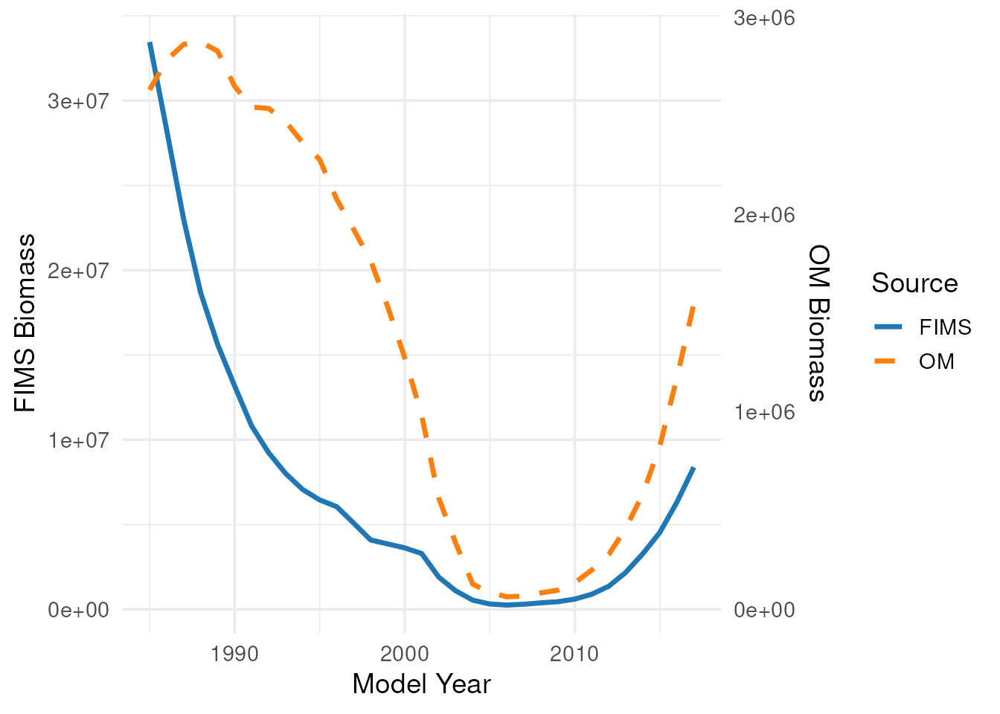
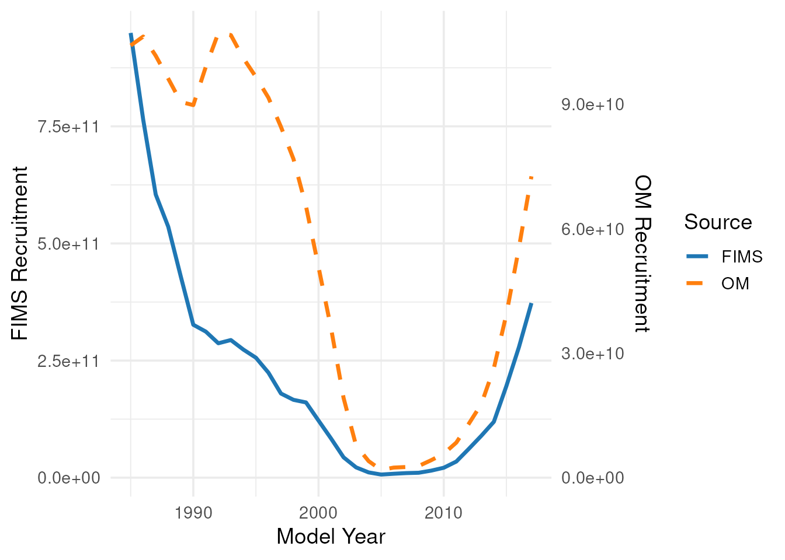
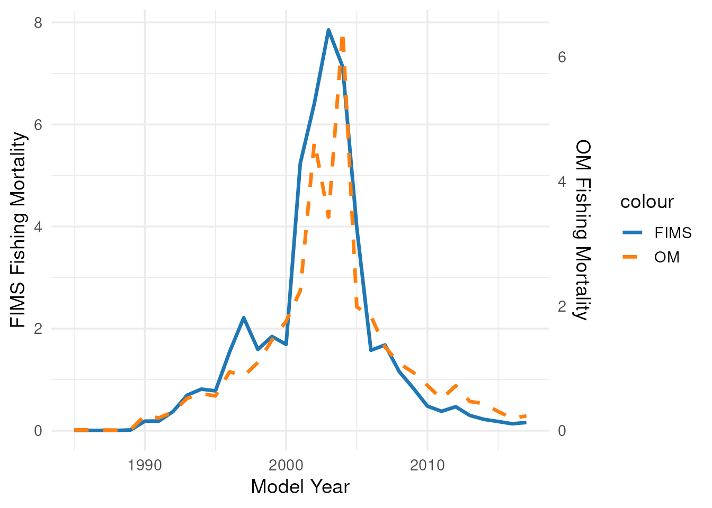

# From Ecopath with Ecosim to Fisheries Integrated Modeling System

## Introduction

Ecosystem-based fishery management (EBFM) is crucial for addressing the
complex, dynamic challenges posed by non-stationary climate, ecological,
and economic conditions. However, translating outputs from ecosystem
models into products suitable for fishery stock assessment models
remains a key challenge.

This vignette demonstrates an end-to-end simulation workflow implemented
in the {ecosystemom} package for linking ecosystem model outputs with
fisheries estimation models. The workflow includes functions to:

- [`load_model()`](../reference/load_model.md) — import and standardize
  output from ecosystem operating models (OM). For example, this
  function can be used to read and standardize Ecopath with Ecosim (EwE)
  Ecosim outputs for downstream analyses within {ecosystemom}.
- [`calc_truth()`](../reference/calc_truth.md) — extract “true”
  population quantities from the OM, including annual or monthly biomass
  trajectories and biomass-at-age.
- `sample_*()` — generate sampled observations from OM outputs for use
  in estimation models such as the Fisheries Integrated Modeling System
  (FIMS).
- [`create_dsem_inputs()`](../reference/create_dsem_inputs.md) — prepare
  environmental covariates or diet composition data from the OM to
  support candidate model specifications for dynamic structural equation
  models (DSEMs) and related ecosystem-informed analyses.

``` r

library(ecosystemom)
library(FIMS)
set.seed(1234)
```

## Load EwE Model Outputs

We begin by identifying and parsing raw comma-separated output matrices
exported from a baseline EwE model run of the Northwest Atlantic. The
critical target files extracted by {ecosystemom} include:

- basic_estimates.csv
- biomass_monthly.csv
- catch_monthly.csv
- diet_composition.csv
- mortality_monthly.csv
- weight_monthly.csv

## Get functional groups from the EwE model

``` r

# Locate package internal files
ewe_nwatlantic_path <- system.file(
  "extdata", "ewe_ecosim_base_nwatlantic",
  package = "ecosystemom"
)

model_years <- 1985:2017

# Load functional groups
functional_groups <- get_functional_groups(
  file_path = fs::path(ewe_nwatlantic_path, "basic_estimates.csv")
)

functional_groups |>
  scroll_table()
```

| functional_group     | species          | group | functional_group_snake_case |
|:---------------------|:-----------------|:------|:----------------------------|
| striped bass 0       | striped bass     | 0     | striped_bass_0              |
| striped bass 2-5     | striped bass     | 2-5   | striped_bass_2_5            |
| striped bass 6+      | striped bass     | 6+    | striped_bass_6_plus         |
| menhaden 0           | menhaden         | 0     | menhaden_0                  |
| menhaden 1           | menhaden         | 1     | menhaden_1                  |
| menhaden 2           | menhaden         | 2     | menhaden_2                  |
| menhaden 3           | menhaden         | 3     | menhaden_3                  |
| menhaden 4           | menhaden         | 4     | menhaden_4                  |
| menhaden 5           | menhaden         | 5     | menhaden_5                  |
| menhaden 6+          | menhaden         | 6+    | menhaden_6_plus             |
| spiny dogfish        | spiny dogfish    | NA    | spiny_dogfish               |
| bluefish juv         | bluefish         | juv   | bluefish_juv                |
| bluefish adult       | bluefish         | adult | bluefish_adult              |
| weakfish juv         | weakfish         | juv   | weakfish_juv                |
| weakfish adult       | weakfish         | adult | weakfish_adult              |
| Atlantic herring 0-1 | Atlantic herring | 0-1   | atlantic_herring_0_1        |
| Atlantic herring 2+  | Atlantic herring | 2+    | atlantic_herring_2_plus     |
| anchovies            | anchovies        | NA    | anchovies                   |
| benthos              | benthos          | NA    | benthos                     |
| zooplankton          | zooplankton      | NA    | zooplankton                 |
| phytoplankton        | phytoplankton    | NA    | phytoplankton               |
| Detritus             | Detritus         | NA    | detritus                    |

### Load EwE Ecosim model

``` r

# Load and standardize EwE outputs
data_om <- load_model(
  directory = ewe_nwatlantic_path,
  functional_groups = functional_groups,
  type = "ewe_ecosim",
  unit = c(
    "biomass" = "1e^6 mt",
    "catch" = "1e^6 mt",
    "landings" = "1e^6 mt",
    "total_mortality" = "year^-1",
    "weight" = "kg"
  )
)

data_om |>
  head(n = 10) |>
  dplyr::mutate(file_name = "./biomass_monthly.csv") |>
  scroll_table()
```

| file_name | type | year | month | functional_group | value | species | group | functional_group_snake_case | unit |
|:---|:---|---:|---:|:---|---:|:---|:---|:---|:---|
| ./biomass_monthly.csv | biomass | 1985 | 1 | striped bass 0 | 0.0084961 | striped bass | 0 | striped_bass_0 | 1e^6 mt |
| ./biomass_monthly.csv | biomass | 1985 | 1 | striped bass 2-5 | 0.0362939 | striped bass | 2-5 | striped_bass_2_5 | 1e^6 mt |
| ./biomass_monthly.csv | biomass | 1985 | 1 | striped bass 6+ | 0.0186583 | striped bass | 6+ | striped_bass_6_plus | 1e^6 mt |
| ./biomass_monthly.csv | biomass | 1985 | 1 | menhaden 0 | 0.2910449 | menhaden | 0 | menhaden_0 | 1e^6 mt |
| ./biomass_monthly.csv | biomass | 1985 | 1 | menhaden 1 | 0.9729747 | menhaden | 1 | menhaden_1 | 1e^6 mt |
| ./biomass_monthly.csv | biomass | 1985 | 1 | menhaden 2 | 0.7663768 | menhaden | 2 | menhaden_2 | 1e^6 mt |
| ./biomass_monthly.csv | biomass | 1985 | 1 | menhaden 3 | 0.3195014 | menhaden | 3 | menhaden_3 | 1e^6 mt |
| ./biomass_monthly.csv | biomass | 1985 | 1 | menhaden 4 | 0.1119810 | menhaden | 4 | menhaden_4 | 1e^6 mt |
| ./biomass_monthly.csv | biomass | 1985 | 1 | menhaden 5 | 0.0409002 | menhaden | 5 | menhaden_5 | 1e^6 mt |
| ./biomass_monthly.csv | biomass | 1985 | 1 | menhaden 6+ | 0.0314173 | menhaden | 6+ | menhaden_6_plus | 1e^6 mt |

``` r


data_om |> 
  dplyr::distinct(type, species) |>
  scroll_table()
```

| type              | species          |
|:------------------|:-----------------|
| biomass           | striped bass     |
| biomass           | menhaden         |
| biomass           | spiny dogfish    |
| biomass           | bluefish         |
| biomass           | weakfish         |
| biomass           | Atlantic herring |
| biomass           | anchovies        |
| biomass           | benthos          |
| biomass           | zooplankton      |
| biomass           | phytoplankton    |
| biomass           | Detritus         |
| catch             | striped bass     |
| catch             | menhaden         |
| catch             | spiny dogfish    |
| catch             | bluefish         |
| catch             | weakfish         |
| catch             | Atlantic herring |
| catch             | anchovies        |
| catch             | benthos          |
| catch             | zooplankton      |
| catch             | phytoplankton    |
| catch             | Detritus         |
| total_mortality   | striped bass     |
| total_mortality   | menhaden         |
| total_mortality   | spiny dogfish    |
| total_mortality   | bluefish         |
| total_mortality   | weakfish         |
| total_mortality   | Atlantic herring |
| total_mortality   | anchovies        |
| total_mortality   | benthos          |
| total_mortality   | zooplankton      |
| total_mortality   | phytoplankton    |
| total_mortality   | Detritus         |
| weight            | striped bass     |
| weight            | menhaden         |
| weight            | spiny dogfish    |
| weight            | bluefish         |
| weight            | weakfish         |
| weight            | Atlantic herring |
| weight            | anchovies        |
| weight            | benthos          |
| weight            | zooplankton      |
| weight            | phytoplankton    |
| weight            | Detritus         |
| fishing_mortality | striped bass     |
| fishing_mortality | menhaden         |
| fishing_mortality | spiny dogfish    |
| fishing_mortality | bluefish         |
| fishing_mortality | weakfish         |
| fishing_mortality | Atlantic herring |
| fishing_mortality | anchovies        |
| fishing_mortality | benthos          |
| fishing_mortality | zooplankton      |
| fishing_mortality | phytoplankton    |
| fishing_mortality | Detritus         |
| natural_mortality | striped bass     |
| natural_mortality | menhaden         |
| natural_mortality | spiny dogfish    |
| natural_mortality | bluefish         |
| natural_mortality | weakfish         |
| natural_mortality | Atlantic herring |
| natural_mortality | anchovies        |
| natural_mortality | benthos          |
| natural_mortality | zooplankton      |
| natural_mortality | phytoplankton    |
| natural_mortality | Detritus         |

## Extract “Truth” from the OM

Using [`calc_truth()`](../reference/calc_truth.md), we synthesize raw
EwE time series into a structured tibble. This “truth” represents the
true state of the ecosystem against which our estimation model will be
tested. For this demonstration, our focal species is “menhaden”. To
isolate a target stock assessment from the broader ecosystem web, we
subset a single focal species from the OM. In this vignette, we track
Atlantic Menhaden (Brevoortia tyrannus), a key forage fish species. We
extract “true” indices and age compositions using
[`calc_truth()`](../reference/calc_truth.md).

``` r

# Extract "true" values for menhaden
truth_om <- calc_truth(
  data = data_om,
  species_name = "menhaden"
)

truth_om |>
  dplyr::select(-truth_om) |>
  scroll_table()
```

| species_name | truth_label       | truth_type | truth_time_step |
|:-------------|:------------------|:-----------|:----------------|
| menhaden     | biomass           | index      | monthly         |
| menhaden     | biomass           | index      | yearly          |
| menhaden     | biomass           | agecomp    | monthly         |
| menhaden     | biomass           | agecomp    | yearly          |
| menhaden     | catch             | index      | monthly         |
| menhaden     | catch             | index      | yearly          |
| menhaden     | catch             | agecomp    | monthly         |
| menhaden     | catch             | agecomp    | yearly          |
| menhaden     | fishing_mortality | index      | monthly         |
| menhaden     | fishing_mortality | index      | yearly          |
| menhaden     | fishing_mortality | agecomp    | monthly         |
| menhaden     | fishing_mortality | agecomp    | yearly          |
| menhaden     | natural_mortality | agecomp    | monthly         |
| menhaden     | natural_mortality | agecomp    | yearly          |
| menhaden     | numbers           | index      | monthly         |
| menhaden     | numbers           | index      | yearly          |
| menhaden     | numbers           | agecomp    | monthly         |
| menhaden     | numbers           | agecomp    | yearly          |
| menhaden     | total_mortality   | agecomp    | monthly         |
| menhaden     | total_mortality   | agecomp    | yearly          |
| menhaden     | weight            | agecomp    | monthly         |
| menhaden     | weight            | agecomp    | yearly          |

``` r


# Extract and unnest annual catch
catch_index_om <- truth_om |> 
  dplyr::filter(
    truth_label == "catch",
    truth_type == "index",
    truth_time_step == "yearly"
  ) |> 
  tidyr::unnest(cols = c(truth_om)) |>
  dplyr::mutate(
    truth_value = truth_value * 1000000, 
    truth_unit = "mt"
  ) 
  
catch_index_om |>
  scroll_table()
```

| species_name | truth_label | truth_type | truth_time_step | truth_year | truth_unit | truth_value |
|:---|:---|:---|:---|---:|:---|---:|
| menhaden | catch | index | yearly | 1985 | mt | 16436.46 |
| menhaden | catch | index | yearly | 1986 | mt | 16565.34 |
| menhaden | catch | index | yearly | 1987 | mt | 15939.05 |
| menhaden | catch | index | yearly | 1988 | mt | 12596.12 |
| menhaden | catch | index | yearly | 1989 | mt | 25993.96 |
| menhaden | catch | index | yearly | 1990 | mt | 321014.86 |
| menhaden | catch | index | yearly | 1991 | mt | 258893.40 |
| menhaden | catch | index | yearly | 1992 | mt | 365211.37 |
| menhaden | catch | index | yearly | 1993 | mt | 600358.51 |
| menhaden | catch | index | yearly | 1994 | mt | 659307.57 |
| menhaden | catch | index | yearly | 1995 | mt | 604887.34 |
| menhaden | catch | index | yearly | 1996 | mt | 907276.10 |
| menhaden | catch | index | yearly | 1997 | mt | 771183.60 |
| menhaden | catch | index | yearly | 1998 | mt | 878034.15 |
| menhaden | catch | index | yearly | 1999 | mt | 981962.22 |
| menhaden | catch | index | yearly | 2000 | mt | 961678.94 |
| menhaden | catch | index | yearly | 2001 | mt | 926563.53 |
| menhaden | catch | index | yearly | 2002 | mt | 933937.94 |
| menhaden | catch | index | yearly | 2003 | mt | 435965.57 |
| menhaden | catch | index | yearly | 2004 | mt | 292324.12 |
| menhaden | catch | index | yearly | 2005 | mt | 66979.80 |
| menhaden | catch | index | yearly | 2006 | mt | 58767.23 |
| menhaden | catch | index | yearly | 2007 | mt | 36368.17 |
| menhaden | catch | index | yearly | 2008 | mt | 41439.10 |
| menhaden | catch | index | yearly | 2009 | mt | 42480.31 |
| menhaden | catch | index | yearly | 2010 | mt | 42963.63 |
| menhaden | catch | index | yearly | 2011 | mt | 47277.22 |
| menhaden | catch | index | yearly | 2012 | mt | 91043.37 |
| menhaden | catch | index | yearly | 2013 | mt | 87008.47 |
| menhaden | catch | index | yearly | 2014 | mt | 120764.99 |
| menhaden | catch | index | yearly | 2015 | mt | 119770.21 |
| menhaden | catch | index | yearly | 2016 | mt | 110616.90 |
| menhaden | catch | index | yearly | 2017 | mt | 175165.13 |

``` r


# Extract and unnest annual weight-at-age
weight_agecomp_om <- truth_om |>
  dplyr::filter(
    truth_label == "weight",
    truth_type == "agecomp",
    truth_time_step == "yearly"
  ) |> 
  tidyr::unnest(cols = c(truth_om)) |>
  dplyr::mutate(
    truth_value = truth_value / 1000,
    truth_unit = "mt"
  )

# Extract and unnest annual catch-at-age in numbers
catch_agecomp_om <- truth_om |> 
  dplyr::filter(
    truth_label == "catch",
    truth_type == "agecomp",
    truth_time_step == "yearly"
  ) |>
  tidyr::unnest(cols = c(truth_om)) |>
  dplyr::mutate(
    truth_value = truth_value * 1000000,
    truth_unit = "mt"
  ) |>
  dplyr::left_join(
    weight_agecomp_om |>
      dplyr::select(-species_name, -truth_label, -truth_type, -truth_time_step, -truth_unit), 
    by = c("truth_year", "truth_group"),
    suffix = c("_catch", "_weight")
  ) |>
  dplyr::mutate(
    truth_value = ceiling(truth_value_catch / truth_value_weight), 
    truth_unit = "numbers"
  ) |>
  dplyr::select(-truth_value_catch, -truth_value_weight)

# Extract and unnest annual biomass
biomass_index_om <- truth_om |>
  dplyr::filter(
    truth_label == "biomass",
    truth_type == "index",
    truth_time_step == "yearly"
  ) |> 
  tidyr::unnest(cols = c(truth_om)) |>
  dplyr::mutate(
    truth_value = truth_value * 1000000, 
    truth_unit = "mt"
  )

# Extract and unnest annual number-at-age
number_agecomp_om <- truth_om |>
  dplyr::filter(
    truth_label == "numbers",
    truth_type == "agecomp",
    truth_time_step == "yearly"
  ) |> 
  tidyr::unnest(cols = c(truth_om)) |>
  dplyr::mutate(
    truth_value = ceiling(truth_value * 1000000 * 1000),
    truth_unit = "numbers"
  )

# Extract and unnest annual natural mortality by age
natural_mortality_agecomp_om <- truth_om |>
  dplyr::filter(
    truth_label == "natural_mortality",
    truth_type == "agecomp",
    truth_time_step == "yearly"
  ) |> 
  tidyr::unnest(cols = c(truth_om))

# Extract and unnest annual fishing mortality by age
fishing_mortality_agecomp_om <- truth_om |>
  dplyr::filter(
    truth_label == "fishing_mortality",
    truth_type == "agecomp",
    truth_time_step == "yearly"
  ) |> 
  tidyr::unnest(cols = c(truth_om))

# Extract and unnest annual fishing mortality: apical F
fishing_mortality_index_om <- truth_om |>
  dplyr::filter(
    truth_label == "fishing_mortality",
    truth_type == "index",
    truth_time_step == "yearly"
  ) |>
  tidyr::unnest(cols = c(truth_om))
```

## Generate Sampled Data

To mimic observed fisheries data, sampled observations are generated
from the OM “truth” while incorporating observation error.

#### Fishery-Dependent Data

Observed catch data are simulated by applying lognormal observation
error to the “true” catch values with a standard deviation of 0.05. Age
composition data are generated using a multinomial sampling distribution
with an effective sample size of N=200.

``` r

catch_index_sd <- 0.05
catch_index_sampled <- catch_index_om |> 
  dplyr::mutate(
    sampled_value = sample_lognormal(
      x = truth_value, 
      sd = catch_index_sd
    )
  )

catch_index_sampled |>
  scroll_table()
```

| species_name | truth_label | truth_type | truth_time_step | truth_year | truth_unit | truth_value | sampled_value |
|:---|:---|:---|:---|---:|:---|---:|---:|
| menhaden | catch | index | yearly | 1985 | mt | 16436.46 | 15454.48 |
| menhaden | catch | index | yearly | 1986 | mt | 16565.34 | 16775.75 |
| menhaden | catch | index | yearly | 1987 | mt | 15939.05 | 16806.13 |
| menhaden | catch | index | yearly | 1988 | mt | 12596.12 | 11188.14 |
| menhaden | catch | index | yearly | 1989 | mt | 25993.96 | 26524.54 |
| menhaden | catch | index | yearly | 1990 | mt | 321014.86 | 328829.77 |
| menhaden | catch | index | yearly | 1991 | mt | 258893.40 | 251245.21 |
| menhaden | catch | index | yearly | 1992 | mt | 365211.37 | 354920.81 |
| menhaden | catch | index | yearly | 1993 | mt | 600358.51 | 582922.58 |
| menhaden | catch | index | yearly | 1994 | mt | 659307.57 | 629822.64 |
| menhaden | catch | index | yearly | 1995 | mt | 604887.34 | 589887.95 |
| menhaden | catch | index | yearly | 1996 | mt | 907276.10 | 862019.15 |
| menhaden | catch | index | yearly | 1997 | mt | 771183.60 | 740898.60 |
| menhaden | catch | index | yearly | 1998 | mt | 878034.15 | 879768.17 |
| menhaden | catch | index | yearly | 1999 | mt | 981962.22 | 1028932.91 |
| menhaden | catch | index | yearly | 2000 | mt | 961678.94 | 955195.83 |
| menhaden | catch | index | yearly | 2001 | mt | 926563.53 | 902060.99 |
| menhaden | catch | index | yearly | 2002 | mt | 933937.94 | 891227.94 |
| menhaden | catch | index | yearly | 2003 | mt | 435965.57 | 417571.04 |
| menhaden | catch | index | yearly | 2004 | mt | 292324.12 | 329443.53 |
| menhaden | catch | index | yearly | 2005 | mt | 66979.80 | 67346.13 |
| menhaden | catch | index | yearly | 2006 | mt | 58767.23 | 57271.33 |
| menhaden | catch | index | yearly | 2007 | mt | 36368.17 | 35531.40 |
| menhaden | catch | index | yearly | 2008 | mt | 41439.10 | 42349.40 |
| menhaden | catch | index | yearly | 2009 | mt | 42480.31 | 40980.84 |
| menhaden | catch | index | yearly | 2010 | mt | 42963.63 | 39912.67 |
| menhaden | catch | index | yearly | 2011 | mt | 47277.22 | 48594.79 |
| menhaden | catch | index | yearly | 2012 | mt | 91043.37 | 86392.70 |
| menhaden | catch | index | yearly | 2013 | mt | 87008.47 | 86834.03 |
| menhaden | catch | index | yearly | 2014 | mt | 120764.99 | 115099.74 |
| menhaden | catch | index | yearly | 2015 | mt | 119770.21 | 126398.53 |
| menhaden | catch | index | yearly | 2016 | mt | 110616.90 | 107882.56 |
| menhaden | catch | index | yearly | 2017 | mt | 175165.13 | 168849.39 |

``` r


catch_agecomp_sample_size <- 150
catch_agecomp_sampled <- catch_agecomp_om |> 
  dplyr::group_by(truth_year) |> 
  dplyr::mutate(
    sampled_value = sample_multinomial(
      x = truth_value,
      sample_size = catch_agecomp_sample_size
    )
  ) |> 
  dplyr::ungroup()
```

#### Fishery-Independent Survey Data

Fishery-independent survey observations are simulated by applying a
double-logistic selectivity and catchability coefficient (q) to the
“true” number-at-age matrix from the OM. Observed survey index is
simulated by applying lognormal observation error to the “true” values
with a standard deviation of 0.1. Age composition data are generated
using a multinomial sampling distribution with an effective sample size
of N=200.

``` r

ages <- 0:6
names(ages) <- functional_groups |>
  dplyr::filter(species == "menhaden") |>
  dplyr::pull(group)

# Define explicit survey catchability
catchability_survey <- 0.05
selectivity_inflection_point_asc <- 1.2
selectivity_slope_asc <- 2.1
selectivity_inflection_point_desc <- 3.8
selectivity_slope_desc <- 1.2
selectivity_ascending  <- 1 / (1 + exp(-selectivity_slope_asc * (ages - selectivity_inflection_point_asc)))
selectivity_descending <- 1 / (1 + exp(-selectivity_slope_desc * (ages - selectivity_inflection_point_desc)))
selectivity_survey   <- selectivity_ascending * (1 - selectivity_descending)
names(selectivity_survey) <- functional_groups |>
  dplyr::filter(species == "menhaden") |>
  dplyr::pull(group)

# Survey index
survey_data <- number_agecomp_om |>
  dplyr::left_join(
    weight_agecomp_om |>
      dplyr::select(-species_name, -truth_label, -truth_type, -truth_time_step, -truth_unit), 
    by = c("truth_year", "truth_group"),
    suffix = c("_number", "_weight")
  ) |>
  dplyr::mutate(
    selectivity = selectivity_survey[truth_group],
    truth_value_selected_number = ceiling(truth_value_number * selectivity * catchability_survey),
    truth_value_selected_biomass = truth_value_selected_number * truth_value_weight
  )

# Generate observed survey biomass indices with lognormal error (SD = 0.1)
survey_index_sd <- 0.1
survey_index_sampled <- survey_data |> 
  dplyr::select(
    -truth_value_number, -truth_value_weight, -selectivity, -truth_value_selected_number
  ) |>
  dplyr::mutate(
    truth_label = "biomass",
    truth_unit = "mt"
  ) |>
  # Aggregate all ages/groups into one annual value
  dplyr::group_by(truth_year) |>
  dplyr::summarise(
    truth_value = sum(truth_value_selected_biomass),
    .groups = "drop"
  ) |>
  dplyr::mutate(
    species_name = "menhaden",
    truth_label = "biomass",
    truth_type = "index",
    truth_time_step = "yearly",
    truth_unit = "mt"
  ) |>
  dplyr::mutate(
    sampled_value = sample_lognormal(
      x = truth_value, 
      sd = survey_index_sd
    )
  )

# Survey agecomp
survey_agecomp_sample_size <- 150
survey_agecomp_sampled <- survey_data |> 
  dplyr::group_by(truth_year) |> 
  dplyr::mutate(
    sampled_value = sample_multinomial(
      x = truth_value_selected_number,
      sample_size = survey_agecomp_sample_size
    )
  ) |> 
  dplyr::ungroup() |>
  dplyr::select(
    -truth_value_number, -truth_value_weight, -selectivity,
    -truth_value_selected_biomass
  ) |>
  dplyr::rename(truth_value = truth_value_selected_number)
```

## Prepare FIMS-compatible data

The sampled fishery-dependent and fishery-independent observations are
next reformatted into a `FIMSFrame` object for use with the FIMS. This
includes annual landings, survey biomass indices, age composition
observations, and weight-at-age information.

The resulting `FIMSFrame object` provides the standardized data
structure required for model configuration and estimation in FIMS.

Click to expand/collapse code

``` r

fishing_fleet_name <- "fishing_fleet"
survey_fleet_name <- "survey_fleet"

landings_data <- data.frame(
  type = "landings",
  name = fishing_fleet_name,
  age = NA, 
  timing = model_years,
  value = catch_index_sampled[["sampled_value"]],
  unit = "mt",
  uncertainty = catch_index_sd
)

index_data <- data.frame(
  type = "index",
  name = survey_fleet_name,
  age = NA,
  timing = model_years,
  value = survey_index_sampled[["sampled_value"]],
  unit = "mt",
  uncertainty = survey_index_sd
)

age_data <- rbind(
  data.frame(
    type = "age_comp",
    name = fishing_fleet_name,
    age = unname(ages[catch_agecomp_sampled[["truth_group"]]]),
    timing = catch_agecomp_sampled[["truth_year"]],
    value = catch_agecomp_sampled[["sampled_value"]],
    unit = "number",
    uncertainty = catch_agecomp_sample_size
  ),
  data.frame(
    type = "age_comp",
    name = survey_fleet_name,
    age = unname(ages[survey_agecomp_sampled[["truth_group"]]]),
    timing = survey_agecomp_sampled[["truth_year"]],
    value = survey_agecomp_sampled[["sampled_value"]],
    unit = "number",
    uncertainty = survey_agecomp_sample_size
  )
)

weight_at_age <- data.frame(
  type = "weight_at_age",
  name = fishing_fleet_name,
  age = unname(ages[weight_agecomp_om[["truth_group"]]]),
  timing = weight_agecomp_om[["truth_year"]],
  value = weight_agecomp_om[["truth_value"]],
  unit = "mt",
  uncertainty = NA
)

weight_year_plus <- weight_at_age |>
  dplyr::filter(timing == max(model_years)) |>
  dplyr::mutate(timing = timing + 1)

weight_at_age_data <- dplyr::bind_rows(
  weight_at_age, 
  weight_year_plus
)

data_fims <- rbind(landings_data, index_data, age_data, weight_at_age_data) |>
  dplyr::mutate(
    length = NA, 
    .after = "age"
  ) |>
  FIMS::FIMSFrame()

methods::show(data_fims)
#> # A tibble: 6 × 8
#>   type     name            age length timing value unit   uncertainty
#>   <chr>    <chr>         <int>  <dbl>  <dbl> <dbl> <chr>        <dbl>
#> 1 age_comp fishing_fleet     0     NA   1985    22 number         150
#> 2 age_comp fishing_fleet     1     NA   1985    49 number         150
#> 3 age_comp fishing_fleet     2     NA   1985    67 number         150
#> 4 age_comp fishing_fleet     3     NA   1985    12 number         150
#> 5 age_comp fishing_fleet     4     NA   1985     0 number         150
#> 6 age_comp fishing_fleet     5     NA   1985     0 number         150
#> additional slots include the following:fleets:
#> [1] "fishing_fleet" "survey_fleet" 
#> n_years:
#> [1] 33
#> ages:
#> [1] 0 1 2 3 4 5 6
#> n_ages:
#> [1] 7
#> lengths:
#> numeric(0)
#> n_lengths:
#> [1] 0
#> start_year:
#> [1] 1985
#> end_year:
#> [1] 2017
```

## Configure the FIMS estimation model

FIMS models are initialized using a set of default configurations and
parameter values derived from the input data. In this section, we
customize those defaults to better align the FIMS estimation model with
the underlying ecosystem OM.

Key modifications include:

- Replacing the default selectivity formulation with a double-logistic
  selectivity function for both the fishing fleet and survey fleet.
- Initializing fishing mortality, survey catchability, recruitment, and
  natural mortality parameters using values derived from the OM “truth”.
- Specifying maturity-at-age using a logistic maturity curve.
- Initializing numbers-at-age in the first model year directly from the
  OM population state.

These steps provide informed starting values that improve consistency
between the OM and the estimation model.

Click to expand/collapse code

``` r

# Generate default FIMS model configurations
default_configurations <- FIMS::create_default_configurations(
  data = data_fims
)

default_configurations |>
  tidyr::unnest(cols = data) |>
  scroll_table()
```

| model_family | module_name | fleet_name | module_type | distribution_type | distribution |
|:---|:---|:---|:---|:---|:---|
| catch_at_age | Data | fishing_fleet | AgeComp | Data | Dmultinom |
| catch_at_age | Data | fishing_fleet | Landings | Data | Dlnorm |
| catch_at_age | Selectivity | fishing_fleet | Logistic | NA | NA |
| catch_at_age | Data | survey_fleet | AgeComp | Data | Dmultinom |
| catch_at_age | Data | survey_fleet | Index | Data | Dlnorm |
| catch_at_age | Selectivity | survey_fleet | Logistic | NA | NA |
| catch_at_age | Growth | NA | EWAA | NA | NA |
| catch_at_age | Maturity | NA | Logistic | NA | NA |
| catch_at_age | Recruitment | NA | BevertonHolt | process | Dnorm |

``` r


# Replace the default selectivity model with a double-logistic function
updated_configurations <- default_configurations |>
  tidyr::unnest(cols = data) |>
  dplyr::rows_update(
    y = tibble::tibble(
      module_name = "Selectivity",
      module_type = "DoubleLogistic"
    ),
    by = c("module_name")
  )

updated_configurations |>
  scroll_table()
```

| model_family | module_name | fleet_name | module_type | distribution_type | distribution |
|:---|:---|:---|:---|:---|:---|
| catch_at_age | Data | fishing_fleet | AgeComp | Data | Dmultinom |
| catch_at_age | Data | fishing_fleet | Landings | Data | Dlnorm |
| catch_at_age | Selectivity | fishing_fleet | DoubleLogistic | NA | NA |
| catch_at_age | Data | survey_fleet | AgeComp | Data | Dmultinom |
| catch_at_age | Data | survey_fleet | Index | Data | Dlnorm |
| catch_at_age | Selectivity | survey_fleet | DoubleLogistic | NA | NA |
| catch_at_age | Growth | NA | EWAA | NA | NA |
| catch_at_age | Maturity | NA | Logistic | NA | NA |
| catch_at_age | Recruitment | NA | BevertonHolt | process | Dnorm |

``` r


# Create default parameter values from the updated model configuration
default_parameters <- FIMS::create_default_parameters(
  configurations = updated_configurations,
  data = data_fims
) |>
  tidyr::unnest(cols = data)

# Fishing fleet selectivity
# Option 1: Estimate selectivity from OM fishing mortality-at-age
# Mismatch note: the ecosystem model OM scales fishing selectivity (double 
# logistic) to a maximum of 1, where FIMS does not.
catch_selectivity <- estimate_true_selectivity(
  data = fishing_mortality_agecomp_om,
  ages = ages,
  functional_form = "double_logistic"
) |>
  dplyr::mutate(fleet_name = fishing_fleet_name)

# Option 2: Explicit fishing fleet selectivity parameter values
catch_selectivity_inflection_point_asc <- 1.8
catch_selectivity_slope_asc <- 3.1
catch_selectivity_inflection_point_desc <- 0.01
catch_selectivity_slope_desc <- 0.88

# Estimate maturity parameters
maturity_parameters <- estimate_true_maturity(
  ages = ages,
  spawning_proportion = c(0, 0.1, 0.5, 0.9, 1, 1, 1),
  functional_form = "logistic"
)

# Estimate recruitment log_sd
recruitment_ewe <- number_agecomp_om |>
  dplyr::filter(truth_group == "0") |>
  dplyr::pull(truth_value)

log_sd_proxy <- (sd(log(recruitment_ewe) - mean(log(recruitment_ewe)))) |>
  log()


# Update parameter values using OM-derived truth information
updated_parameters <- default_parameters |>
  # dplyr::filter(!(module_name == "Selectivity" & fleet_name == fishing_fleet_name)) |>
  # dplyr::bind_rows(catch_selectivity) |>
  dplyr::rows_update(
    y = tibble::tibble(
      fleet_name = fishing_fleet_name,
      label = c(
        "inflection_point_asc", "slope_asc", 
        "inflection_point_desc", "slope_desc"
      ),
      value = c(
        catch_selectivity_inflection_point_asc,
        catch_selectivity_slope_asc,
        catch_selectivity_inflection_point_desc,
        catch_selectivity_slope_desc
      )
    ),
    by = c("fleet_name", "label")
  ) |>
  dplyr::rows_update(
    y = tibble::tibble(
      fleet_name = fishing_fleet_name,
      label = "log_Fmort",
      time = fishing_mortality_index_om[["truth_year"]],
      value = fishing_mortality_index_om[["truth_value"]] |>
        log()
    ), 
    by = c("fleet_name", "label", "time")
  ) |> 
  dplyr::rows_update(
    y = tibble::tibble(
      fleet_name = survey_fleet_name,
      label = c(
        "inflection_point_asc", "slope_asc", 
        "inflection_point_desc", "slope_desc", 
        "log_q"
      ),
      value = c(
        selectivity_inflection_point_asc,
        selectivity_slope_asc,
        selectivity_inflection_point_desc,
        selectivity_slope_desc,
        log(catchability_survey)
      )
    ),
    by = c("fleet_name", "label")
  ) |>
  dplyr::rows_update(
    y = tibble::tibble(
      label = "log_rzero", 
      module_type = "BevertonHolt",
      value = number_agecomp_om |>
        dplyr::filter(truth_group == "0") |>
        dplyr::pull(truth_value) |>
        (\(x) mean(log(x)))()
        # dplyr::filter(truth_group  == "0", truth_year == model_years[1]) |>
        # dplyr::pull(truth_value) |>
        # log()
    ),
    by = c("label", "module_type")
  ) |>
  dplyr::rows_update(
    y = tibble::tibble(
      label = "logit_steep", 
      module_type = "BevertonHolt",
      # calculate from vulnerability matrix: v / (v + 1)
      # v = 411.23 + 1.02 + 191.58 + 2 + 1016.36 + 12.18 + 2 + 403.26 = 2039.63
      # h = v / (v + 1) = 0.99
      value = -log(1.0 - 0.99) + log(0.99 - 0.2)
    ),
    by = c("label", "module_type")
  ) |>
  dplyr::rows_update(
    y = tibble::tibble(
      label = "log_sd",
      module_type = "BevertonHolt",
      value = log_sd_proxy,
      estimation_type = "constant"
    ),
    by = c("label", "module_type")
  ) |>
  dplyr::filter(!(module_name == "Maturity")) |>
  dplyr::bind_rows(maturity_parameters) |>
  dplyr::rows_update(
    y = tibble::tibble(
      label = "log_M", 
      age = unname(ages[natural_mortality_agecomp_om[["truth_group"]]]),
      time = natural_mortality_agecomp_om[["truth_year"]],
      value = log(natural_mortality_agecomp_om[["truth_value"]])
    ),
    by = c("label", "age", "time")
  ) |>
  dplyr::rows_update(
    y = tibble::tibble(
      label = "log_init_naa",
      age = number_agecomp_om |>
        dplyr::filter(truth_year == model_years[1]) |>
        dplyr::pull(truth_group) |>
        (\(x) unname(ages[x]))(),
      value = number_agecomp_om |>
        dplyr::filter(truth_year == model_years[1]) |>
        dplyr::pull(truth_value) |>
        log()
    ),
    by = c("label", "age")
  )

# Display updated parameter table
updated_parameters |>
  scroll_table()
```

| model_family | module_name | fleet_name | module_type | label | age | length | time | value | estimation_type | distribution_type | distribution |
|:---|:---|:---|:---|:---|---:|---:|---:|---:|:---|:---|:---|
| catch_at_age | Selectivity | fishing_fleet | DoubleLogistic | inflection_point_asc | NA | NA | NA | 1.8000000 | fixed_effects | NA | NA |
| catch_at_age | Selectivity | fishing_fleet | DoubleLogistic | slope_asc | NA | NA | NA | 3.1000000 | fixed_effects | NA | NA |
| catch_at_age | Selectivity | fishing_fleet | DoubleLogistic | inflection_point_desc | NA | NA | NA | 0.0100000 | fixed_effects | NA | NA |
| catch_at_age | Selectivity | fishing_fleet | DoubleLogistic | slope_desc | NA | NA | NA | 0.8800000 | fixed_effects | NA | NA |
| catch_at_age | Fleet | fishing_fleet | NA | log_q | NA | NA | NA | 0.0000000 | constant | NA | NA |
| catch_at_age | Fleet | fishing_fleet | NA | log_Fmort | NA | NA | 1985 | -4.3883506 | fixed_effects | NA | NA |
| catch_at_age | Fleet | fishing_fleet | NA | log_Fmort | NA | NA | 1986 | -4.4365488 | fixed_effects | NA | NA |
| catch_at_age | Fleet | fishing_fleet | NA | log_Fmort | NA | NA | 1987 | -4.5062927 | fixed_effects | NA | NA |
| catch_at_age | Fleet | fishing_fleet | NA | log_Fmort | NA | NA | 1988 | -4.7597733 | fixed_effects | NA | NA |
| catch_at_age | Fleet | fishing_fleet | NA | log_Fmort | NA | NA | 1989 | -4.0244071 | fixed_effects | NA | NA |
| catch_at_age | Fleet | fishing_fleet | NA | log_Fmort | NA | NA | 1990 | -1.4276610 | fixed_effects | NA | NA |
| catch_at_age | Fleet | fishing_fleet | NA | log_Fmort | NA | NA | 1991 | -1.5789096 | fixed_effects | NA | NA |
| catch_at_age | Fleet | fishing_fleet | NA | log_Fmort | NA | NA | 1992 | -1.2008085 | fixed_effects | NA | NA |
| catch_at_age | Fleet | fishing_fleet | NA | log_Fmort | NA | NA | 1993 | -0.6559324 | fixed_effects | NA | NA |
| catch_at_age | Fleet | fishing_fleet | NA | log_Fmort | NA | NA | 1994 | -0.5195762 | fixed_effects | NA | NA |
| catch_at_age | Fleet | fishing_fleet | NA | log_Fmort | NA | NA | 1995 | -0.5837083 | fixed_effects | NA | NA |
| catch_at_age | Fleet | fishing_fleet | NA | log_Fmort | NA | NA | 1996 | -0.0562434 | fixed_effects | NA | NA |
| catch_at_age | Fleet | fishing_fleet | NA | log_Fmort | NA | NA | 1997 | -0.1307473 | fixed_effects | NA | NA |
| catch_at_age | Fleet | fishing_fleet | NA | log_Fmort | NA | NA | 1998 | 0.0898828 | fixed_effects | NA | NA |
| catch_at_age | Fleet | fishing_fleet | NA | log_Fmort | NA | NA | 1999 | 0.3755226 | fixed_effects | NA | NA |
| catch_at_age | Fleet | fishing_fleet | NA | log_Fmort | NA | NA | 2000 | 0.5622899 | fixed_effects | NA | NA |
| catch_at_age | Fleet | fishing_fleet | NA | log_Fmort | NA | NA | 2001 | 0.8092934 | fixed_effects | NA | NA |
| catch_at_age | Fleet | fishing_fleet | NA | log_Fmort | NA | NA | 2002 | 1.5348651 | fixed_effects | NA | NA |
| catch_at_age | Fleet | fishing_fleet | NA | log_Fmort | NA | NA | 2003 | 1.2316391 | fixed_effects | NA | NA |
| catch_at_age | Fleet | fishing_fleet | NA | log_Fmort | NA | NA | 2004 | 1.8614121 | fixed_effects | NA | NA |
| catch_at_age | Fleet | fishing_fleet | NA | log_Fmort | NA | NA | 2005 | 0.6861542 | fixed_effects | NA | NA |
| catch_at_age | Fleet | fishing_fleet | NA | log_Fmort | NA | NA | 2006 | 0.6069573 | fixed_effects | NA | NA |
| catch_at_age | Fleet | fishing_fleet | NA | log_Fmort | NA | NA | 2007 | 0.2939806 | fixed_effects | NA | NA |
| catch_at_age | Fleet | fishing_fleet | NA | log_Fmort | NA | NA | 2008 | 0.0769286 | fixed_effects | NA | NA |
| catch_at_age | Fleet | fishing_fleet | NA | log_Fmort | NA | NA | 2009 | -0.0688433 | fixed_effects | NA | NA |
| catch_at_age | Fleet | fishing_fleet | NA | log_Fmort | NA | NA | 2010 | -0.3206130 | fixed_effects | NA | NA |
| catch_at_age | Fleet | fishing_fleet | NA | log_Fmort | NA | NA | 2011 | -0.6751821 | fixed_effects | NA | NA |
| catch_at_age | Fleet | fishing_fleet | NA | log_Fmort | NA | NA | 2012 | -0.3278062 | fixed_effects | NA | NA |
| catch_at_age | Fleet | fishing_fleet | NA | log_Fmort | NA | NA | 2013 | -0.7579312 | fixed_effects | NA | NA |
| catch_at_age | Fleet | fishing_fleet | NA | log_Fmort | NA | NA | 2014 | -0.8353783 | fixed_effects | NA | NA |
| catch_at_age | Fleet | fishing_fleet | NA | log_Fmort | NA | NA | 2015 | -1.1794289 | fixed_effects | NA | NA |
| catch_at_age | Fleet | fishing_fleet | NA | log_Fmort | NA | NA | 2016 | -1.6155008 | fixed_effects | NA | NA |
| catch_at_age | Fleet | fishing_fleet | NA | log_Fmort | NA | NA | 2017 | -1.4445852 | fixed_effects | NA | NA |
| catch_at_age | Data | fishing_fleet | Landings | log_sd | NA | NA | 1985 | -2.9957323 | constant | Data | Dlnorm |
| catch_at_age | Data | fishing_fleet | Landings | log_sd | NA | NA | 1986 | -2.9957323 | constant | Data | Dlnorm |
| catch_at_age | Data | fishing_fleet | Landings | log_sd | NA | NA | 1987 | -2.9957323 | constant | Data | Dlnorm |
| catch_at_age | Data | fishing_fleet | Landings | log_sd | NA | NA | 1988 | -2.9957323 | constant | Data | Dlnorm |
| catch_at_age | Data | fishing_fleet | Landings | log_sd | NA | NA | 1989 | -2.9957323 | constant | Data | Dlnorm |
| catch_at_age | Data | fishing_fleet | Landings | log_sd | NA | NA | 1990 | -2.9957323 | constant | Data | Dlnorm |
| catch_at_age | Data | fishing_fleet | Landings | log_sd | NA | NA | 1991 | -2.9957323 | constant | Data | Dlnorm |
| catch_at_age | Data | fishing_fleet | Landings | log_sd | NA | NA | 1992 | -2.9957323 | constant | Data | Dlnorm |
| catch_at_age | Data | fishing_fleet | Landings | log_sd | NA | NA | 1993 | -2.9957323 | constant | Data | Dlnorm |
| catch_at_age | Data | fishing_fleet | Landings | log_sd | NA | NA | 1994 | -2.9957323 | constant | Data | Dlnorm |
| catch_at_age | Data | fishing_fleet | Landings | log_sd | NA | NA | 1995 | -2.9957323 | constant | Data | Dlnorm |
| catch_at_age | Data | fishing_fleet | Landings | log_sd | NA | NA | 1996 | -2.9957323 | constant | Data | Dlnorm |
| catch_at_age | Data | fishing_fleet | Landings | log_sd | NA | NA | 1997 | -2.9957323 | constant | Data | Dlnorm |
| catch_at_age | Data | fishing_fleet | Landings | log_sd | NA | NA | 1998 | -2.9957323 | constant | Data | Dlnorm |
| catch_at_age | Data | fishing_fleet | Landings | log_sd | NA | NA | 1999 | -2.9957323 | constant | Data | Dlnorm |
| catch_at_age | Data | fishing_fleet | Landings | log_sd | NA | NA | 2000 | -2.9957323 | constant | Data | Dlnorm |
| catch_at_age | Data | fishing_fleet | Landings | log_sd | NA | NA | 2001 | -2.9957323 | constant | Data | Dlnorm |
| catch_at_age | Data | fishing_fleet | Landings | log_sd | NA | NA | 2002 | -2.9957323 | constant | Data | Dlnorm |
| catch_at_age | Data | fishing_fleet | Landings | log_sd | NA | NA | 2003 | -2.9957323 | constant | Data | Dlnorm |
| catch_at_age | Data | fishing_fleet | Landings | log_sd | NA | NA | 2004 | -2.9957323 | constant | Data | Dlnorm |
| catch_at_age | Data | fishing_fleet | Landings | log_sd | NA | NA | 2005 | -2.9957323 | constant | Data | Dlnorm |
| catch_at_age | Data | fishing_fleet | Landings | log_sd | NA | NA | 2006 | -2.9957323 | constant | Data | Dlnorm |
| catch_at_age | Data | fishing_fleet | Landings | log_sd | NA | NA | 2007 | -2.9957323 | constant | Data | Dlnorm |
| catch_at_age | Data | fishing_fleet | Landings | log_sd | NA | NA | 2008 | -2.9957323 | constant | Data | Dlnorm |
| catch_at_age | Data | fishing_fleet | Landings | log_sd | NA | NA | 2009 | -2.9957323 | constant | Data | Dlnorm |
| catch_at_age | Data | fishing_fleet | Landings | log_sd | NA | NA | 2010 | -2.9957323 | constant | Data | Dlnorm |
| catch_at_age | Data | fishing_fleet | Landings | log_sd | NA | NA | 2011 | -2.9957323 | constant | Data | Dlnorm |
| catch_at_age | Data | fishing_fleet | Landings | log_sd | NA | NA | 2012 | -2.9957323 | constant | Data | Dlnorm |
| catch_at_age | Data | fishing_fleet | Landings | log_sd | NA | NA | 2013 | -2.9957323 | constant | Data | Dlnorm |
| catch_at_age | Data | fishing_fleet | Landings | log_sd | NA | NA | 2014 | -2.9957323 | constant | Data | Dlnorm |
| catch_at_age | Data | fishing_fleet | Landings | log_sd | NA | NA | 2015 | -2.9957323 | constant | Data | Dlnorm |
| catch_at_age | Data | fishing_fleet | Landings | log_sd | NA | NA | 2016 | -2.9957323 | constant | Data | Dlnorm |
| catch_at_age | Data | fishing_fleet | Landings | log_sd | NA | NA | 2017 | -2.9957323 | constant | Data | Dlnorm |
| catch_at_age | Data | fishing_fleet | AgeComp | NA | NA | NA | NA | NA | NA | Data | Dmultinom |
| catch_at_age | Selectivity | survey_fleet | DoubleLogistic | inflection_point_asc | NA | NA | NA | 1.2000000 | fixed_effects | NA | NA |
| catch_at_age | Selectivity | survey_fleet | DoubleLogistic | slope_asc | NA | NA | NA | 2.1000000 | fixed_effects | NA | NA |
| catch_at_age | Selectivity | survey_fleet | DoubleLogistic | inflection_point_desc | NA | NA | NA | 3.8000000 | fixed_effects | NA | NA |
| catch_at_age | Selectivity | survey_fleet | DoubleLogistic | slope_desc | NA | NA | NA | 1.2000000 | fixed_effects | NA | NA |
| catch_at_age | Fleet | survey_fleet | NA | log_q | NA | NA | NA | -2.9957323 | fixed_effects | NA | NA |
| catch_at_age | Fleet | survey_fleet | NA | log_Fmort | NA | NA | 1985 | -200.0000000 | constant | NA | NA |
| catch_at_age | Fleet | survey_fleet | NA | log_Fmort | NA | NA | 1986 | -200.0000000 | constant | NA | NA |
| catch_at_age | Fleet | survey_fleet | NA | log_Fmort | NA | NA | 1987 | -200.0000000 | constant | NA | NA |
| catch_at_age | Fleet | survey_fleet | NA | log_Fmort | NA | NA | 1988 | -200.0000000 | constant | NA | NA |
| catch_at_age | Fleet | survey_fleet | NA | log_Fmort | NA | NA | 1989 | -200.0000000 | constant | NA | NA |
| catch_at_age | Fleet | survey_fleet | NA | log_Fmort | NA | NA | 1990 | -200.0000000 | constant | NA | NA |
| catch_at_age | Fleet | survey_fleet | NA | log_Fmort | NA | NA | 1991 | -200.0000000 | constant | NA | NA |
| catch_at_age | Fleet | survey_fleet | NA | log_Fmort | NA | NA | 1992 | -200.0000000 | constant | NA | NA |
| catch_at_age | Fleet | survey_fleet | NA | log_Fmort | NA | NA | 1993 | -200.0000000 | constant | NA | NA |
| catch_at_age | Fleet | survey_fleet | NA | log_Fmort | NA | NA | 1994 | -200.0000000 | constant | NA | NA |
| catch_at_age | Fleet | survey_fleet | NA | log_Fmort | NA | NA | 1995 | -200.0000000 | constant | NA | NA |
| catch_at_age | Fleet | survey_fleet | NA | log_Fmort | NA | NA | 1996 | -200.0000000 | constant | NA | NA |
| catch_at_age | Fleet | survey_fleet | NA | log_Fmort | NA | NA | 1997 | -200.0000000 | constant | NA | NA |
| catch_at_age | Fleet | survey_fleet | NA | log_Fmort | NA | NA | 1998 | -200.0000000 | constant | NA | NA |
| catch_at_age | Fleet | survey_fleet | NA | log_Fmort | NA | NA | 1999 | -200.0000000 | constant | NA | NA |
| catch_at_age | Fleet | survey_fleet | NA | log_Fmort | NA | NA | 2000 | -200.0000000 | constant | NA | NA |
| catch_at_age | Fleet | survey_fleet | NA | log_Fmort | NA | NA | 2001 | -200.0000000 | constant | NA | NA |
| catch_at_age | Fleet | survey_fleet | NA | log_Fmort | NA | NA | 2002 | -200.0000000 | constant | NA | NA |
| catch_at_age | Fleet | survey_fleet | NA | log_Fmort | NA | NA | 2003 | -200.0000000 | constant | NA | NA |
| catch_at_age | Fleet | survey_fleet | NA | log_Fmort | NA | NA | 2004 | -200.0000000 | constant | NA | NA |
| catch_at_age | Fleet | survey_fleet | NA | log_Fmort | NA | NA | 2005 | -200.0000000 | constant | NA | NA |
| catch_at_age | Fleet | survey_fleet | NA | log_Fmort | NA | NA | 2006 | -200.0000000 | constant | NA | NA |
| catch_at_age | Fleet | survey_fleet | NA | log_Fmort | NA | NA | 2007 | -200.0000000 | constant | NA | NA |
| catch_at_age | Fleet | survey_fleet | NA | log_Fmort | NA | NA | 2008 | -200.0000000 | constant | NA | NA |
| catch_at_age | Fleet | survey_fleet | NA | log_Fmort | NA | NA | 2009 | -200.0000000 | constant | NA | NA |
| catch_at_age | Fleet | survey_fleet | NA | log_Fmort | NA | NA | 2010 | -200.0000000 | constant | NA | NA |
| catch_at_age | Fleet | survey_fleet | NA | log_Fmort | NA | NA | 2011 | -200.0000000 | constant | NA | NA |
| catch_at_age | Fleet | survey_fleet | NA | log_Fmort | NA | NA | 2012 | -200.0000000 | constant | NA | NA |
| catch_at_age | Fleet | survey_fleet | NA | log_Fmort | NA | NA | 2013 | -200.0000000 | constant | NA | NA |
| catch_at_age | Fleet | survey_fleet | NA | log_Fmort | NA | NA | 2014 | -200.0000000 | constant | NA | NA |
| catch_at_age | Fleet | survey_fleet | NA | log_Fmort | NA | NA | 2015 | -200.0000000 | constant | NA | NA |
| catch_at_age | Fleet | survey_fleet | NA | log_Fmort | NA | NA | 2016 | -200.0000000 | constant | NA | NA |
| catch_at_age | Fleet | survey_fleet | NA | log_Fmort | NA | NA | 2017 | -200.0000000 | constant | NA | NA |
| catch_at_age | Data | survey_fleet | Index | log_sd | NA | NA | 1985 | -2.3025851 | constant | Data | Dlnorm |
| catch_at_age | Data | survey_fleet | Index | log_sd | NA | NA | 1986 | -2.3025851 | constant | Data | Dlnorm |
| catch_at_age | Data | survey_fleet | Index | log_sd | NA | NA | 1987 | -2.3025851 | constant | Data | Dlnorm |
| catch_at_age | Data | survey_fleet | Index | log_sd | NA | NA | 1988 | -2.3025851 | constant | Data | Dlnorm |
| catch_at_age | Data | survey_fleet | Index | log_sd | NA | NA | 1989 | -2.3025851 | constant | Data | Dlnorm |
| catch_at_age | Data | survey_fleet | Index | log_sd | NA | NA | 1990 | -2.3025851 | constant | Data | Dlnorm |
| catch_at_age | Data | survey_fleet | Index | log_sd | NA | NA | 1991 | -2.3025851 | constant | Data | Dlnorm |
| catch_at_age | Data | survey_fleet | Index | log_sd | NA | NA | 1992 | -2.3025851 | constant | Data | Dlnorm |
| catch_at_age | Data | survey_fleet | Index | log_sd | NA | NA | 1993 | -2.3025851 | constant | Data | Dlnorm |
| catch_at_age | Data | survey_fleet | Index | log_sd | NA | NA | 1994 | -2.3025851 | constant | Data | Dlnorm |
| catch_at_age | Data | survey_fleet | Index | log_sd | NA | NA | 1995 | -2.3025851 | constant | Data | Dlnorm |
| catch_at_age | Data | survey_fleet | Index | log_sd | NA | NA | 1996 | -2.3025851 | constant | Data | Dlnorm |
| catch_at_age | Data | survey_fleet | Index | log_sd | NA | NA | 1997 | -2.3025851 | constant | Data | Dlnorm |
| catch_at_age | Data | survey_fleet | Index | log_sd | NA | NA | 1998 | -2.3025851 | constant | Data | Dlnorm |
| catch_at_age | Data | survey_fleet | Index | log_sd | NA | NA | 1999 | -2.3025851 | constant | Data | Dlnorm |
| catch_at_age | Data | survey_fleet | Index | log_sd | NA | NA | 2000 | -2.3025851 | constant | Data | Dlnorm |
| catch_at_age | Data | survey_fleet | Index | log_sd | NA | NA | 2001 | -2.3025851 | constant | Data | Dlnorm |
| catch_at_age | Data | survey_fleet | Index | log_sd | NA | NA | 2002 | -2.3025851 | constant | Data | Dlnorm |
| catch_at_age | Data | survey_fleet | Index | log_sd | NA | NA | 2003 | -2.3025851 | constant | Data | Dlnorm |
| catch_at_age | Data | survey_fleet | Index | log_sd | NA | NA | 2004 | -2.3025851 | constant | Data | Dlnorm |
| catch_at_age | Data | survey_fleet | Index | log_sd | NA | NA | 2005 | -2.3025851 | constant | Data | Dlnorm |
| catch_at_age | Data | survey_fleet | Index | log_sd | NA | NA | 2006 | -2.3025851 | constant | Data | Dlnorm |
| catch_at_age | Data | survey_fleet | Index | log_sd | NA | NA | 2007 | -2.3025851 | constant | Data | Dlnorm |
| catch_at_age | Data | survey_fleet | Index | log_sd | NA | NA | 2008 | -2.3025851 | constant | Data | Dlnorm |
| catch_at_age | Data | survey_fleet | Index | log_sd | NA | NA | 2009 | -2.3025851 | constant | Data | Dlnorm |
| catch_at_age | Data | survey_fleet | Index | log_sd | NA | NA | 2010 | -2.3025851 | constant | Data | Dlnorm |
| catch_at_age | Data | survey_fleet | Index | log_sd | NA | NA | 2011 | -2.3025851 | constant | Data | Dlnorm |
| catch_at_age | Data | survey_fleet | Index | log_sd | NA | NA | 2012 | -2.3025851 | constant | Data | Dlnorm |
| catch_at_age | Data | survey_fleet | Index | log_sd | NA | NA | 2013 | -2.3025851 | constant | Data | Dlnorm |
| catch_at_age | Data | survey_fleet | Index | log_sd | NA | NA | 2014 | -2.3025851 | constant | Data | Dlnorm |
| catch_at_age | Data | survey_fleet | Index | log_sd | NA | NA | 2015 | -2.3025851 | constant | Data | Dlnorm |
| catch_at_age | Data | survey_fleet | Index | log_sd | NA | NA | 2016 | -2.3025851 | constant | Data | Dlnorm |
| catch_at_age | Data | survey_fleet | Index | log_sd | NA | NA | 2017 | -2.3025851 | constant | Data | Dlnorm |
| catch_at_age | Data | survey_fleet | AgeComp | NA | NA | NA | NA | NA | NA | Data | Dmultinom |
| catch_at_age | Recruitment | NA | BevertonHolt | log_rzero | NA | NA | NA | 24.1027090 | fixed_effects | NA | NA |
| catch_at_age | Recruitment | NA | BevertonHolt | logit_steep | NA | NA | NA | 4.3694479 | constant | NA | NA |
| catch_at_age | Recruitment | NA | BevertonHolt | log_devs | NA | NA | 1986 | 0.0000000 | random_effects | process | Dnorm |
| catch_at_age | Recruitment | NA | BevertonHolt | log_devs | NA | NA | 1987 | 0.0000000 | random_effects | process | Dnorm |
| catch_at_age | Recruitment | NA | BevertonHolt | log_devs | NA | NA | 1988 | 0.0000000 | random_effects | process | Dnorm |
| catch_at_age | Recruitment | NA | BevertonHolt | log_devs | NA | NA | 1989 | 0.0000000 | random_effects | process | Dnorm |
| catch_at_age | Recruitment | NA | BevertonHolt | log_devs | NA | NA | 1990 | 0.0000000 | random_effects | process | Dnorm |
| catch_at_age | Recruitment | NA | BevertonHolt | log_devs | NA | NA | 1991 | 0.0000000 | random_effects | process | Dnorm |
| catch_at_age | Recruitment | NA | BevertonHolt | log_devs | NA | NA | 1992 | 0.0000000 | random_effects | process | Dnorm |
| catch_at_age | Recruitment | NA | BevertonHolt | log_devs | NA | NA | 1993 | 0.0000000 | random_effects | process | Dnorm |
| catch_at_age | Recruitment | NA | BevertonHolt | log_devs | NA | NA | 1994 | 0.0000000 | random_effects | process | Dnorm |
| catch_at_age | Recruitment | NA | BevertonHolt | log_devs | NA | NA | 1995 | 0.0000000 | random_effects | process | Dnorm |
| catch_at_age | Recruitment | NA | BevertonHolt | log_devs | NA | NA | 1996 | 0.0000000 | random_effects | process | Dnorm |
| catch_at_age | Recruitment | NA | BevertonHolt | log_devs | NA | NA | 1997 | 0.0000000 | random_effects | process | Dnorm |
| catch_at_age | Recruitment | NA | BevertonHolt | log_devs | NA | NA | 1998 | 0.0000000 | random_effects | process | Dnorm |
| catch_at_age | Recruitment | NA | BevertonHolt | log_devs | NA | NA | 1999 | 0.0000000 | random_effects | process | Dnorm |
| catch_at_age | Recruitment | NA | BevertonHolt | log_devs | NA | NA | 2000 | 0.0000000 | random_effects | process | Dnorm |
| catch_at_age | Recruitment | NA | BevertonHolt | log_devs | NA | NA | 2001 | 0.0000000 | random_effects | process | Dnorm |
| catch_at_age | Recruitment | NA | BevertonHolt | log_devs | NA | NA | 2002 | 0.0000000 | random_effects | process | Dnorm |
| catch_at_age | Recruitment | NA | BevertonHolt | log_devs | NA | NA | 2003 | 0.0000000 | random_effects | process | Dnorm |
| catch_at_age | Recruitment | NA | BevertonHolt | log_devs | NA | NA | 2004 | 0.0000000 | random_effects | process | Dnorm |
| catch_at_age | Recruitment | NA | BevertonHolt | log_devs | NA | NA | 2005 | 0.0000000 | random_effects | process | Dnorm |
| catch_at_age | Recruitment | NA | BevertonHolt | log_devs | NA | NA | 2006 | 0.0000000 | random_effects | process | Dnorm |
| catch_at_age | Recruitment | NA | BevertonHolt | log_devs | NA | NA | 2007 | 0.0000000 | random_effects | process | Dnorm |
| catch_at_age | Recruitment | NA | BevertonHolt | log_devs | NA | NA | 2008 | 0.0000000 | random_effects | process | Dnorm |
| catch_at_age | Recruitment | NA | BevertonHolt | log_devs | NA | NA | 2009 | 0.0000000 | random_effects | process | Dnorm |
| catch_at_age | Recruitment | NA | BevertonHolt | log_devs | NA | NA | 2010 | 0.0000000 | random_effects | process | Dnorm |
| catch_at_age | Recruitment | NA | BevertonHolt | log_devs | NA | NA | 2011 | 0.0000000 | random_effects | process | Dnorm |
| catch_at_age | Recruitment | NA | BevertonHolt | log_devs | NA | NA | 2012 | 0.0000000 | random_effects | process | Dnorm |
| catch_at_age | Recruitment | NA | BevertonHolt | log_devs | NA | NA | 2013 | 0.0000000 | random_effects | process | Dnorm |
| catch_at_age | Recruitment | NA | BevertonHolt | log_devs | NA | NA | 2014 | 0.0000000 | random_effects | process | Dnorm |
| catch_at_age | Recruitment | NA | BevertonHolt | log_devs | NA | NA | 2015 | 0.0000000 | random_effects | process | Dnorm |
| catch_at_age | Recruitment | NA | BevertonHolt | log_devs | NA | NA | 2016 | 0.0000000 | random_effects | process | Dnorm |
| catch_at_age | Recruitment | NA | BevertonHolt | log_devs | NA | NA | 2017 | 0.0000000 | random_effects | process | Dnorm |
| catch_at_age | Recruitment | NA | BevertonHolt | log_sd | NA | NA | NA | 0.3322577 | constant | process | Dnorm |
| catch_at_age | Population | NA | NA | log_M | 0 | NA | 1985 | 0.5510554 | constant | NA | NA |
| catch_at_age | Population | NA | NA | log_M | 1 | NA | 1985 | 0.2578511 | constant | NA | NA |
| catch_at_age | Population | NA | NA | log_M | 2 | NA | 1985 | 0.2345560 | constant | NA | NA |
| catch_at_age | Population | NA | NA | log_M | 3 | NA | 1985 | 0.3162692 | constant | NA | NA |
| catch_at_age | Population | NA | NA | log_M | 4 | NA | 1985 | -0.0214885 | constant | NA | NA |
| catch_at_age | Population | NA | NA | log_M | 5 | NA | 1985 | -0.0588443 | constant | NA | NA |
| catch_at_age | Population | NA | NA | log_M | 6 | NA | 1985 | -0.3368522 | constant | NA | NA |
| catch_at_age | Population | NA | NA | log_M | 0 | NA | 1986 | 0.5498290 | constant | NA | NA |
| catch_at_age | Population | NA | NA | log_M | 1 | NA | 1986 | 0.2525224 | constant | NA | NA |
| catch_at_age | Population | NA | NA | log_M | 2 | NA | 1986 | 0.2368321 | constant | NA | NA |
| catch_at_age | Population | NA | NA | log_M | 3 | NA | 1986 | 0.3225341 | constant | NA | NA |
| catch_at_age | Population | NA | NA | log_M | 4 | NA | 1986 | -0.0169781 | constant | NA | NA |
| catch_at_age | Population | NA | NA | log_M | 5 | NA | 1986 | -0.0477069 | constant | NA | NA |
| catch_at_age | Population | NA | NA | log_M | 6 | NA | 1986 | -0.3378550 | constant | NA | NA |
| catch_at_age | Population | NA | NA | log_M | 0 | NA | 1987 | 0.5429496 | constant | NA | NA |
| catch_at_age | Population | NA | NA | log_M | 1 | NA | 1987 | 0.2532065 | constant | NA | NA |
| catch_at_age | Population | NA | NA | log_M | 2 | NA | 1987 | 0.2310666 | constant | NA | NA |
| catch_at_age | Population | NA | NA | log_M | 3 | NA | 1987 | 0.3265500 | constant | NA | NA |
| catch_at_age | Population | NA | NA | log_M | 4 | NA | 1987 | -0.0133847 | constant | NA | NA |
| catch_at_age | Population | NA | NA | log_M | 5 | NA | 1987 | -0.0459568 | constant | NA | NA |
| catch_at_age | Population | NA | NA | log_M | 6 | NA | 1987 | -0.3330032 | constant | NA | NA |
| catch_at_age | Population | NA | NA | log_M | 0 | NA | 1988 | 0.5342818 | constant | NA | NA |
| catch_at_age | Population | NA | NA | log_M | 1 | NA | 1988 | 0.2533493 | constant | NA | NA |
| catch_at_age | Population | NA | NA | log_M | 2 | NA | 1988 | 0.2334027 | constant | NA | NA |
| catch_at_age | Population | NA | NA | log_M | 3 | NA | 1988 | 0.3244762 | constant | NA | NA |
| catch_at_age | Population | NA | NA | log_M | 4 | NA | 1988 | -0.0091122 | constant | NA | NA |
| catch_at_age | Population | NA | NA | log_M | 5 | NA | 1988 | -0.0393908 | constant | NA | NA |
| catch_at_age | Population | NA | NA | log_M | 6 | NA | 1988 | -0.3246372 | constant | NA | NA |
| catch_at_age | Population | NA | NA | log_M | 0 | NA | 1989 | 0.5299623 | constant | NA | NA |
| catch_at_age | Population | NA | NA | log_M | 1 | NA | 1989 | 0.2549291 | constant | NA | NA |
| catch_at_age | Population | NA | NA | log_M | 2 | NA | 1989 | 0.2359440 | constant | NA | NA |
| catch_at_age | Population | NA | NA | log_M | 3 | NA | 1989 | 0.3294850 | constant | NA | NA |
| catch_at_age | Population | NA | NA | log_M | 4 | NA | 1989 | -0.0085674 | constant | NA | NA |
| catch_at_age | Population | NA | NA | log_M | 5 | NA | 1989 | -0.0287585 | constant | NA | NA |
| catch_at_age | Population | NA | NA | log_M | 6 | NA | 1989 | -0.3062291 | constant | NA | NA |
| catch_at_age | Population | NA | NA | log_M | 0 | NA | 1990 | 0.5248457 | constant | NA | NA |
| catch_at_age | Population | NA | NA | log_M | 1 | NA | 1990 | 0.2575867 | constant | NA | NA |
| catch_at_age | Population | NA | NA | log_M | 2 | NA | 1990 | 0.2474677 | constant | NA | NA |
| catch_at_age | Population | NA | NA | log_M | 3 | NA | 1990 | 0.3450687 | constant | NA | NA |
| catch_at_age | Population | NA | NA | log_M | 4 | NA | 1990 | 0.0062393 | constant | NA | NA |
| catch_at_age | Population | NA | NA | log_M | 5 | NA | 1990 | -0.0158175 | constant | NA | NA |
| catch_at_age | Population | NA | NA | log_M | 6 | NA | 1990 | -0.2765721 | constant | NA | NA |
| catch_at_age | Population | NA | NA | log_M | 0 | NA | 1991 | 0.5245231 | constant | NA | NA |
| catch_at_age | Population | NA | NA | log_M | 1 | NA | 1991 | 0.2536110 | constant | NA | NA |
| catch_at_age | Population | NA | NA | log_M | 2 | NA | 1991 | 0.2388876 | constant | NA | NA |
| catch_at_age | Population | NA | NA | log_M | 3 | NA | 1991 | 0.3361421 | constant | NA | NA |
| catch_at_age | Population | NA | NA | log_M | 4 | NA | 1991 | 0.0102276 | constant | NA | NA |
| catch_at_age | Population | NA | NA | log_M | 5 | NA | 1991 | 0.0010650 | constant | NA | NA |
| catch_at_age | Population | NA | NA | log_M | 6 | NA | 1991 | -0.2498855 | constant | NA | NA |
| catch_at_age | Population | NA | NA | log_M | 0 | NA | 1992 | 0.5489156 | constant | NA | NA |
| catch_at_age | Population | NA | NA | log_M | 1 | NA | 1992 | 0.2515150 | constant | NA | NA |
| catch_at_age | Population | NA | NA | log_M | 2 | NA | 1992 | 0.2415777 | constant | NA | NA |
| catch_at_age | Population | NA | NA | log_M | 3 | NA | 1992 | 0.3392345 | constant | NA | NA |
| catch_at_age | Population | NA | NA | log_M | 4 | NA | 1992 | 0.0117635 | constant | NA | NA |
| catch_at_age | Population | NA | NA | log_M | 5 | NA | 1992 | 0.0135985 | constant | NA | NA |
| catch_at_age | Population | NA | NA | log_M | 6 | NA | 1992 | -0.2218991 | constant | NA | NA |
| catch_at_age | Population | NA | NA | log_M | 0 | NA | 1993 | 0.5676137 | constant | NA | NA |
| catch_at_age | Population | NA | NA | log_M | 1 | NA | 1993 | 0.2598213 | constant | NA | NA |
| catch_at_age | Population | NA | NA | log_M | 2 | NA | 1993 | 0.2440548 | constant | NA | NA |
| catch_at_age | Population | NA | NA | log_M | 3 | NA | 1993 | 0.3493315 | constant | NA | NA |
| catch_at_age | Population | NA | NA | log_M | 4 | NA | 1993 | 0.0189946 | constant | NA | NA |
| catch_at_age | Population | NA | NA | log_M | 5 | NA | 1993 | 0.0185022 | constant | NA | NA |
| catch_at_age | Population | NA | NA | log_M | 6 | NA | 1993 | -0.1989036 | constant | NA | NA |
| catch_at_age | Population | NA | NA | log_M | 0 | NA | 1994 | 0.5733348 | constant | NA | NA |
| catch_at_age | Population | NA | NA | log_M | 1 | NA | 1994 | 0.2650077 | constant | NA | NA |
| catch_at_age | Population | NA | NA | log_M | 2 | NA | 1994 | 0.2451121 | constant | NA | NA |
| catch_at_age | Population | NA | NA | log_M | 3 | NA | 1994 | 0.3383036 | constant | NA | NA |
| catch_at_age | Population | NA | NA | log_M | 4 | NA | 1994 | 0.0203143 | constant | NA | NA |
| catch_at_age | Population | NA | NA | log_M | 5 | NA | 1994 | 0.0232880 | constant | NA | NA |
| catch_at_age | Population | NA | NA | log_M | 6 | NA | 1994 | -0.1878561 | constant | NA | NA |
| catch_at_age | Population | NA | NA | log_M | 0 | NA | 1995 | 0.5714939 | constant | NA | NA |
| catch_at_age | Population | NA | NA | log_M | 1 | NA | 1995 | 0.2671489 | constant | NA | NA |
| catch_at_age | Population | NA | NA | log_M | 2 | NA | 1995 | 0.2452425 | constant | NA | NA |
| catch_at_age | Population | NA | NA | log_M | 3 | NA | 1995 | 0.3310723 | constant | NA | NA |
| catch_at_age | Population | NA | NA | log_M | 4 | NA | 1995 | 0.0075400 | constant | NA | NA |
| catch_at_age | Population | NA | NA | log_M | 5 | NA | 1995 | 0.0219000 | constant | NA | NA |
| catch_at_age | Population | NA | NA | log_M | 6 | NA | 1995 | -0.1841973 | constant | NA | NA |
| catch_at_age | Population | NA | NA | log_M | 0 | NA | 1996 | 0.5737462 | constant | NA | NA |
| catch_at_age | Population | NA | NA | log_M | 1 | NA | 1996 | 0.2712608 | constant | NA | NA |
| catch_at_age | Population | NA | NA | log_M | 2 | NA | 1996 | 0.2720812 | constant | NA | NA |
| catch_at_age | Population | NA | NA | log_M | 3 | NA | 1996 | 0.3682440 | constant | NA | NA |
| catch_at_age | Population | NA | NA | log_M | 4 | NA | 1996 | 0.0228084 | constant | NA | NA |
| catch_at_age | Population | NA | NA | log_M | 5 | NA | 1996 | 0.0197111 | constant | NA | NA |
| catch_at_age | Population | NA | NA | log_M | 6 | NA | 1996 | -0.1800214 | constant | NA | NA |
| catch_at_age | Population | NA | NA | log_M | 0 | NA | 1997 | 0.5681622 | constant | NA | NA |
| catch_at_age | Population | NA | NA | log_M | 1 | NA | 1997 | 0.2709746 | constant | NA | NA |
| catch_at_age | Population | NA | NA | log_M | 2 | NA | 1997 | 0.2456691 | constant | NA | NA |
| catch_at_age | Population | NA | NA | log_M | 3 | NA | 1997 | 0.3458910 | constant | NA | NA |
| catch_at_age | Population | NA | NA | log_M | 4 | NA | 1997 | 0.0284636 | constant | NA | NA |
| catch_at_age | Population | NA | NA | log_M | 5 | NA | 1997 | 0.0244087 | constant | NA | NA |
| catch_at_age | Population | NA | NA | log_M | 6 | NA | 1997 | -0.1819947 | constant | NA | NA |
| catch_at_age | Population | NA | NA | log_M | 0 | NA | 1998 | 0.5619796 | constant | NA | NA |
| catch_at_age | Population | NA | NA | log_M | 1 | NA | 1998 | 0.2733790 | constant | NA | NA |
| catch_at_age | Population | NA | NA | log_M | 2 | NA | 1998 | 0.2647729 | constant | NA | NA |
| catch_at_age | Population | NA | NA | log_M | 3 | NA | 1998 | 0.3547694 | constant | NA | NA |
| catch_at_age | Population | NA | NA | log_M | 4 | NA | 1998 | 0.0273642 | constant | NA | NA |
| catch_at_age | Population | NA | NA | log_M | 5 | NA | 1998 | 0.0323325 | constant | NA | NA |
| catch_at_age | Population | NA | NA | log_M | 6 | NA | 1998 | -0.1822804 | constant | NA | NA |
| catch_at_age | Population | NA | NA | log_M | 0 | NA | 1999 | 0.5515537 | constant | NA | NA |
| catch_at_age | Population | NA | NA | log_M | 1 | NA | 1999 | 0.2780025 | constant | NA | NA |
| catch_at_age | Population | NA | NA | log_M | 2 | NA | 1999 | 0.2777461 | constant | NA | NA |
| catch_at_age | Population | NA | NA | log_M | 3 | NA | 1999 | 0.3887215 | constant | NA | NA |
| catch_at_age | Population | NA | NA | log_M | 4 | NA | 1999 | 0.0377142 | constant | NA | NA |
| catch_at_age | Population | NA | NA | log_M | 5 | NA | 1999 | 0.0187607 | constant | NA | NA |
| catch_at_age | Population | NA | NA | log_M | 6 | NA | 1999 | -0.1874319 | constant | NA | NA |
| catch_at_age | Population | NA | NA | log_M | 0 | NA | 2000 | 0.5340019 | constant | NA | NA |
| catch_at_age | Population | NA | NA | log_M | 1 | NA | 2000 | 0.2819094 | constant | NA | NA |
| catch_at_age | Population | NA | NA | log_M | 2 | NA | 2000 | 0.2818811 | constant | NA | NA |
| catch_at_age | Population | NA | NA | log_M | 3 | NA | 2000 | 0.3971050 | constant | NA | NA |
| catch_at_age | Population | NA | NA | log_M | 4 | NA | 2000 | 0.0613504 | constant | NA | NA |
| catch_at_age | Population | NA | NA | log_M | 5 | NA | 2000 | 0.0140518 | constant | NA | NA |
| catch_at_age | Population | NA | NA | log_M | 6 | NA | 2000 | -0.2027708 | constant | NA | NA |
| catch_at_age | Population | NA | NA | log_M | 0 | NA | 2001 | 0.5088359 | constant | NA | NA |
| catch_at_age | Population | NA | NA | log_M | 1 | NA | 2001 | 0.2904512 | constant | NA | NA |
| catch_at_age | Population | NA | NA | log_M | 2 | NA | 2001 | 0.3150982 | constant | NA | NA |
| catch_at_age | Population | NA | NA | log_M | 3 | NA | 2001 | 0.4372885 | constant | NA | NA |
| catch_at_age | Population | NA | NA | log_M | 4 | NA | 2001 | 0.0845208 | constant | NA | NA |
| catch_at_age | Population | NA | NA | log_M | 5 | NA | 2001 | 0.0249441 | constant | NA | NA |
| catch_at_age | Population | NA | NA | log_M | 6 | NA | 2001 | -0.2176771 | constant | NA | NA |
| catch_at_age | Population | NA | NA | log_M | 0 | NA | 2002 | 0.5031093 | constant | NA | NA |
| catch_at_age | Population | NA | NA | log_M | 1 | NA | 2002 | 0.3388435 | constant | NA | NA |
| catch_at_age | Population | NA | NA | log_M | 2 | NA | 2002 | 0.6235324 | constant | NA | NA |
| catch_at_age | Population | NA | NA | log_M | 3 | NA | 2002 | 0.8869642 | constant | NA | NA |
| catch_at_age | Population | NA | NA | log_M | 4 | NA | 2002 | 0.3265030 | constant | NA | NA |
| catch_at_age | Population | NA | NA | log_M | 5 | NA | 2002 | 0.0966963 | constant | NA | NA |
| catch_at_age | Population | NA | NA | log_M | 6 | NA | 2002 | -0.2268668 | constant | NA | NA |
| catch_at_age | Population | NA | NA | log_M | 0 | NA | 2003 | 0.4731706 | constant | NA | NA |
| catch_at_age | Population | NA | NA | log_M | 1 | NA | 2003 | 0.3343495 | constant | NA | NA |
| catch_at_age | Population | NA | NA | log_M | 2 | NA | 2003 | 0.2232572 | constant | NA | NA |
| catch_at_age | Population | NA | NA | log_M | 3 | NA | 2003 | 0.3743130 | constant | NA | NA |
| catch_at_age | Population | NA | NA | log_M | 4 | NA | 2003 | 0.2736178 | constant | NA | NA |
| catch_at_age | Population | NA | NA | log_M | 5 | NA | 2003 | 0.1090028 | constant | NA | NA |
| catch_at_age | Population | NA | NA | log_M | 6 | NA | 2003 | -0.2664116 | constant | NA | NA |
| catch_at_age | Population | NA | NA | log_M | 0 | NA | 2004 | 0.4398723 | constant | NA | NA |
| catch_at_age | Population | NA | NA | log_M | 1 | NA | 2004 | 0.4214778 | constant | NA | NA |
| catch_at_age | Population | NA | NA | log_M | 2 | NA | 2004 | 0.9795473 | constant | NA | NA |
| catch_at_age | Population | NA | NA | log_M | 3 | NA | 2004 | 1.0558503 | constant | NA | NA |
| catch_at_age | Population | NA | NA | log_M | 4 | NA | 2004 | 0.4349309 | constant | NA | NA |
| catch_at_age | Population | NA | NA | log_M | 5 | NA | 2004 | 0.2781599 | constant | NA | NA |
| catch_at_age | Population | NA | NA | log_M | 6 | NA | 2004 | -0.2591358 | constant | NA | NA |
| catch_at_age | Population | NA | NA | log_M | 0 | NA | 2005 | 0.4287877 | constant | NA | NA |
| catch_at_age | Population | NA | NA | log_M | 1 | NA | 2005 | 0.2797446 | constant | NA | NA |
| catch_at_age | Population | NA | NA | log_M | 2 | NA | 2005 | -0.0241177 | constant | NA | NA |
| catch_at_age | Population | NA | NA | log_M | 3 | NA | 2005 | -0.0363912 | constant | NA | NA |
| catch_at_age | Population | NA | NA | log_M | 4 | NA | 2005 | 0.0010457 | constant | NA | NA |
| catch_at_age | Population | NA | NA | log_M | 5 | NA | 2005 | 0.0430499 | constant | NA | NA |
| catch_at_age | Population | NA | NA | log_M | 6 | NA | 2005 | -0.3152792 | constant | NA | NA |
| catch_at_age | Population | NA | NA | log_M | 0 | NA | 2006 | 0.3269996 | constant | NA | NA |
| catch_at_age | Population | NA | NA | log_M | 1 | NA | 2006 | 0.2875417 | constant | NA | NA |
| catch_at_age | Population | NA | NA | log_M | 2 | NA | 2006 | 0.3426944 | constant | NA | NA |
| catch_at_age | Population | NA | NA | log_M | 3 | NA | 2006 | 0.1217517 | constant | NA | NA |
| catch_at_age | Population | NA | NA | log_M | 4 | NA | 2006 | -0.2883387 | constant | NA | NA |
| catch_at_age | Population | NA | NA | log_M | 5 | NA | 2006 | -0.0708458 | constant | NA | NA |
| catch_at_age | Population | NA | NA | log_M | 6 | NA | 2006 | -0.3230885 | constant | NA | NA |
| catch_at_age | Population | NA | NA | log_M | 0 | NA | 2007 | 0.3674750 | constant | NA | NA |
| catch_at_age | Population | NA | NA | log_M | 1 | NA | 2007 | 0.2006637 | constant | NA | NA |
| catch_at_age | Population | NA | NA | log_M | 2 | NA | 2007 | 0.2011350 | constant | NA | NA |
| catch_at_age | Population | NA | NA | log_M | 3 | NA | 2007 | 0.3437272 | constant | NA | NA |
| catch_at_age | Population | NA | NA | log_M | 4 | NA | 2007 | -0.2176963 | constant | NA | NA |
| catch_at_age | Population | NA | NA | log_M | 5 | NA | 2007 | -0.2891413 | constant | NA | NA |
| catch_at_age | Population | NA | NA | log_M | 6 | NA | 2007 | -0.3316298 | constant | NA | NA |
| catch_at_age | Population | NA | NA | log_M | 0 | NA | 2008 | 0.3573618 | constant | NA | NA |
| catch_at_age | Population | NA | NA | log_M | 1 | NA | 2008 | 0.2473479 | constant | NA | NA |
| catch_at_age | Population | NA | NA | log_M | 2 | NA | 2008 | 0.1530368 | constant | NA | NA |
| catch_at_age | Population | NA | NA | log_M | 3 | NA | 2008 | 0.2744374 | constant | NA | NA |
| catch_at_age | Population | NA | NA | log_M | 4 | NA | 2008 | -0.0342365 | constant | NA | NA |
| catch_at_age | Population | NA | NA | log_M | 5 | NA | 2008 | -0.2498623 | constant | NA | NA |
| catch_at_age | Population | NA | NA | log_M | 6 | NA | 2008 | -0.3518946 | constant | NA | NA |
| catch_at_age | Population | NA | NA | log_M | 0 | NA | 2009 | 0.3300643 | constant | NA | NA |
| catch_at_age | Population | NA | NA | log_M | 1 | NA | 2009 | 0.2240159 | constant | NA | NA |
| catch_at_age | Population | NA | NA | log_M | 2 | NA | 2009 | 0.2212610 | constant | NA | NA |
| catch_at_age | Population | NA | NA | log_M | 3 | NA | 2009 | 0.2515276 | constant | NA | NA |
| catch_at_age | Population | NA | NA | log_M | 4 | NA | 2009 | -0.0698555 | constant | NA | NA |
| catch_at_age | Population | NA | NA | log_M | 5 | NA | 2009 | -0.0999613 | constant | NA | NA |
| catch_at_age | Population | NA | NA | log_M | 6 | NA | 2009 | -0.4366274 | constant | NA | NA |
| catch_at_age | Population | NA | NA | log_M | 0 | NA | 2010 | 0.3474680 | constant | NA | NA |
| catch_at_age | Population | NA | NA | log_M | 1 | NA | 2010 | 0.2053755 | constant | NA | NA |
| catch_at_age | Population | NA | NA | log_M | 2 | NA | 2010 | 0.1749986 | constant | NA | NA |
| catch_at_age | Population | NA | NA | log_M | 3 | NA | 2010 | 0.2994620 | constant | NA | NA |
| catch_at_age | Population | NA | NA | log_M | 4 | NA | 2010 | -0.1000761 | constant | NA | NA |
| catch_at_age | Population | NA | NA | log_M | 5 | NA | 2010 | -0.1293331 | constant | NA | NA |
| catch_at_age | Population | NA | NA | log_M | 6 | NA | 2010 | -0.4334877 | constant | NA | NA |
| catch_at_age | Population | NA | NA | log_M | 0 | NA | 2011 | 0.3447916 | constant | NA | NA |
| catch_at_age | Population | NA | NA | log_M | 1 | NA | 2011 | 0.2190391 | constant | NA | NA |
| catch_at_age | Population | NA | NA | log_M | 2 | NA | 2011 | 0.1678352 | constant | NA | NA |
| catch_at_age | Population | NA | NA | log_M | 3 | NA | 2011 | 0.2626725 | constant | NA | NA |
| catch_at_age | Population | NA | NA | log_M | 4 | NA | 2011 | -0.0575752 | constant | NA | NA |
| catch_at_age | Population | NA | NA | log_M | 5 | NA | 2011 | -0.1569189 | constant | NA | NA |
| catch_at_age | Population | NA | NA | log_M | 6 | NA | 2011 | -0.4347730 | constant | NA | NA |
| catch_at_age | Population | NA | NA | log_M | 0 | NA | 2012 | 0.3490304 | constant | NA | NA |
| catch_at_age | Population | NA | NA | log_M | 1 | NA | 2012 | 0.2116800 | constant | NA | NA |
| catch_at_age | Population | NA | NA | log_M | 2 | NA | 2012 | 0.2033567 | constant | NA | NA |
| catch_at_age | Population | NA | NA | log_M | 3 | NA | 2012 | 0.2896446 | constant | NA | NA |
| catch_at_age | Population | NA | NA | log_M | 4 | NA | 2012 | -0.0715796 | constant | NA | NA |
| catch_at_age | Population | NA | NA | log_M | 5 | NA | 2012 | -0.1124122 | constant | NA | NA |
| catch_at_age | Population | NA | NA | log_M | 6 | NA | 2012 | -0.4560552 | constant | NA | NA |
| catch_at_age | Population | NA | NA | log_M | 0 | NA | 2013 | 0.3732705 | constant | NA | NA |
| catch_at_age | Population | NA | NA | log_M | 1 | NA | 2013 | 0.2141775 | constant | NA | NA |
| catch_at_age | Population | NA | NA | log_M | 2 | NA | 2013 | 0.1687402 | constant | NA | NA |
| catch_at_age | Population | NA | NA | log_M | 3 | NA | 2013 | 0.2823266 | constant | NA | NA |
| catch_at_age | Population | NA | NA | log_M | 4 | NA | 2013 | -0.0679503 | constant | NA | NA |
| catch_at_age | Population | NA | NA | log_M | 5 | NA | 2013 | -0.1312684 | constant | NA | NA |
| catch_at_age | Population | NA | NA | log_M | 6 | NA | 2013 | -0.4359907 | constant | NA | NA |
| catch_at_age | Population | NA | NA | log_M | 0 | NA | 2014 | 0.3781329 | constant | NA | NA |
| catch_at_age | Population | NA | NA | log_M | 1 | NA | 2014 | 0.2243395 | constant | NA | NA |
| catch_at_age | Population | NA | NA | log_M | 2 | NA | 2014 | 0.1910518 | constant | NA | NA |
| catch_at_age | Population | NA | NA | log_M | 3 | NA | 2014 | 0.2695222 | constant | NA | NA |
| catch_at_age | Population | NA | NA | log_M | 4 | NA | 2014 | -0.0632346 | constant | NA | NA |
| catch_at_age | Population | NA | NA | log_M | 5 | NA | 2014 | -0.1246131 | constant | NA | NA |
| catch_at_age | Population | NA | NA | log_M | 6 | NA | 2014 | -0.4365002 | constant | NA | NA |
| catch_at_age | Population | NA | NA | log_M | 0 | NA | 2015 | 0.4026229 | constant | NA | NA |
| catch_at_age | Population | NA | NA | log_M | 1 | NA | 2015 | 0.2201120 | constant | NA | NA |
| catch_at_age | Population | NA | NA | log_M | 2 | NA | 2015 | 0.1964566 | constant | NA | NA |
| catch_at_age | Population | NA | NA | log_M | 3 | NA | 2015 | 0.2830671 | constant | NA | NA |
| catch_at_age | Population | NA | NA | log_M | 4 | NA | 2015 | -0.0779602 | constant | NA | NA |
| catch_at_age | Population | NA | NA | log_M | 5 | NA | 2015 | -0.1204480 | constant | NA | NA |
| catch_at_age | Population | NA | NA | log_M | 6 | NA | 2015 | -0.4337887 | constant | NA | NA |
| catch_at_age | Population | NA | NA | log_M | 0 | NA | 2016 | 0.4379455 | constant | NA | NA |
| catch_at_age | Population | NA | NA | log_M | 1 | NA | 2016 | 0.2269621 | constant | NA | NA |
| catch_at_age | Population | NA | NA | log_M | 2 | NA | 2016 | 0.1974454 | constant | NA | NA |
| catch_at_age | Population | NA | NA | log_M | 3 | NA | 2016 | 0.2881298 | constant | NA | NA |
| catch_at_age | Population | NA | NA | log_M | 4 | NA | 2016 | -0.0641154 | constant | NA | NA |
| catch_at_age | Population | NA | NA | log_M | 5 | NA | 2016 | -0.1316616 | constant | NA | NA |
| catch_at_age | Population | NA | NA | log_M | 6 | NA | 2016 | -0.4270618 | constant | NA | NA |
| catch_at_age | Population | NA | NA | log_M | 0 | NA | 2017 | 0.4742664 | constant | NA | NA |
| catch_at_age | Population | NA | NA | log_M | 1 | NA | 2017 | 0.2358421 | constant | NA | NA |
| catch_at_age | Population | NA | NA | log_M | 2 | NA | 2017 | 0.2108008 | constant | NA | NA |
| catch_at_age | Population | NA | NA | log_M | 3 | NA | 2017 | 0.2968401 | constant | NA | NA |
| catch_at_age | Population | NA | NA | log_M | 4 | NA | 2017 | -0.0521981 | constant | NA | NA |
| catch_at_age | Population | NA | NA | log_M | 5 | NA | 2017 | -0.1120706 | constant | NA | NA |
| catch_at_age | Population | NA | NA | log_M | 6 | NA | 2017 | -0.4277903 | constant | NA | NA |
| catch_at_age | Population | NA | NA | log_init_naa | 0 | NA | NA | 25.3696876 | fixed_effects | NA | NA |
| catch_at_age | Population | NA | NA | log_init_naa | 1 | NA | NA | 23.7255009 | fixed_effects | NA | NA |
| catch_at_age | Population | NA | NA | log_init_naa | 2 | NA | NA | 22.3631177 | fixed_effects | NA | NA |
| catch_at_age | Population | NA | NA | log_init_naa | 3 | NA | NA | 20.8751140 | fixed_effects | NA | NA |
| catch_at_age | Population | NA | NA | log_init_naa | 4 | NA | NA | 19.4450038 | fixed_effects | NA | NA |
| catch_at_age | Population | NA | NA | log_init_naa | 5 | NA | NA | 18.2081170 | fixed_effects | NA | NA |
| catch_at_age | Population | NA | NA | log_init_naa | 6 | NA | NA | 17.6518987 | fixed_effects | NA | NA |
| catch_at_age | Growth | NA | EWAA | NA | NA | NA | NA | NA | NA | NA | NA |
| catch_at_age | Maturity | NA | Logistic | inflection_point | NA | NA | NA | 1.9999914 | constant | NA | NA |
| catch_at_age | Maturity | NA | Logistic | slope | NA | NA | NA | 2.2306407 | constant | NA | NA |

## Fit the FIMS Model

After configuring model structure and parameter values, the FIMS
estimation model can be initialized and optimized.

The workflow below:

- Initializes the FIMS model object using the prepared data and
  parameter values.
- Runs optimization to estimate model parameters.
- Extracts estimated quantities for downstream comparison with the OM
  “truth”.
- Clears the FIMS interface to reset the modeling environment.

``` r

# Initialize and fit the FIMS estimation model
fit_fims <- updated_parameters |>
  FIMS::initialize_fims((data = data_fims)) |>
  FIMS::fit_fims(
    optimize = TRUE,
    control = list(
      # eval.max = 20000,
      eval.max = 20000,
      iter.max = 10000,
      trace = 0
    )
  )

# Extract estimates
estimates_fims <- FIMS::get_estimates(fit_fims)

FIMS::clear()
```

## Compare OM and FIMS

**Note: FIMS has not converged yet :( and I am still working on
investigation!**

The fitted FIMS model can now be compared against the ecosystem OM
“truth” used to generate the simulated observations.

Although the temporal trends between the OM and FIMS are similar, the
absolute scales differ substantially due to structural differences
between the ecosystem operating model and the single-species estimation
model. In this example, important sources of scale mismatch include:

- differences in spawning biomass definitions between EwE and FIMS and
  fixed female proportion in FIMS (0.5).
- differences in double-logistic selectivity parameterization and
  scaling.







## Create DSEM inputs

In addition to supporting fisheries stock assessment workflows,
{ecosystemom} can also be used to generate candidate inputs for Dynamic
Structural Equation Models (DSEMs). These models provide a flexible
framework for evaluating ecosystem linkages, environmental drivers, and
trophic interactions through time.

The [`create_dsem_inputs()`](../reference/create_dsem_inputs.md)
function:

- extracts and reshapes ecosystem time-series data,
- generates candidate SEM pathways based on trophic interactions, and
- filters trophic links using a user-defined diet composition threshold.

In this example, trophic links are derived from the static Ecopath diet
composition matrix, where diet_composition_threshold controls the
minimum diet proportion retained in the candidate SEM structure.

``` r

# Load diet composition data
data_diet_composition <- load_diet_composition(
  file.path(ewe_nwatlantic_path , "diet_composition.csv")
)

data <- tibble::tibble(
  data_om = list(data_om),
  data_diet_composition = list(data_diet_composition)
)

sem <- create_dsem_inputs(
  data = data,
  focal_functional_group = "menhaden 0",
  diet_composition_threshold = 0.05
)

sem[["sem_tibble"]][[1]] |>
  scroll_table()
```

| driver              | target     | lag | type      | param_name                     |
|:--------------------|:-----------|----:|:----------|:-------------------------------|
| zooplankton         | menhaden_0 |   0 | bottom_up | zooplankton_menhaden_0         |
| phytoplankton       | menhaden_0 |   0 | bottom_up | phytoplankton_menhaden_0       |
| detritus            | menhaden_0 |   0 | bottom_up | detritus_menhaden_0            |
| striped_bass_2_5    | menhaden_0 |   0 | top_down  | striped_bass_2_5_menhaden_0    |
| striped_bass_6_plus | menhaden_0 |   0 | top_down  | striped_bass_6_plus_menhaden_0 |

``` r


sem[["sem_lines"]]
#> [1] "zooplankton -> menhaden_0, 0, zooplankton_menhaden_0\nphytoplankton -> menhaden_0, 0, phytoplankton_menhaden_0\ndetritus -> menhaden_0, 0, detritus_menhaden_0\nstriped_bass_2_5 -> menhaden_0, 0, striped_bass_2_5_menhaden_0\nstriped_bass_6_plus -> menhaden_0, 0, striped_bass_6_plus_menhaden_0"

# Fit Dynamic Structural Equation Model (DSEM)
fit_dsem <- dsem::dsem(
  sem = sem[["sem_lines"]],
  tsdata = sem[["data_time_series_sem"]][[1]],
  control = dsem::dsem_control(quiet = TRUE)
)
#> Warning in dsem::dsem(sem = sem[["sem_lines"]], tsdata =
#> sem[["data_time_series_sem"]][[1]], : The ratio of maximum and minimum Hessian
#> eigenvalues is high. Some parameters might not be identifiable.

# Display model summary
fit_dsem |>
  summary() |>
  dplyr::select(path, Estimate, Std_Error, p_value) |>
  knitr::kable(digits = 3)
```

| path                                          | Estimate | Std_Error | p_value |
|:----------------------------------------------|---------:|----------:|--------:|
| zooplankton -\> menhaden_0                    |   -1.478 |     0.038 |       0 |
| phytoplankton -\> menhaden_0                  |   -2.993 |     0.261 |       0 |
| detritus -\> menhaden_0                       |   -5.461 |     0.201 |       0 |
| striped_bass_2_5 -\> menhaden_0               |   -1.353 |     0.080 |       0 |
| striped_bass_6_plus -\> menhaden_0            |    0.944 |     0.044 |       0 |
| year \<-\> year                               |    9.534 |     0.339 |       0 |
| month \<-\> month                             |    3.456 |     0.123 |       0 |
| zooplankton \<-\> zooplankton                 |   -0.173 |     0.006 |       0 |
| phytoplankton \<-\> phytoplankton             |   -0.026 |     0.001 |       0 |
| detritus \<-\> detritus                       |    0.009 |     0.000 |       0 |
| striped_bass_2_5 \<-\> striped_bass_2_5       |   -0.026 |     0.001 |       0 |
| striped_bass_6_plus \<-\> striped_bass_6_plus |    0.035 |     0.001 |       0 |
| menhaden_0 \<-\> menhaden_0                   |    0.006 |     0.000 |       0 |

## Next steps

Future development of {ecosystemom} will focus on expanding helper
functions for initializing and configuring FIMS models directly from
ecosystem operating model outputs, and better diagnosing structural
matches and mismatches between modeling frameworks. Additional planned
extensions include support for a broader suite of ecosystem operating
models beyond Ecosim, such as Ecospace, individual-based implementations
of Ecospace, and Atlantis, enabling more flexible and general
ecosystem-to-assessment simulation workflows across modeling platforms.
